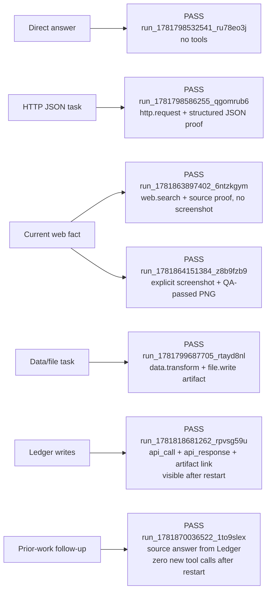
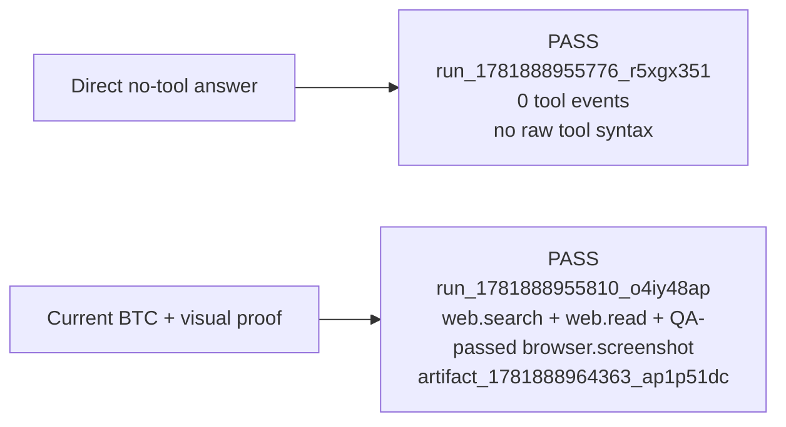

# Agent Handoff

Status date: 2026-06-22.

## Active Base

Continue from `main`. It has been updated to the split rebuild runtime and should be the
new primary branch.

- Current primary branch: `main`.
- Merge commit: `cac5b9d` (`Merge split BaseAgent mainline with core toolbelt`).
- Preserved source branch: `codex/split-mainline`.
- Split base branch: `codex/rewrite-from-agentic-main-next`.
- Active runtime: `BaseAgent`.
- Active roadmap: `docs/roadmap-core-toolbelt.md`.
- Active executable task queue: `docs/tasks/README.md`.
- Active architecture map: `docs/current-architecture.md`.
- Current active implementation task: `docs/tasks/07-p1-proof-policy-and-evidence-artifacts.md`.

Do not use `claude/phase17-research-delegation` as the active base. It was audited on
2026-06-18 and still contains a legacy `src/agents/universalAgent.ts` above 9k lines plus
legacy Tool Builder paths. It may contain ideas or test references, but it should not be
merged wholesale into the split rebuild.

## Product Philosophy

Agentic is being reset around a stable universal agent plus a preinstalled portable
core toolbelt. The tool builder is paused until the base agent can reliably solve real
tasks with stable first-party tools.

Core tools are not hardcoded private pipelines. They should use the same manifest,
schema, version, runner, settings, secret-handle, artifact, health, and trace contracts
that generated tools will use later.

## Current Verified State

`npm run verify` passed on 2026-06-19 from `main` after merging the split runtime and
after the default-core-toolbelt plus Ledger/P0 proof/current-fact fixes: lint,
typecheck, test typecheck, 532 unit tests, and build. Targeted BaseAgent P0 coverage now includes
API-only structured proof without screenshots, safe stable HTTP reuse, deterministic
`data.transform` reuse, direct local utility transformation/file-write chains without an
LLM call, local utility framing, and current-data HTTP reuse bypass with trace-visible
`work-ledger-reuse-skipped`, bounded current-fact source selection, blocker fallback,
primary-source synthesis, explicit screenshot proof behavior, and prior-work recovery for
source/artifact follow-ups.

The tool catalog cleanup was completed on 2026-06-19. `/api/tools` now returns
normalized `ToolCatalogEntry` records with `catalogLayer` and `agentEligibility`.
Tools UI defaults to active tools (`core + generated-active`) and has Core, Generated,
Inactive, and All filters. Manual smoke `run_1781876088935_yg4izgpx` confirmed that the
agent received exactly 10 offered tools:
`web.search`, `web.read`, `browser.operate`, `browser.screenshot`, `http.request`,
`file.read`, `file.write`, `document.extract`, `data.transform`, and
`external.action.prepare`; inactive generated records, `channel.telegram`, and guarded
`external.action.commit` were not in the agent prompt.

Durable-stack agent smoke was then repeated with Postgres, SearXNG, browser-operate,
local artifacts, and local LM Studio tiers enabled:

React UI smoke confirmed the data/file run page shows the final answer, timeline,
`smoke-people.csv` artifact card, preview, and download link.

Additional P0 smoke on 2026-06-19 after model-routing and proof-link fixes:

Recent P0 fixes:

- API/HTTP/JSON endpoint tasks use structured/source proof by default and no longer
  trigger screenshot/browser proof repair unless the user explicitly asks for visual
  proof of a web page.
- Direct no-tool frames keep tool use disabled across repair extensions. If a local
  model emits raw function-style tool prose during a truncated-answer repair, the partial
  draft is scrubbed from the repair prompt so the model cannot reinforce invalid
  `file.read(path="...")` text.
- `browser.screenshot` now extracts visible page text before capturing the PNG, so proof
  QA and final synthesis can compare the screenshot against visible claim signals.
- Run Workspace hydrates final-answer markdown artifact filenames to real run artifact
  URLs, matching the Conversation view and avoiding broken relative image links.
- LLM routing now goes through a tier plus capability-aware resolver and emits
  `model-route-selected` trace events. The durable profile/probe/multimodal work remains
  open in `docs/tasks/10-p2-model-routing.md`.
- Follow-up questions about prior answers can frame as `thread_context_answer` and answer
  from thread summary/facts/open questions instead of doing a fresh lookup.
- Thread-scoped prior-work recovery now asks the Work/Evidence Ledger for passed and
  rejected evidence before normal tool execution. Source/artifact follow-ups can answer
  from prior passed evidence with no LLM call and no new search/browser/tool call. Applied
  reuse is visible through `work-ledger-prior-context-resolved`,
  `work-ledger-prior-context-applied`, and a run-local prior-work decision/evidence Ledger record.
  Failed/blocked prior evidence is exposed as `retryExclusions`; it is not reused as
  proof.
- `src/agents/baseAgent.ts` is below the 800-line limit again; thread-context framing moved
  into `src/agents/baseAgentThreadContext.ts`.
- Working / Decision Board is complete for the current P1 slice:
  `src/agents/workingDecisionLedger.ts` projects `working-decision-*` snapshots from
  persisted run events; `src/agents/workingDecisionBoardUpdate.ts` validates/redacts
  model-written updates; `src/agents/baseAgentWorkingBoard.ts` handles the
  `update_working_board` meta-action; Run Workspace and Trace Lab render objective,
  phase, facts, candidates, rejected evidence, next action, draft status, compact
  metrics, scores, refs, and semantic LLM labels. Manual smokes:
  `run_1782161622838_s46658d4` and `run_1782161672962_2lrltrod`.
- Source/search discipline is complete for the current P1 slice. `TaskFrame` now carries
  `sourcePolicy`; explicit no-internet/no-web requests forbid external source tools;
  broad global research gets a mixed user-language/English source plan; API/docs tasks
  bias toward official documentation; and local-provider tasks bias toward location-aware
  provider search. `RunSourceRegistry` normalizes/redacts URLs, skips duplicate
  normalized reads, avoids repeating blocked sources unless strategy changes, emits
  `source-*` trace events plus `agent-source-search-plan-repair-requested`, and projects
  discoveries/rejections into the Working / Decision Board. Technical assets, search
  result pages, and social/provider search pages are filtered from source discovery,
  skipped before broad-research `web.read`, and not promoted as board candidates unless
  the user explicitly asks about that host/source type.
- Preinstalled tools now exist on the primary branch: `web.search`, `web.read`,
  `browser.operate`, `browser.screenshot`, `http.request`, `file.read`, `file.write`,
  `document.extract`, `data.transform`, `external.action.prepare`,
  `external.action.commit`, and `channel.telegram`.
- Core tools are enabled by default. `BUILTIN_TOOLS=disabled` is only for focused tests or
  generated-tool-only experiments. Live API smoke confirmed `/api/tools` exposes all 12
  core tools and manual `http.request` plus `data.transform` calls work.
- `data.transform` now tolerates common LLM-shaped inputs: JSON-looking strings are parsed
  before operations, and operation fields may use `path`, `key`, `field`, or `column`;
  sort direction accepts `direction` or `order`.
- Successful `file.write` calls now become downloadable run artifacts using the content
  already sent to the tool, so this survives later container isolation.
- BaseAgent core-tool execution now writes Work/Evidence Ledger records: each real tool
  call creates a run-local execution work item before execution, stores the canonical
  reusable work key in metadata, completes or fails that item after execution, records
  source/tool/artifact evidence, and links generated artifact ids back to the work item.
- Safe deterministic tool calls now publish thread/instance-scoped reusable-index items
  without `runId`. Stable `http.request` GET/HEAD calls can reuse fresh passed evidence
  for up to 10 minutes while still creating a new run-local work/evidence record and
  trace events. Current/fresh/live HTTP tasks such as price/current facts deliberately
  bypass this reuse path and emit `work-ledger-reuse-skipped`. Deterministic
  `data.transform` and inline-content `document.extract` calls also reuse passed
  evidence; mutable `file.read`, `file.write`, URL extraction, and path extraction do
  not.
- Explicit local file/document/data requests now frame as `local_utility`. The agent is
  instructed to use `document.extract`, `data.transform`, `file.read`, and `file.write`
  directly, avoid web/browser discovery unless requested, and treat local tool output or
  generated files as proof.
- Obvious JSON/CSV/file transformation requests now take a deterministic local utility
  fast path: the runtime can chain `file.read` / `data.transform` / `file.write`,
  records normal trace and Work/Evidence Ledger events, saves written files as run
  artifacts, and returns without any LLM call. Ambiguous local utility requests still go
  through the bounded agent loop with the local tool family.
- Narrow explicit current fact requests now take a bounded current-fact fast path when
  `web.search` and `web.read` are available: deterministic search, source ranking that
  avoids stale/social/listing noise, deterministic read of the best proof-worthy URL,
  blocker detection with direct search-evidence fallback when the snippet already
  contains a standalone current value, optional focused `browser.screenshot` only when
  requested, and one no-tools synthesis call grounded to the selected primary source.
  It emits `current-fact-fast-path-selected`, `current-fact-source-rejected`,
  `proof-skipped` or `proof-degraded`, and normal tool/artifact/Ledger events.
- Durable Ledger smoke passed after backend restart: `run_1781818681262_rpvsg59u` keeps
  one completed `api_call` work item, one `api_response` evidence record, and linked
  artifact `artifact_1781818687616_9q389ujl`; the React Ledger page shows the same data
  in `Backend ready · postgres` mode.
- Run status migrations must preserve `waiting_approval` in every recreated
  `runs_status_check` constraint.

## Current Priorities

P0:

- First P0 task completed on 2026-06-19: simple API/local/current-fact runs now use
  bounded fast paths, avoid unnecessary browser/search, keep screenshot proof explicit,
  and finish with structured/source/artifact proof. The completed task spec was removed
  from `docs/tasks/`.
- Ledger recovery/reuse is now active for source/artifact follow-ups and failed-evidence
  retry guidance. Remaining P0/P1 continuation work moves to the explicit memory model:
  accepted run/thread/user/group memories, artifact reuse policy, and clearer operator
  controls for what becomes durable memory.

P1:

- Conversation and memory continuity baseline is complete: accepted visible memories are
  retrieved for real API runs, policy-filtered, ranked, injected into the BaseAgent
  prompt, and emitted as `memory-context-prepared`. Full `npm run verify` passed, and
  durable smoke `run_1781874414255_yy0s68ik` completed from accepted group memory with
  zero tool calls.
- Tool catalog cleanup baseline is complete: active/operator views are separated, core
  tools appear first, and agent prompts include only `agentEligibility.offered` tools.
- Code hygiene: keep active files near the 800-line target, and prune/freeze builder code
  that is not needed for the core-toolbelt phase.

P2:

- Keep the simplified external-action approval/preparation path stable. The first UI and
  runtime pass is complete: one primary proposal action, safe preparation/proof after
  approval, generic executor attach, one final submit action, and final confirmation.
- Model routing: resolve from available local/remote providers by tier plus required
  capability flags such as vision, reasoning, coding, tool-calling, context window, and
  operator preferences.

P3:

- Redesign Tool Builder only after the core tool contract is stable. Generated tools must
  be out-of-tree portable packages/services, not app-specific code branches.

## Known Gaps

- Durable agent-level smoke through `/api/runs` now passes for direct answer, HTTP JSON,
  current web fact with screenshot proof, and data/file artifact tasks.
- External-action UX no longer stops at confusing intermediate approval states in the
  local fixture exam. Remaining work is real-provider blocker polish, automode fixture
  exams, and making the final report richer for real provider confirmations.
- Work/Evidence Ledger unit coverage and durable live UI/API verification are green for
  BaseAgent `http.request`, safe repeated `http.request` reuse, and `file.write` paths.
  Broader tool-family reuse coverage should be added as those flows are touched.
- Four files remain slightly above the preferred 800-line limit:
  `src/server/modules/runs/action-proposal-preparation-runner.ts`,
  `tests/actionProposalPreparationRunner.test.ts`,
  `src/server/modules/runs/runs.service.ts`, and `tests/nestApi.test.ts`.

## Rules For Next Agents

- Do not restore legacy `/api/tool-build-*`, `/api/tool-investigations`, or
  `/api/tool-rework-waits` as ordinary fixes.
- Do not reintroduce `UniversalAgent` as the active runtime.
- Keep generated or imported tool implementations out of Agentic app source unless they are
  deliberately promoted as first-party core packages.
- Update `AGENTS.md`, this handoff, `docs/current-architecture.md`, and
  `docs/roadmap-core-toolbelt.md` whenever architecture, command, or roadmap decisions
  change.
