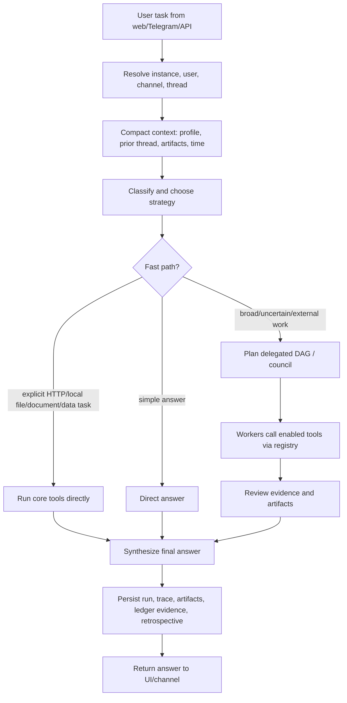
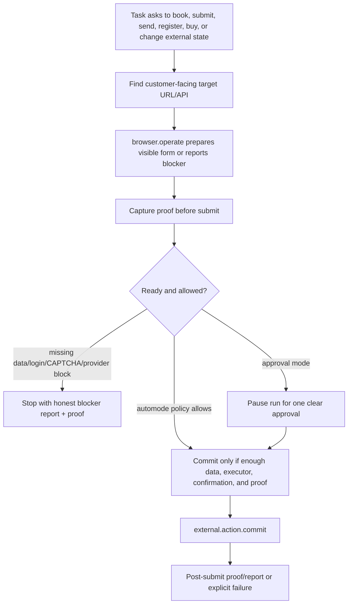

# Agentic Handoff: Current Philosophy, Roadmap, And Known Gaps

Last updated: 2026-06-12.

This document is the quickest handoff for another AI coding agent joining the project.
Read it together with `AGENTS.md`, `README.md`, `docs/roadmap.md`, and
`docs/core-toolbelt-roadmap.md` before changing code.

## Current Product Philosophy

Agentic is a universal assistant platform for one bounded instance: a household, family,
company, team, or similar group. The assistant should be useful because it combines:

- a capable LLM layer with configurable model tiers;
- a stable registry of reusable tools;
- traceable agent runs with input/output observability;
- durable work/evidence ledgers to avoid repeated work;
- scoped group/user/channel memory and policies;
- safe external-action preparation and approval.

The current decision is to stop building the product around the old generated Tool
Builder. That path became too large, brittle, and confusing before the runtime had a
stable base. The active product path is now:

```text
stable core toolbelt
  -> reliable agent use of those tools
  -> clear traces, artifacts, evidence, and run persistence
  -> external-action prepare/approve/commit flow
  -> model routing by tier + capability
  -> only then redesign generated tools as an out-of-tree builder layer
```

The project should avoid private task hacks. A failed restaurant booking, barbershop
appointment, API integration, Telegram reply, or laptop research run should lead to one
of these generic fixes:

- better planning / prompting;
- better model routing;
- a stronger reusable core tool;
- improved proof/evidence policy;
- clearer approval/external-action UX;
- a recorded external limitation;
- a future portable tool-builder requirement.

Do not add hardcoded one-off paths for a specific website, provider, domain, or user's
current prompt unless explicitly marked as temporary test fixture code.

## Active Core Toolbelt

The active tool foundation is `createCoreToolbelt()`:

- `web.search`: search/discovery.
- `web.read`: page/resource reading.
- `browser.operate`: browser navigation, observation, clicking, filling, extraction,
  screenshot/proof primitives, and safe external-action preparation.
- `browser.screenshot`: focused proof screenshots.
- `http.request`: generic API client for explicit HTTP/API/JSON tasks.
- `file.read` / `file.write`: workspace file and artifact operations.
- `document.extract`: PDF/DOCX/HTML/text/JSON extraction.
- `data.transform`: deterministic JSON/CSV/text transformation.
- `external.action.prepare`: no-submit external-action draft/preparation boundary.
- `external.action.commit`: final commit after approval and a real executor.
- `channel.telegram`: always-on Telegram channel adapter.

Generated tools should eventually use the same registry/version/metadata/health contract
as these tools. They should be portable packages/services outside tracked app source,
not special branches inside Agentic.

## Current Agent Execution Model

At a high level:



External actions use a separate safety boundary:



The approval UX is still an active problem. The desired behavior is one clear approval
for normal mode, and zero approvals in automode only when policy and evidence are enough.

## Model Routing Direction

Models should be selected from discovered local OpenAI-compatible models and manually
registered remote providers. Routing should use:

- tier: S / M / L / XL;
- capabilities: vision, reasoning, coding, tool-calling, embedding;
- operator preference overrides;
- health/latency/context-window behavior.

If a task requires vision, pick a vision-capable model within the requested tier. If it
requires strong reasoning, prefer reasoning-capable models within tier. The current code
has catalog/capability scaffolding, but durable capability overrides and robust runtime
routing still need more work.

## Current Roadmap

1. Stabilize the preinstalled core toolbelt.
   - Ensure every tool works through API, agent run, trace, artifacts, and persistence.
   - Keep tool versions visible in traces and UI.
   - Do not reintroduce the legacy builder queue.

2. Make browser/external-action flows reliable.
   - Better customer-facing URL selection.
   - Multi-candidate retry when the first provider URL is blocked or not actionable.
   - Honest blocker detection for login, account, CAPTCHA, unavailable forms, and consent.
   - Proof screenshots before submit and after submit when possible.
   - Final report: where, what data, what happened, confirmation/cancellation/contact info.

3. Simplify approvals and automode.
   - Approval mode: one understandable approval card, then the run continues.
   - Automode: commit only when policy, data, executor, proof, and confidence are enough.
   - Avoid confusing intermediate buttons that do not visibly progress the run.

4. Improve agent research quality.
   - Broad tasks should frame ideal user intent, likely disappointments, and proof needs.
   - Use `web.search` + `web.read` deeply before recommendations.
   - Use screenshots/files/links as proof, but do not fail the whole answer when visual
     proof is unavailable.
   - Reuse prior thread artifacts/evidence when follow-up questions ask about them.

5. Finish model routing.
   - Persist provider/catalog capabilities.
   - Add health probes and context-window metadata.
   - Route by tier plus required capability.

6. Redesign generated tool creation later.
   - Builder input: user goal, docs/files/URLs, credential handles, startup mode, QA.
   - Builder output: out-of-tree package/service manifest, tests, README, schemas.
   - Gates: package-local build/test, behavior QA, security/secret redaction, health.
   - Promotion: register into the same tool registry as the core toolbelt.

## Known Active Problems

- Full verification passed on 2026-06-12 after updating stale reset-era test contracts:
  `npm run verify` completed typecheck, test types, 531 tests, and build successfully.
  Re-run verification after any new changes.
- External-action approval flow remains too confusing. The user expects fewer steps and
  clearer wording about what is being approved, what is prepared, and when a real submit
  will happen.
- Browser preparation can still get stuck on provider pages, login boundaries, or
  marketplace/provider-admin URLs. It must try better customer-facing alternatives before
  returning a blocker.
- Telegram/channel polish is incomplete: attachment delivery, Markdown/Telegram
  formatting, continuation mapping, and channel-user approvals need more hardening.
- Run/conversation persistence must remain durable across restarts. Terminal run statuses
  must never be mutated back to active by late events.
- Trace/Run UI should keep input/output, tool version, artifacts, QA, and approval state
  visible without overwhelming the page.
- `tools/` is intentionally gitignored for generated/out-of-tree packages. Do not commit
  generated tool package source unless the project deliberately promotes a reusable
  reference service into tracked source.

## Do Not Reintroduce

- `/api/tool-build-*`
- `/api/tool-investigations`
- `/api/tool-rework-waits`
- automatic tool-build requests inside normal user runs
- generated source written into tracked `src/tools/generated`
- task-specific hardcoded tools such as a special barbershop/restaurant/laptop pipeline

Missing capabilities should be reported honestly until the new builder lifecycle is
redesigned.
