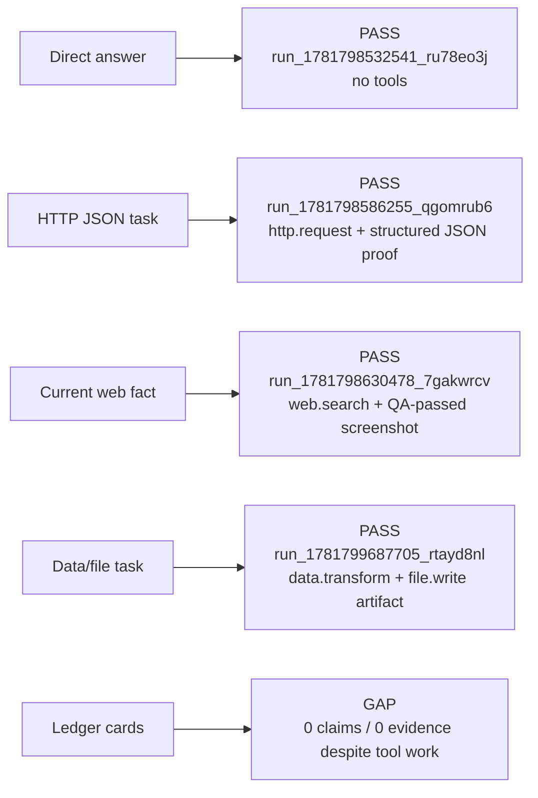

# Agent Handoff

Status date: 2026-06-18.

## Active Base

Continue from `main`. It has been updated to the split rebuild runtime and should be the
new primary branch.

- Current primary branch: `main`.
- Merge commit: `cac5b9d` (`Merge split BaseAgent mainline with core toolbelt`).
- Preserved source branch: `codex/split-mainline`.
- Split base branch: `codex/rewrite-from-agentic-main-next`.
- Active runtime: `BaseAgent`.
- Active roadmap: `docs/roadmap-core-toolbelt.md`.
- Active architecture map: `docs/current-architecture.md`.

Do not use `claude/phase17-research-delegation` as the active base. It was audited on
2026-06-18 and still contains a legacy `src/agents/universalAgent.ts` above 9k lines plus
legacy Tool Builder paths. It may contain ideas or test references, but it should not be
merged wholesale into the split rebuild.

## Product Philosophy

Agentic is being reset around a stable universal agent plus a preinstalled portable
core toolbelt. The tool builder is paused until the base agent can reliably solve real
tasks with stable first-party tools.

Core tools are not hardcoded private pipelines. They should use the same manifest,
schema, version, runner, settings, secret-handle, artifact, health, and trace contracts
that generated tools will use later.

## Current Verified State

`npm run verify` passed on 2026-06-18 from `main` after merging the split runtime and
after the default-core-toolbelt fix: lint, typecheck, test typecheck, 508 unit tests,
and build. Targeted suites also passed: BaseAgent runtime 49/49, external-action
preparation/approval 29/29, and focused env/core-toolbelt/auth 12/12.

Durable-stack agent smoke was then repeated with Postgres, SearXNG, browser-operate,
local artifacts, and local LM Studio tiers enabled:

React UI smoke confirmed the data/file run page shows the final answer, timeline,
`smoke-people.csv` artifact card, preview, and download link.

Recent P0 fixes:

- Explicit API/HTTP/JSON tasks that say not to screenshot no longer trigger visual proof
  repair. They can still save structured/source proof artifacts.
- Follow-up questions about prior answers can frame as `thread_context_answer` and answer
  from thread summary/facts/open questions instead of doing a fresh lookup.
- `src/agents/baseAgent.ts` is below the 800-line limit again; thread-context framing moved
  into `src/agents/baseAgentThreadContext.ts`.
- Preinstalled tools now exist on the primary branch: `web.search`, `web.read`,
  `browser.operate`, `browser.screenshot`, `http.request`, `file.read`, `file.write`,
  `document.extract`, `data.transform`, `external.action.prepare`,
  `external.action.commit`, and `channel.telegram`.
- Core tools are enabled by default. `BUILTIN_TOOLS=disabled` is only for focused tests or
  generated-tool-only experiments. Live API smoke confirmed `/api/tools` exposes all 12
  core tools and manual `http.request` plus `data.transform` calls work.
- `data.transform` now tolerates common LLM-shaped inputs: JSON-looking strings are parsed
  before operations, and operation fields may use `path`, `key`, `field`, or `column`;
  sort direction accepts `direction` or `order`.
- Successful `file.write` calls now become downloadable run artifacts using the content
  already sent to the tool, so this survives later container isolation.
- Run status migrations must preserve `waiting_approval` in every recreated
  `runs_status_check` constraint.

## Current Priorities

P0:

- Wire BaseAgent core-tool execution into Work/Evidence Ledger. The latest durable smoke
  proves tool work happens, but `/api/work-ledger?runId=...` and
  `/api/evidence-ledger?runId=...` still return empty records.
- Keep simple runs fast and correct in practice: API/local utility tasks should use the
  direct core-tool path, avoid browser/search when unnecessary, and finish with structured
  proof instead of screenshots.
- Keep proof policy proportional: screenshot proof for visual/current web tasks,
  structured proof for API/local utility tasks, and no visual proof when the user
  explicitly forbids it.

P1:

- Conversation and memory continuity: follow-ups should reuse thread facts/artifacts;
  run memory should know already completed steps; user/group profile memory should be
  visible to the agent without polluting every prompt.
- Clean/segregate legacy generated failed tools from the active tool catalog/UI so
  operators see the stable preinstalled toolbelt first.
- Code hygiene: keep active files near the 800-line target, and prune/freeze builder code
  that is not needed for the core-toolbelt phase.

P2:

- Simplify external-action approval/preparation so a user can ask for a booking/action and
  get one clear proposal, proof, one approval boundary, submit/commit, and final report.
- Model routing: resolve from available local/remote providers by tier plus required
  capability flags such as vision, reasoning, coding, tool-calling, context window, and
  operator preferences.

P3:

- Redesign Tool Builder only after the core tool contract is stable. Generated tools must
  be out-of-tree portable packages/services, not app-specific code branches.

## Known Gaps

- Durable agent-level smoke through `/api/runs` now passes for direct answer, HTTP JSON,
  current web fact with screenshot proof, and data/file artifact tasks.
- External actions remain too hard to understand from the UI and still stop too early in
  ordinary approval mode.
- Work/Evidence Ledger cards on tested runs show zero records despite tool activity; this
  is now the highest-priority system correctness gap.
- Four files remain slightly above the preferred 800-line limit:
  `src/server/modules/runs/action-proposal-preparation-runner.ts`,
  `tests/actionProposalPreparationRunner.test.ts`,
  `src/server/modules/runs/runs.service.ts`, and `tests/nestApi.test.ts`.

## Rules For Next Agents

- Do not restore legacy `/api/tool-build-*`, `/api/tool-investigations`, or
  `/api/tool-rework-waits` as ordinary fixes.
- Do not reintroduce `UniversalAgent` as the active runtime.
- Keep generated or imported tool implementations out of Agentic app source unless they are
  deliberately promoted as first-party core packages.
- Update `AGENTS.md`, this handoff, `docs/current-architecture.md`, and
  `docs/roadmap-core-toolbelt.md` whenever architecture, command, or roadmap decisions
  change.
