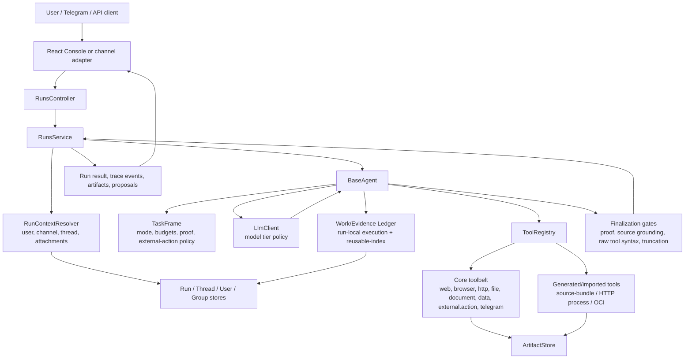
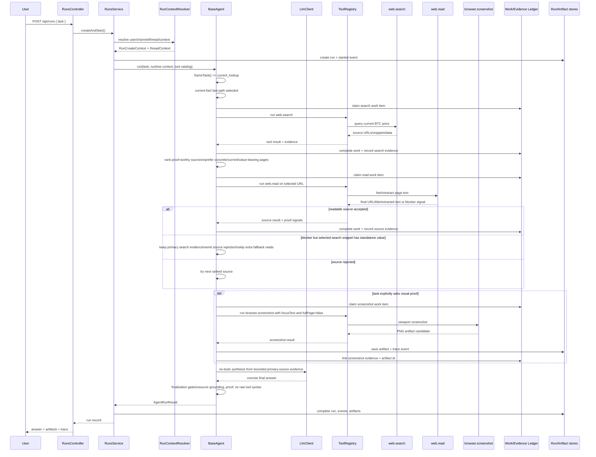
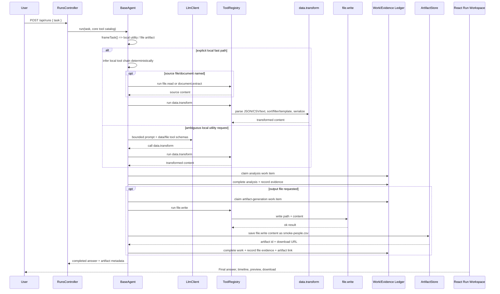
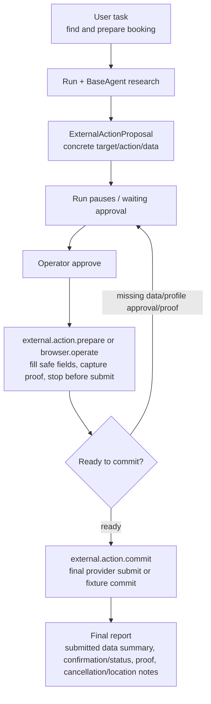
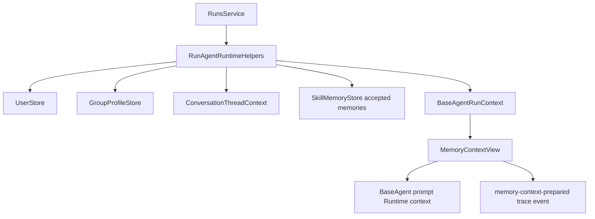
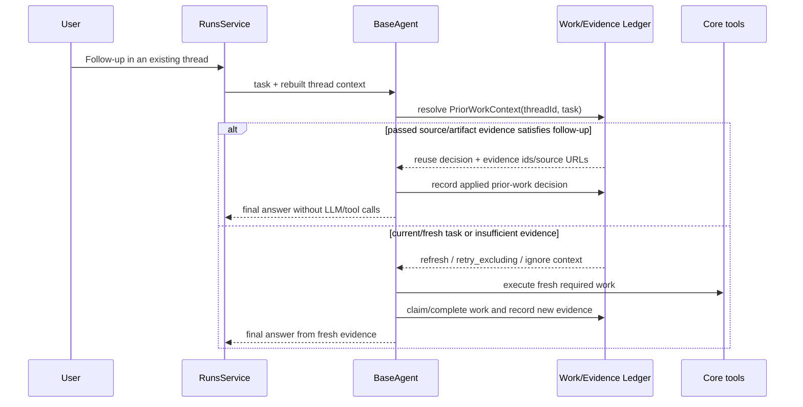

# Current Architecture

Status date: 2026-06-19.

This document describes the active code path in `main`. Historical recursive/council
runtime files and legacy tool-build queues are not active.

## Product Shape

Agentic currently has four runtime layers:

- **API/UI layer**: Nest controllers plus the React console.
- **Run orchestration layer**: `RunsService`, context resolution, run persistence, trace
  events, artifacts, approvals, channel outbound delivery, and recovery.
- **Agent layer**: `BaseAgent`, a bounded ReAct-style loop around one task.
- **Tool layer**: `ToolRegistry`, preinstalled core tools, generated/source-bundle tools,
  OCI/source-bundle runners, service supervisor, metadata, settings, and secrets.

## Main Code Map

### Agent Runtime

- `src/agents/baseAgent.ts`: runtime facade and ReAct loop.
- `src/agents/baseAgentLocalUtility.ts`: deterministic fast path for obvious local
  data/file/document chains that can be satisfied by `file.read`, `document.extract`,
  `data.transform`, and `file.write` without entering the LLM ReAct loop.
- `src/agents/baseAgentCurrentFact.ts`: bounded fast path for narrow explicit current
  fact tasks. It runs `web.search`, `web.read`, optional `browser.screenshot`, then one
  no-tools synthesis call instead of entering the general ReAct loop.
- `src/agents/taskFrame.ts`: task classification, research/proof contract, default step
  budgets, and external-action policy.
- `src/agents/baseAgentPrompt.ts`: system prompt and tool schemas passed to the model.
- `src/agents/baseAgentToolExecution.ts`: registered tool execution, tool-call cache,
  evidence capture, artifact save hooks.
- `src/agents/baseAgentToolLedger.ts`: Work/Evidence Ledger classification,
  run-local claim/evidence writes, and safe reusable-index publication/lookup for
  deterministic `http.request` calls.
- `src/agents/baseAgentPriorWork.ts`: thread-scoped prior-work recovery bridge. It asks
  the runtime Ledger for passed/rejected prior evidence before normal tool execution,
  short-circuits source/artifact follow-ups when prior evidence is enough, and records
  applied reuse decisions as normal Work/Evidence records.
- `src/agents/baseAgentFinalization.ts`: final-answer gates, action proposal creation,
  result assembly.
- `src/agents/baseAgentEvidence.ts` and `src/agents/baseAgentProof.ts`: source/proof
  extraction, proof repair, screenshot/source checks.
- `src/agents/baseAgentThreadContext.ts`: follow-up rewriting so prior-thread questions
  can answer from conversation context instead of repeating work.
- `src/agents/baseAgentTruncation.ts`: rolling context compaction and truncated-answer
  repair.

### Run Orchestration

- `src/server/modules/runs/runs.service.ts`: run creation, execution, cancellation,
  recovery, artifacts, finalization, outbound delivery.
- `src/server/modules/runs/run-context-resolver.ts`: user/channel/thread resolution,
  thread context rebuild, attachment parsing.
- `src/server/modules/runs/run-agent-runtime-helpers.ts`: bridges runs to BaseAgent,
  tool creation/edit callbacks, secrets/configuration, channel outbound events.
- `src/server/modules/runs/run-ledger-runtime.ts`: durable run event sink plus
  Work/Evidence Ledger coordinator wiring for each run.
- `src/server/modules/runs/action-proposals.service.ts` plus
  `action-proposal-*.ts`: external-action proposal, approval, prepare, profile
  hydration, commit readiness, fixture/commit support.
- `src/runs/postgresRunStore.ts`: durable run/event storage with `getMeta()` for light
  SSE polling.

### Tool System

- `src/tools/coreToolbelt.ts`: registers preinstalled first-party tools by default.
- `src/tools/registry.ts`: in-process registry and execution boundary.
- Core tools:
  - `web.search`, `web.read`
  - `browser.operate`, `browser.screenshot`
  - `http.request`
  - `file.read`, `file.write`
  - `document.extract`
  - `data.transform`
  - `external.action.prepare`, `external.action.commit`
  - `channel.telegram`
- Generated/imported tool infrastructure:
  - `src/tools/toolCreationV1*.ts`
  - `src/tools/toolPackageRunner*.ts`
  - `src/tools/toolPackageWorkspaceQa.ts`
  - `src/tools/toolServiceSupervisor.ts`
  - `src/tools/toolMetadataStore.ts` and Postgres adapters.

### Persistence And Settings

- `src/server/persistence/persistence.module.ts`: wires stores, LLM client, core toolbelt,
  registry, secrets, runtime settings, artifacts, work/evidence ledger.
- `src/server/config/env.ts`: local environment. Core tools are enabled by default;
  `BUILTIN_TOOLS=disabled` is an opt-out test/experiment mode.
- `src/settings/modelProviderStore.ts` and `src/settings/modelTierSettings.ts`: model
  provider/tier settings.
- `src/server/common/guards/api-token.guard.ts`: opt-in shared API token guard through
  `AGENTIC_API_TOKEN`.

## Request Lifecycle: Current Bitcoin Price

Example user task: "Какая сейчас цена биткоина? Дай краткий ответ и proof."

## Request Lifecycle: Local Data/File Task

Example user task: "Отсортируй JSON по age desc, сохрани CSV в smoke-people.csv."

`file.write` artifacts are created from the content passed into the tool call. This avoids
depending on a shared filesystem path and keeps the behavior compatible with future
containerized tool execution.

## External Action Lifecycle

External actions are state-changing tasks such as bookings, form submits, purchases, API
writes, or outbound messages. The active safety model is prepare -> approve -> commit.

## Memory Model In Code

Current memory is split and now enters each run through an explicit runtime memory view:

- **Run memory**: run events, tool results, artifacts, and trace spans in the run store.
- **Thread memory**: `ConversationThreadStore` summary, accepted facts, rejected attempts,
  open questions, artifact ids. Restart/resume paths rebuild this context by thread id.
- **User/channel memory**: `UserStore` maps local users and channel identities.
- **Group memory**: `GroupProfileStore` is wired into runtime context.
- **Longer-term skill memory**: `SkillMemory` / `PostgresSkillMemory` accepted entries are
  retrieved by `RunAgentRuntimeHelpers` for visible run/thread/user/group scopes and then
  filtered by `evaluateMemoryPolicy`.
- **Runtime memory context**: `src/agents/memoryContext.ts` builds `MemoryContextView`
  with run/thread/user/group/accepted-learning/prior-work sections. `BaseAgent` formats
  this compact view into the prompt and emits `memory-context-prepared` so Trace Lab can
  show which memory influenced the run. Proposed/rejected memories and other-user private
  memories are not injected; sensitive memories require an explicit policy grant.
- **Work/Evidence Ledger**: BaseAgent tool calls claim a run-local execution work item
  before execution, store the canonical reusable work key in metadata, complete or fail
  the item after execution, record evidence with source/tool/artifact metadata, and link
  artifact ids when a tool produces files or screenshots.
  Stable `http.request` GET/HEAD calls also publish a thread/instance-scoped
  reusable-index item without `runId`; later identical stable calls can reuse fresh
  passed evidence for up to 10 minutes while still creating run-local work/evidence.
  Deterministic `data.transform` and inline-content `document.extract` calls use the
  same reusable-index path without a freshness TTL. Current/live HTTP tasks bypass reuse
  and emit `work-ledger-reuse-skipped` so operators can see that the repeated tool call
  was intentional.
- **Prior work recovery**: before normal tool execution, `BaseAgent` resolves a compact
  `PriorWorkContext` from thread-scoped Work/Evidence Ledger records. Passed source or
  artifact evidence can answer `thread_context_answer` follow-ups without any LLM/tool
  call. Failed/blocked evidence is not reused; its URLs are surfaced as
  `retryExclusions` for subsequent search/browser/external-action retries. Empty threads
  do not create trace or Ledger noise.

## Verified State

- `npm run verify` passed on 2026-06-19: lint, typecheck, test typecheck, 532 tests, build.
- Targeted suites passed:
  - BaseAgent runtime and local utility coverage.
  - External action preparation/approval: 29 tests.
  - Focused env/core-toolbelt/auth regression: 12 tests.
- Live API smoke passed after enabling core toolbelt by default:
  - `/api/health` responds.
  - React dev shell responds on port 3001.
  - `/api/tools` exposes all 12 preinstalled core tools.
  - Manual `http.request` call to JSONPlaceholder succeeds.
  - Manual `data.transform` JSON->CSV sort succeeds.
- Durable agent-level smoke passed after that:
  - Direct no-tool run: `run_1781798532541_ru78eo3j`.
  - HTTP JSON fast path with structured proof and no screenshot:
    `run_1781798586255_qgomrub6`.
  - Current web fact without screenshot when not requested:
    `run_1781863897402_6ntzkgym`.
  - Current web fact with explicit QA-passed screenshot proof:
    `run_1781864151384_z8b9fzb9`.
  - Data/file artifact path with preview/download in React:
    `run_1781799687705_rtayd8nl`.
- Automated BaseAgent P0 coverage confirms `http.request` writes an `api_call` work
  item plus `api_response` evidence, and `file.write` links the saved artifact id to
  both Work Ledger and Evidence Ledger records. It also confirms explicit local utility
  tasks frame as `local_utility`, obvious JSON/CSV/file transform chains complete
  through the deterministic local utility fast path without an LLM call, `file.write`
  fast-path outputs become downloadable artifacts, a second identical stable
  `http.request` GET in the same thread/instance uses Ledger evidence instead of
  executing another HTTP call, deterministic `data.transform` calls reuse passed
  evidence, and current/fresh HTTP tasks bypass that reuse and trace the reason.
- Prior-work recovery coverage confirms source follow-ups can answer from prior passed
  Ledger evidence with zero new tool calls and zero LLM calls, fresh/current prompts do
  not reuse prior evidence as truth, and failed evidence exposes retry exclusions instead
  of becoming reusable proof.
- Durable prior-work smoke passed on Postgres/S3 and survived backend restart:
  `run_1781869705670_93qohg1o` created persisted `http.request` source evidence in
  `thread_1781869705669_bj426305`; after restarting the API,
  `run_1781870036522_1to9slex` answered the source follow-up from Ledger context with
  zero tool events and `work-ledger-prior-context-resolved/applied` trace events.
- API-only HTTP/JSON endpoint tasks use structured/source proof by default. They avoid
  browser/screenshot proof unless the user explicitly asks for visual proof of a web
  page.
- Durable Ledger product smoke passed on Postgres/S3 and survived server restart:
  `run_1781818681262_rpvsg59u` completed an `http.request` JSON task, `/api/work-ledger`
  shows one completed `api_call`, `/api/evidence-ledger` shows one `api_response`, both
  records link `artifact_1781818687616_9q389ujl`, and the React Ledger page shows
  `Backend ready · postgres` with the same work/evidence/artifact records.

## Current Gaps

- `npm run web` without `DATABASE_URL` starts in-memory stores. That is acceptable for
  smoke tests, but real persistence testing must set Postgres env.
- Work/Evidence Ledger writes, safe `http.request` reuse, deterministic local utility
  reuse, and thread follow-up prior-work recovery are covered in BaseAgent unit tests.
  External-action retry selection should consume `retryExclusions` more aggressively in
  the next UX/action pass.
- External-action UI is safer than before but still complex. The next UX target is one
  understandable proposal/proof/approval/commit path.
- Tool Builder V1 still exists and works for source-bundle candidates, but strategic
  builder work should wait until the core tool contract is live-tested.
- The remaining over-800-line files should be split when touched.
