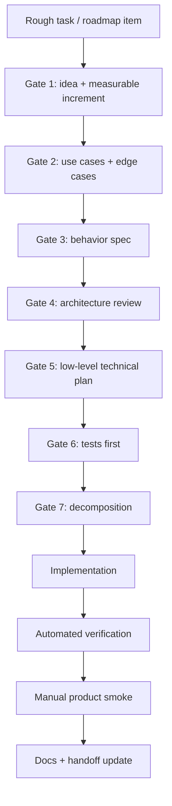

# Development Convention: Spec-First, Test-First Delivery

Status date: 2026-06-22.

This convention is mandatory for non-trivial Agentic work. It exists so a new chat or a
new agent can pick up any active task from the repository without relying on hidden
conversation history.

`AGENTS.md` links here because it is the first file every coding agent must read before
changing the project.

## Principle

Do not start coding an active roadmap task directly from a rough idea.

Every substantial task must first pass through a written task-readiness cycle:

1. clarify the product idea;
2. reduce it to a measurable increment;
3. capture use cases, weak spots, and edge cases;
4. write a spec;
5. design the architecture;
6. design the concrete implementation;
7. define tests and manual verification;
8. decompose the work;
9. then implement.

The spec should be stored in one authoritative task file under `docs/tasks/`. It may link
to supporting architecture docs, but the task file must contain enough high-level and
low-level context for a new agent to execute the work correctly.

## Scope

Use the full process for:

- every task in `docs/tasks/README.md`;
- roadmap changes;
- runtime behavior changes;
- database/schema/API changes;
- agent loop, tool, memory, proof, approval, model routing, or observability changes;
- any change whose failure would affect user trust, external actions, data durability,
  secrets, or product direction.

Small mechanical fixes may use a compact version of the same process, but they still need
clear expected behavior, affected files, tests, and verification. Critical outage or
security fixes may be patched immediately only when delay is risky; backfill the task
file or handoff note afterwards.

## Task Readiness Gates

### Gate 1: Idea And Outcome

Define the problem in product terms.

Required output:

- user-visible pain or system gap;
- measurable outcome;
- non-goals;
- what changes after this increment ships;
- how this fits the current roadmap.

Good increment shape:

- small enough to verify end-to-end;
- large enough to be meaningful to a user/operator;
- not a private code cleanup disguised as product work.

### Gate 2: Use Cases, Weak Spots, Edge Cases

Before architecture, enumerate what the system must handle.

Required output:

- primary happy path;
- at least 3 realistic alternate paths;
- failure modes;
- edge cases;
- old-data / migration behavior;
- observability expectations;
- security/privacy implications;
- user confusion risks in UI.

### Gate 3: Spec Driven Development

Write the behavior contract before coding.

Required output:

- BA view: user stories and product behavior;
- functional requirements;
- acceptance criteria;
- explicit out-of-scope items;
- examples of expected UI/API/trace output where relevant;
- Mermaid diagrams when a flow, state machine, or data path is involved.

The spec must describe behavior, not just implementation. It should be possible to judge
the final product against the spec without reading the code.

### Gate 4: Architecture Review

Decide where the feature belongs and how it scales.

Required output:

- affected modules and ownership boundaries;
- why this belongs there;
- contracts with existing runtime pieces;
- data flow;
- state ownership;
- durability strategy;
- metrics/logs/traces/audit events;
- performance and bottleneck analysis;
- compatibility with existing runs/tools/conversations;
- failure and rollback behavior.

Reject designs that:

- add provider/domain-specific concepts to core contracts;
- duplicate state in several sources of truth;
- hide important behavior only in prompts;
- require UI users to understand internal implementation details;
- make future generated/container tools harder to support.

### Gate 5: Low-Level Technical Design

Translate the architecture into concrete code decisions.

Required output:

- tables or stores, if any;
- endpoint names and payload shapes;
- event names and payload shapes;
- DTO/type names;
- service/module/function names;
- file-level edit plan;
- reusable helpers and patterns to follow;
- migration needs;
- feature flags/config/env vars, if any;
- exact UI surfaces and copy changes;
- backward compatibility for existing persisted data.

This is where vague words like "improve", "make better", or "support X" must become
testable contracts.

### Gate 6: Test Design Before Implementation

Write the test plan before code changes.

Required output:

- unit tests;
- integration/API tests;
- regression tests for known bugs;
- UI/manual smoke plan;
- negative tests and edge cases;
- performance/observability checks when relevant.

Tests should be named from behavior, not implementation. If a test cannot be written yet,
the spec must say why and define the manual verification that covers the risk.

### Gate 7: Decomposition

Break the work into implementation slices.

Required output:

- ordered steps;
- files/modules per step;
- validation after each step;
- rollback plan for risky steps;
- what documentation must be updated;
- what manual run proves the slice.

Only after Gate 7 is complete should normal coding begin.

## Required Task File Shape

Each active task file should contain this structure or an equivalent superset:

```md
# P? Task Title

## Status

Owner/status/date, current branch, verification state.

## 1. Idea And Measurable Increment

Problem, outcome, non-goals, measurement.

## 2. Use Cases, Weak Spots, Edge Cases

Happy path, alternates, failure modes, old data, security, UX risks.

## 3. Spec

Functional requirements and acceptance criteria.

## 4. Architecture

Module boundaries, data flow, state ownership, diagrams, observability.

## 5. Low-Level Technical Plan

Tables/stores/endpoints/events/types/files/patterns.

## 6. Test Plan

Automated tests first, manual smokes, negative cases.

## 7. Decomposition

Ordered implementation steps and validation gates.

## 8. Completion Notes

Actual changes, manual run ids, verification commands, follow-ups.
```

Existing task files may keep their BA / Architect / QA / PM sections, but before
implementation they must be upgraded with any missing readiness gates above.

## Execution Loop



## Definition Of Ready

A task is ready for implementation only when:

- the task file contains the readiness gates;
- expected behavior is measurable;
- known weak spots and edge cases are listed;
- architecture placement is justified;
- low-level affected code is named;
- test plan exists before code;
- manual verification plan exists.

## Definition Of Done

A task is done only when:

- implementation matches the spec or the spec is updated with the accepted change;
- automated tests pass;
- a relevant manual UI/API run was executed;
- metrics/logs/traces expose the behavior where applicable;
- documentation and handoff files are updated;
- follow-up tasks are explicit and ordered.

## Practical Notes

- Keep one authoritative task file per task. Do not scatter required decisions across
  chat history.
- Mermaid diagrams are preferred for flows, state machines, data paths, and lifecycle
  boundaries.
- Specs should scale with risk. Do not create a 20-page spec for a typo, but do not code
  a runtime behavior change from a paragraph.
- If implementation discovers that the spec is wrong, stop and update the spec before
  continuing.
- Prefer system-level fixes over case-specific patches. If an example is domain-specific,
  extract the generic platform requirement from it.
