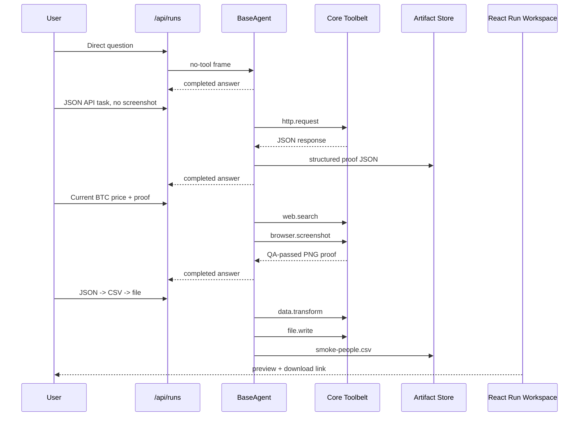
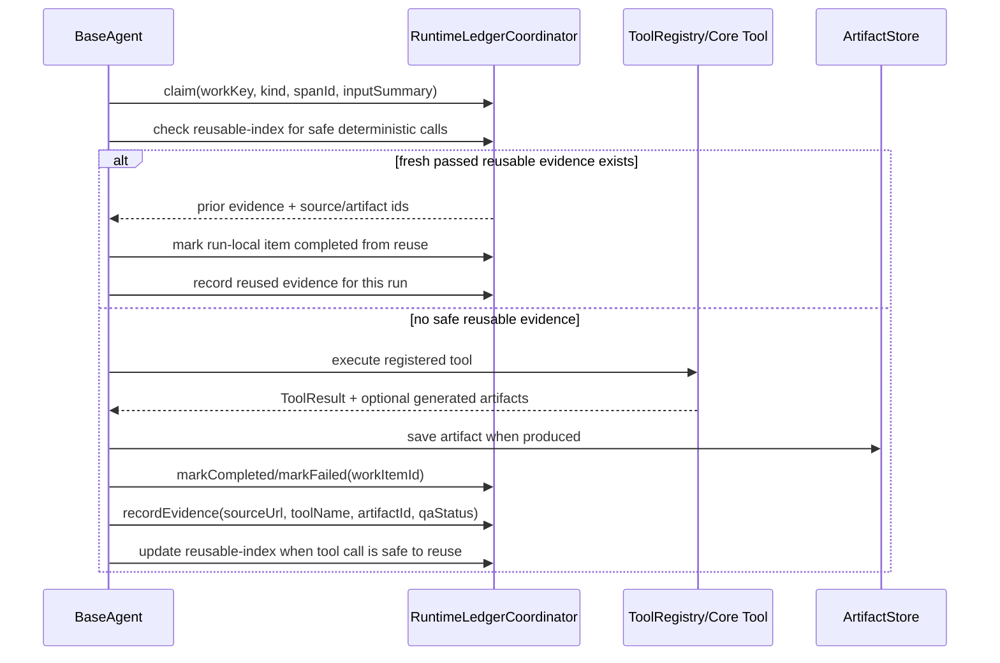

# Core Toolbelt Roadmap

Status date: 2026-06-19.

## 2026-06-18 Validation Checkpoint

Historical branch: `codex/rewrite-from-agentic-main-next`.
Current primary branch: `main`.
Preserved split branch: `codex/split-mainline`.

Automated verification:

- `npm run verify` passed for this checkpoint: lint, typecheck, type tests, unit tests, and
  build.

Runtime smoke:

- `npm run web` starts the Nest API at `http://127.0.0.1:3000` and the React console at
  `http://127.0.0.1:3001`.
- `/api/health` reports Postgres-backed durable stores for runs, run events, secrets,
  tool metadata, tool creations, audit, conversations, work ledger, and evidence ledger;
  artifacts use the configured S3/MinIO store when the local durable stack is started
  with `MINIO_*` env.
- The generated registry reloads 20 tool packages.

Manual tool calls that passed through `/api/tools/:name/run`:

- `web.search@0.1.0`: returned search results for `OpenAI official website`.
- `web.read@0.1.0`: read `https://example.com` with status/title/text/links.
- `browser.screenshot@0.1.5`: captured a viewport PNG for `https://example.com`.
- `browser.operate@0.1.4`: operated the local external-action fixture in prepare-only
  mode.
- `external.action.prepare@0.1.15`: prepared the local fixture without final submit.
- `external.action.commit@0.1.2`: committed a safe fixture action manually, even though
  it is not currently offered to agents.

Agent runs:

- `run_1781737302310_6ln1wrr2`: current Bitcoin lookup used `web.search` and
  `browser.screenshot`, returned CoinMarketCap source and a QA-passed proof artifact.
- `run_1781737990450_4ziwnf5r`: simple direct answer completed without tool calls.
- `run_1781738025605_mozhfsmv`: URL read over `jsonplaceholder.typicode.com/todos/1`
  returned the correct `title` and stored a QA-passed screenshot artifact.
- `run_1781738068292_apav9bnh`: barbershop appointment task found a real Booksy target
  and reached `waiting_approval` with a proposal card.
- `run_1781738317784_dx4prbn0`: conversation follow-up failed because task framing
  treated "what source did you use in the previous answer" as a fresh `current_lookup`
  and the return gate demanded a new search/fetch instead of accepting thread context.

UI smoke:

- Dashboard, Tools, Run Workspace, Trace Lab, and an external-action waiting-approval run
  render in the React console without Vite overlays or console errors after normal data
  loading.
- Run Workspace and Trace Lab show the Bitcoin proof artifact, tool versions, timeline,
  trace inputs/outputs, and approval controls.

Follow-up checkpoint on branch `codex/split-mainline`:

- Audited Claude's separate `claude/phase17-research-delegation` worktree. It is a
  legacy/monolithic branch with `src/agents/universalAgent.ts` still above 9k lines, so it
  is not the base for the current rebuild. Continue from the split `BaseAgent` branch
  instead.
- `npm run verify` passed after the P0 split-branch fixes: lint, typecheck, type tests,
  493 unit tests, and build.
- Added regression coverage in `tests/baseAgent.p0.test.ts` for:
  - explicit API/no-screenshot tasks using structured HTTP proof without visual proof
    repair;
  - follow-up questions about prior answers using thread context instead of doing a fresh
    lookup.
- `src/agents/baseAgent.ts` is back under the line limit at 793 lines after moving thread
  framing helpers into `src/agents/baseAgentThreadContext.ts`.
- The preinstalled core toolbelt from `main` was ported onto the split BaseAgent branch:
  `createCoreToolbelt()` now registers first-party `web.search`, `web.read`,
  `browser.operate`, `browser.screenshot`, `http.request`, `file.read`, `file.write`,
  `document.extract`, `data.transform`, `external.action.prepare`,
  `external.action.commit`, and `channel.telegram` at bootstrap when built-ins are enabled.
  Typecheck and focused BaseAgent/core-toolbelt tests passed after the port.
- `main` was then updated through merge commit `cac5b9d` so the primary branch now uses
  the verified split `BaseAgent` tree with the preinstalled core toolbelt. `npm run
  verify` passed on `main` after the merge: lint, typecheck, test typecheck, 506 unit
  tests, and build.
- Follow-up live API smoke on `main` found and fixed a product/runtime mismatch:
  preinstalled core tools were registered only when `BUILTIN_TOOLS=enabled`, while the
  product contract says the first-party toolbelt is the default baseline. `BUILTIN_TOOLS`
  is now opt-out: set `BUILTIN_TOOLS=disabled` only for focused tests or
  generated-tool-only experiments.
- After that fix, live `/api/tools` exposes all 12 preinstalled tools:
  `web.search`, `web.read`, `browser.operate`, `browser.screenshot`, `http.request`,
  `file.read`, `file.write`, `document.extract`, `data.transform`,
  `external.action.prepare`, `external.action.commit`, and `channel.telegram`.
- Manual API smoke passed for `http.request` against
  `https://jsonplaceholder.typicode.com/todos/1` and for `data.transform` JSON-to-CSV
  sorting. This smoke was run with the local dev server and no `DATABASE_URL`, so the
  remaining product smoke must use the durable Postgres stack.
- `npm run verify` passed after the BaseAgent Ledger/proof/local-utility fix: lint,
  typecheck, test typecheck, 516 unit tests, and build.

Durable agent-level smoke then passed on `main` with Postgres-backed persistence:

Passed runs:

- `run_1781798532541_ru78eo3j`: simple direct answer completed without tool calls.
- `run_1781798586255_qgomrub6`: JSONPlaceholder API task used `http.request`, avoided
  screenshot proof, and produced structured JSON proof.
- `run_1781798630478_7gakwrcv`: current Bitcoin lookup used `web.search` plus
  `browser.screenshot`; the final screenshot artifact passed QA.
- `run_1781799687705_rtayd8nl`: JSON array sorted by `age desc`, written to
  `smoke-people.csv`, surfaced as a run artifact, and verified in React with preview and
  download.
- `run_1781818681262_rpvsg59u`: JSONPlaceholder API task completed through
  `http.request`, wrote one completed `api_call` Work Ledger item, one `api_response`
  Evidence Ledger record, linked artifact `artifact_1781818687616_9q389ujl`, rendered in
  the Ledger page, and remained visible after a backend restart.

Code fixes from that smoke:

- Docker compose no longer disables the core toolbelt by default.
- `runs_status_check` migration statements consistently include `waiting_approval`.
- `data.transform` parses JSON-looking `input` strings and accepts common operation
  aliases such as `key`/`field`/`column` and `order: "desc"`.
- `file.write` output is registered as a downloadable artifact from the tool input
  content, not from a shared filesystem read.
- BaseAgent tool execution now claims run-local Work Ledger execution items before real
  tool calls, stores canonical reusable work keys in metadata, completes or fails the
  items after execution, records Evidence Ledger records with source/tool/artifact
  metadata, and links saved artifact ids back to work items.
- Safe deterministic tool calls now publish reusable-index work items scoped to the
  current thread/instance and not tied to a specific run. A later identical stable
  `http.request` GET/HEAD call can reuse fresh passed evidence for up to 10 minutes,
  while current/fresh HTTP tasks bypass reuse, still execute the tool, and emit a
  trace-visible `work-ledger-reuse-skipped` reason. Deterministic `data.transform` and
  inline-content `document.extract` calls also reuse passed evidence; mutable
  `file.read`, `file.write`, URL extraction, and path extraction stay run-local.
- Explicit local file/document/data tasks now frame as `local_utility`, which keeps them
  on `document.extract` / `data.transform` / `file.read` / `file.write` and suppresses
  web/browser discovery unless the user explicitly asks for it.
- API-only HTTP/JSON endpoint tasks treat structured protocol/source evidence as the
  proof by default. They should finish after one successful direct `http.request` when it
  satisfies the task, without adding web search, web read, browser operation, or
  screenshot proof unless the user explicitly requests visual proof.

Current blockers before declaring the base ready for broader product testing:

- External-action tasks still stop before preparation in ordinary approval mode. The
  proposal card is clearer than before, but the user still cannot complete "find,
  prepare, show proof, then submit after one approval" in one simple flow.
- Work/Evidence Ledger writes are now covered by unit tests and durable live smoke for
  the `http.request` path, including cross-run safe reuse of stable GET calls. Broader
  tool-family coverage should be added as those flows are touched.
- Files slightly above the preferred 800-line limit remain after the P0 split:
  `src/server/modules/runs/action-proposal-preparation-runner.ts`,
  `tests/actionProposalPreparationRunner.test.ts`,
  `src/server/modules/runs/runs.service.ts`, and `tests/nestApi.test.ts`.

## Active Priority Order After Durable Smoke

P0: keep simple runs fast, correct, and auditable.

- BaseAgent core-tool calls now write Work/Evidence Ledger records: run-local execution
  keys, canonical reusable work keys, source URLs, evidence ids, artifact ids, status,
  and failure reasons.
- Stable `http.request` GET/HEAD calls now create reusable-index records and can be
  reused across runs in the same thread/instance when fresh passed evidence exists.
- Deterministic local `data.transform` and inline-content `document.extract` calls now
  use the same reusable-index path, while mutable file/path/url work stays run-local.
- Obvious inline JSON/CSV transformation requests now use a deterministic local utility
  fast path: infer `data.transform`, run it through the normal registry/Ledger/trace
  path, and finish without an LLM call. Ambiguous local utility work still uses the
  bounded local-tool agent loop.
- Current/fresh/live tasks now bypass stable HTTP reuse explicitly and expose the
  decision in Trace Lab instead of silently reusing or silently refetching.
- `/api/work-ledger`, `/api/evidence-ledger`, and the React Ledger page show the same
  tool work visible in Trace Lab for `run_1781818681262_rpvsg59u`.
- Run records, events, artifacts, and ledger records survived backend restart in the
  durable Postgres/S3 smoke.
- Next: expand Ledger-backed product flow to follow-up recovery, external-action
  recovery, and additional deterministic tool families instead of treating Ledger as a
  passive audit page only.

Current expected runtime shape:

P1: make the agent operationally coherent.

- Ensure follow-up runs reuse thread context and artifact metadata before reacquiring data.
- Add a clear memory model for run memory, conversation/thread memory, user memory, group
  memory, and accepted retrospective memory.
- Clean/segregate legacy generated failed tools from the active tool catalog/UI, without
  deleting the registry/version machinery needed by future generated tools.

P2: reduce friction and complexity.

- Simplify external-action approval to one understandable path: proposed action, prepared
  proof, one approval, commit, final report.
- Keep the active codebase near the 800-line file target and split the remaining oversized
  files when touching those areas.
- Freeze/delete inactive builder paths only after tests prove they are not used by the
  core-toolbelt phase.

P3: route models and revive builder later.

- Route models by tier plus capability requirements: vision, reasoning, coding,
  tool-calling, context window, and operator preference.
- Redesign Tool Builder around the same manifest/version/runner/QA contract as the
  preinstalled tools. Do not make generated tools permanent app-source branches.

This is the active product roadmap after the tool-builder/external-action stress phase.
The immediate goal is to make agents useful with a stable, generic toolbelt before adding
more builder complexity.

## Decision

Pause new Tool Creation V1 and external-action feature expansion until the base agent can
reliably solve real tasks with preinstalled, versioned, portable tools.

This is not a return to hardcoded private pipelines. Core tools are first-party portable
tool packages with the same manifest, schema, version, settings, secret-handle, runner,
artifact, health, and trace contracts as generated tools. The platform imports and
registers them; agents see only enabled active tools through the registry.

The builder remains important, but it becomes the later extension mechanism. First it
must learn from a clean reference toolbelt instead of generating every critical capability
while the runtime is still moving.

## Complexity Audit

Measured active areas on 2026-06-02:

- Selected active runtime/UI/tool areas: about 54,577 TypeScript/TSX lines.
- Builder/tools creation area: about 15,966 lines.
- External-action/approval area: about 7,693 lines.
- Base agent area: about 5,818 lines.
- Tool runtime/service area: about 2,501 lines.

The project has removed a large amount of legacy recursive/council/tool-build code, but
the replacement implementation still overweights tool building and external actions.
Builder plus external-action code is now more than four times the size of the base agent
area. That creates three risks:

- The agent cannot improve because most work goes into making tools build themselves.
- UX becomes hard to test because approvals, preparation, commit, profile hydration,
  executors, and generated candidates interact before the core task flow is stable.
- Deterministic glue starts encoding private behavior, especially around external action
  planning, instead of letting generic tools and agents handle the domain.

## Keep

These parts are foundational and should remain active:

- Tool registry metadata, version activation, enabled/disabled visibility, and manual
  runs.
- Source-bundle/local HTTP/OCI runner contracts.
- Artifact storage, previews, downloads, QA metadata, and trace/event capture.
- Secrets/settings stores and tool-scoped secret handles.
- Conversation threads, run persistence, channel provenance, and durable run events.
- Basic tool service lifecycle for always-on tools.
- BaseAgent tool calling, task framing, proof expectations, and final-answer gates.

## Freeze

These should receive only bug fixes needed to keep the app running:

- Tool Creation V1 package authoring strategies.
- Tool edit/version builder workflows.
- LLM-backed builder experiments.
- API-doc crawling, npm discovery, multi-call QA expansion.
- External-action generated executor creation.
- New approval modes or new external-action UX states.

## Quarantine

These areas should be treated as candidates for simplification or replacement:

- `src/agents/externalActionPlanning.ts`: too much deterministic action inference lives
  in the agent layer. It should shrink to a generic policy boundary: detect possible
  state-changing action, require enough data/proof/approval, and let tools handle forms.
- Approval UI flows: useful but too complex for the current phase. Keep one clear manual
  approval path and one later automode path, but avoid adding states until the action
  tool contract is stable.
- Tool builder compatibility fields and legacy-kind branches: keep for existing data only
  until core tools replace the need for most generated baseline capabilities.
- Historical docs that still describe deleted recursive/council/build queues as active.

## Later Delete Candidates

Delete only after tests prove no active path needs them:

- Builder templates whose only purpose is echo/demo compatibility.
- Fixture-only external-action surfaces that are not used by tests or manual exams.
- Legacy documentation sections that conflict with this roadmap.
- UI routes/cards for disabled feature families when the feature is intentionally frozen.
- Generated test tools and stale package metadata that are not part of the current
  registry state.

## Phase 0: Stabilize The Baseline

Goal: one local command sequence starts the platform, durable runs stay visible, and the
UI can exercise agent/tool paths without tool-builder work.

Deliverables:

- Document the exact local startup/check commands.
- Verify Postgres, artifact storage fallback, run persistence, tool registry loading, and
  trace UI.
- Ensure disabled/missing tool packages do not appear in the agent catalog.
- Keep `npm run verify` green.

Manual exam:

- Start the stack.
- Create one direct-answer run.
- Create one run that uses an enabled core tool and returns a proof artifact.
- Restart the app and confirm the runs remain visible.

## Phase 1: Core Tool Package Contract

Goal: define the stable contract for first-party core tools before writing more tools.

Deliverables:

- One manifest shape for preinstalled, imported, generated, source-bundle, and OCI tools.
- One registration path that records name, version, schemas, docs, capabilities, settings,
  secret handles, runtime type, health, and active/enabled state.
- One manual run path and one agent-call path.
- One trace contract: input, output, artifacts, errors, runtime version, and elapsed time.

Manual exam:

- Import/register a core package.
- Activate/deactivate versions.
- Run the exact same package manually and through an agent run.
- Confirm trace shows the version and full input/output.

## Phase 2: Preinstalled Core Toolbelt

Goal: provide enough generic tools for useful agent work without relying on builder output.

Core tools:

- `web.search`: current web search with source URL/title/snippet evidence.
- `web.read`: page fetch/extract/readability with source metadata and failure reasons.
- `browser.screenshot`: viewport proof screenshots with focus/quality checks.
- `browser.operate`: generic browser navigation, form fill, extraction, and screenshots.
- `file.read`: read uploaded/user-provided files through artifact handles.
- `file.write`: create reports, JSON/CSV/text artifacts.
- `document.extract`: PDF/doc/text extraction.
- `data.table`: small CSV/JSON table transform/filter/sort/join helper.
- `http.request`: generic HTTP/API call with schemas, headers through secret handles,
  and redacted traces.
- `channel.telegram`: always-on channel adapter through the same service lifecycle.

These are not domain tools. They are generic substrate tools.

Manual exams:

- Current fact with proof: price/weather/news style request with source and screenshot.
- Broad research: compare options using search + read + proof artifacts.
- Uploaded document: ask a question over an uploaded file.
- Generic API: call a public API through `http.request`.
- Telegram conversation: ask, follow up, and receive artifacts when possible.

## Phase 3: Agent Runtime Over The Toolbelt

Goal: improve the agent itself using stable tools.

Deliverables:

- Better task framing for broad, ambiguous, and action-oriented requests.
- Tool-selection prompt that receives only enabled active tool summaries.
- Evidence ledger behavior: reuse fresh artifacts in follow-ups instead of repeating work.
- Final answer gate that rejects empty/truncated/internal-debug outputs.
- Proof policy: always attach source/artifact proof when feasible, explain when not.

Manual exams:

- Ask a vague research task and verify the agent plans, reads sources, compares, and
  returns a complete recommendation.
- Ask a follow-up in the same conversation and verify it reuses previous context.
- Ask for a file/report artifact and verify it appears in UI and channel output.

## Phase 4: External Actions As Generic Browser/API Work

Goal: support online booking, appointment, order, message, or API write flows without
domain-specific code.

Deliverables:

- External action policy stays in platform core: detect state-changing boundaries,
  require approval where configured, require pre-submit proof, require post-submit
  confirmation/report.
- Execution belongs to generic tools: mostly `browser.operate` and `http.request`.
- Approval UI shows one clear proposal: target, action, data to submit, pre-submit proof,
  risk, and the single next button.
- Automode is allowed only when the task explicitly permits it and all required data,
  proof, and confirmation strategy are available.

Manual exams:

- Find a bookable place, prepare a form, stop before submit, and show proof.
  PASSED 2026-06-13 (live, Marbella barbershop): run reaches `waiting_approval`
  in ~50s with a clean proposal card (real target name, the provider URL the
  answer cited), approve triggers preparation that captures a QA-checked proof
  screenshot and commit candidates, and the no-submit boundary blocks final
  commit controls in prepareOnly mode.
- Approve once, submit, and return confirmation or explicit provider failure.
  PASSED 2026-06-13 (live, local safe fixture): approve fills the provider
  form from task-collected inputs (time/email; contact split into
  name/email/phone), captures proof, and commit executes the generic
  external.action.commit tool to `committed` with confirmation evidence
  from the fixture page. Infra note: the commit tool launches its own
  playwright-core browser — the host needs `chromium-headless-shell`
  in the ms-playwright cache (install via the tool package's
  node_modules/.bin/playwright-core).
- Try the same flow in automode on a safe fixture or test provider.

## Phase 5: Reintroduce Tool Builder

Goal: make the builder create tools that match the core package contract and are compared
against the curated core tools.

Deliverables:

- Builder request form becomes human-simple: name, task, docs/files, optional credentials,
  activation policy.
- Builder derives QA from docs/examples when possible.
- Builder has a bounded repair loop after QA failure.
- Generated package must pass the same manual/agent/trace/artifact contract as core tools.
- New generated versions remain disabled unless activation policy and QA allow otherwise.

Manual exams:

- Create a simple API client from docs.
- Create a document/parser tool from a package dependency.
- Create an always-on channel adapter.
- Request an edit from user-level desired behavior, not implementation-level instructions.

## Phase 6: Prune And Simplify

Goal: remove code that the core toolbelt makes unnecessary.

Rules:

- Do not delete a path just because it looks old; first identify the active endpoint,
  UI route, test, database record, or runtime path using it.
- Prefer replacing complex product paths with the same generic tool contract.
- Keep migration/read compatibility only when real persisted data needs it.
- Every deletion must have a test proving the supported path still works.

Initial targets:

- Shrink external-action planning to policy-only logic.
- Move browser/form specifics into `browser.operate` capabilities and tests.
- Remove fixture-only or demo-only builder templates when equivalent core tools exist.
- Collapse approval UI into a smaller state machine after the generic action contract is
  stable.
- Split or delete files that approach the 800-line limit as part of each touched area.
