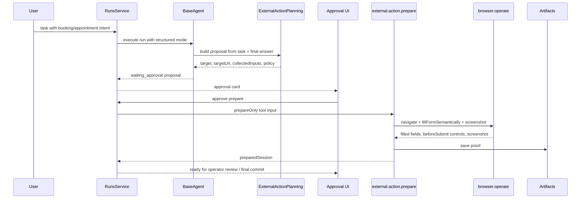

# P0 External-Action Prepare For Real Booking Widgets

Status: active.
Created: 2026-06-24.
Owner: current coding agent.

## Problem

External-action tasks must be understandable and safe for users: the agent should find or
use the chosen provider, prepare the form without final submit, show exactly what was
filled, capture proof, and stop at approval/commit boundaries. Recent live tests showed
that the core flow exists, but brittle planning and preparation details made the user
experience confusing:

- research `sourceUrls` could override the selected `preparation.targetUrl`;
- markdown headings like `Status`, `Form data`, or submit button labels could become the
  proposal target;
- semantic browser preparation received verbose safety instructions in its `goal`, which
  the browser tool could treat as field content;
- the approval card did not always make clear what was already prepared versus what still
  needs operator input;
- simple explicit fixture actions could still spend too many LLM steps before reaching
  `waiting_approval`.

## Business Outcome

The user can say, in normal language, “prepare this booking/appointment form, do not
send it yet” and get one clear proposal:

- where the action will happen;
- which data will be filled;
- what proof was captured after approval preparation;
- which final submit/control was detected;
- what still blocks final submit, if anything.

The platform must never submit the final external action before the selected policy
allows it.

## Behavior Spec

1. Explicit provider/action URLs from the user or final answer are authoritative for
   preparation. Source/research URLs are fallback only.
2. Proposal `target` must be a provider/place/system, not a status line, form heading,
   JSON payload heading, filled-field label, submit button, or safety text.
3. Semantic browser fill receives only a compact intent such as `appointment` or
   `reservation`; safety semantics are carried by structured flags:
   `submit:false`, `prepareOnly:true`, `allowContinue:true`, and commit-boundary policy.
4. Approval mode:
   - initial run stops at `waiting_approval`;
   - approval prepares the form and captures proof;
   - final external submit remains a separate commit action.
5. Automode:
   - may prepare and commit only when policy, inputs, executor, confirmation contract,
     and proof are sufficient;
   - otherwise it must degrade to a clear blocker/proposal instead of pretending success.
6. Failed diagnostic artifacts can stay in Agentic UI, but only usable proof artifacts
   should be returned as successful prepared-session proof.

## Current Implementation Notes

Implemented during 2026-06-24 manual testing:

- `browser.operate` wrapper exposes `form-fill` and `browser-safe-advance`;
- `external.action.prepare` uses semantic `fillFormSemantically` when available;
- semantic fill splits contact into `name`, `email`, `phone`;
- semantic fill goal is now just the action type;
- `preparation.targetUrl` wins over ranked research sources;
- target extraction rejects known non-target headings/fields/buttons.
- explicit prepare-only action URLs can now use a deterministic BaseAgent fast path:
  build the approval proposal directly from task text, emit
  `external-action-fast-path-selected`, and stop at `waiting_approval` without LLM/tool
  probing.

Manual smokes:

- `run_1782325936578_7hnvej2h`: initially misclassified explicit local appointment as
  direct/current task; fixed by preparation-intent detection.
- `run_1782328992857_f4j7lnef`: reached `waiting_approval` with correct explicit
  `targetUrl`, then approval prepared the local form, filled Name/Date/Time/Email/Notes,
  detected `Confirm reservation`, and saved proof artifact
  `artifact_1782329054625_jsu6vtpu`.
- `run_1782329227878_8ghhknaf`: verified correct preparation URL and approval
  preparation, but exposed submit-button target noise; covered by regression tests.
- `run_1782331268320_hyen5hhw`: latest clean local fixture anchor. The initial run
  reached `waiting_approval` in about 28 seconds. Approval auto-advanced into
  preparation, filled Name/Date/Time/Email/Notes through semantic `browser.operate`,
  detected `Confirm reservation`, saved proof artifact
  `artifact_1782331348656_mfhi3tz1`, attached the existing `external.action.commit`,
  and still stopped before final submit. Metrics after approval: 3 LLM calls, 2 tool
  calls, 1 artifact, 22,786 provider tokens. One non-critical failed `http.request`
  remains as evidence that explicit prepare-URL tasks should avoid the general source
  probing path.
- `run_1782332823871_2fh9uzh1`: deterministic explicit-URL fast-path anchor. The run
  reached `waiting_approval` in about 1 second with 0 LLM calls, 0 tool calls, and 0
  failed tools. It normalized `стрижка в пятницу после 17:00` to
  `2026-06-26 after 17:00`, then approval auto-prepared the local form, filled
  Name/Date/Time/Email/Notes through semantic `browser.operate`, detected
  `Confirm reservation`, saved proof artifact `artifact_1782332854998_l15vr3q0`, attached
  `external.action.commit`, and still stopped before final submit.

Known remaining gaps:

- provider target can still be absent/generic when the user supplies only a raw form URL;
- date previews can be over-redacted as secret-like strings, e.g. `**2*-0*-26`;
- real provider pages may still need provider-specific discovery/fallback when the
  supplied URL is a landing/listing page instead of a form URL;
- real booking widgets need more live coverage: Booksy-like multi-step forms, restaurant
  widgets, CAPTCHA/verification, login walls, and missing provider fields.

## Architecture

## Acceptance Criteria

- Focused tests cover:
  - explicit `preparation.targetUrl` priority over `sourceUrls`;
  - prepare-only safety wording with explicit URL;
  - semantic fill command shape and contact split;
  - semantic fill reports -> filled fields and commit candidates;
  - non-target headings/buttons/status labels do not become targets.
- Manual fixture run:
  - reaches `waiting_approval`;
  - approval completes preparation;
  - prepared session has proof artifact id;
  - prepared session has at least one commit candidate;
  - final submit is not executed during preparation.
- Manual real-provider run:
  - either prepares to a real pre-submit boundary with proof, or reports a precise
    structured blocker such as login, CAPTCHA, SMS/email verification, unavailable slot,
    or missing provider field.

## Decomposition

1. Finish fixture prepare correctness and regression coverage. Done for the local
   appointment fixture.
2. Add deterministic shortcut for explicit local/external-action URLs to reduce the
   unnecessary general LLM loop and avoid source probing when the task already supplies
   the action URL. Done for explicit prepare-only URL tasks.
3. Fix secret redaction for benign dates/times in prepared field previews.
4. Improve approval UI language: proposal, prepared draft, blocker, proof, and final
   submit must be one clear state machine.
5. Run a matrix of real booking widgets:
   - simple local fixture;
   - Booksy-style appointment;
   - restaurant reservation widget;
   - provider requiring email/SMS verification;
   - provider with CAPTCHA/security wall.
6. Only after prepare is stable, test commit on safe fixture and then real providers with
   explicit operator approval.
