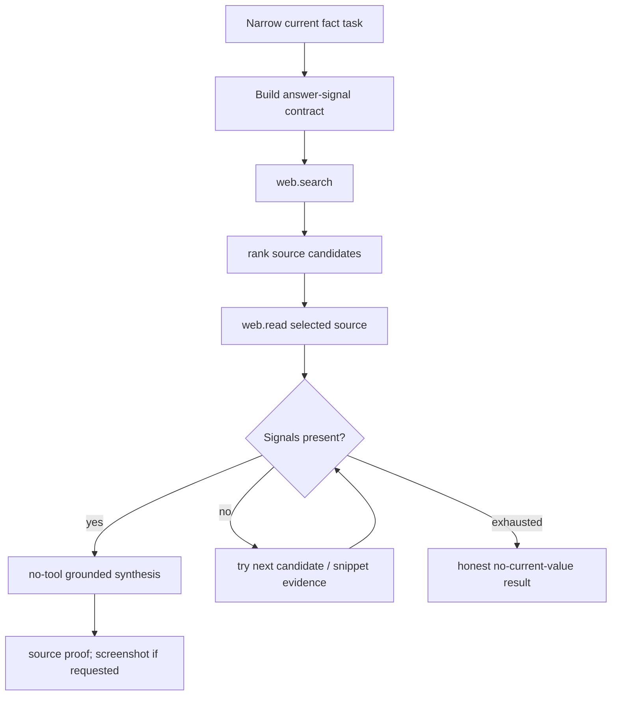

# P0 Current-Fact Answer Signal Fallback

Status: active.
Created: 2026-06-24.

## Problem

Narrow current-fact tasks should be fast and correct. A live smoke on
`run_1782325936513_t9kpao4m` completed in roughly 22 seconds, but returned a weak Bitcoin
price answer because the selected source/read path did not expose a clean numeric answer
signal. The fast path needs to detect that condition and fallback to another source or
structured evidence before synthesis.

## Business Outcome

For tasks such as “current BTC price”, “weather now”, “latest exchange rate”, or a
specific live API fact, the user should receive:

- the current value;
- timestamp/source;
- link or structured proof;
- optional screenshot only when requested or useful.

The runtime should not hallucinate or synthesize from an empty/weak read.

## Behavior Spec

1. The current-fact fast path must define expected answer signals from the task:
   numeric price, currency, entity symbol/name, date/time, unit, or known field.
2. After `web.read` or selected search evidence, validate that at least one answer signal
   is present before final synthesis.
3. If the selected source lacks the signal:
   - try the next ranked proof-worthy source;
   - or use standalone search evidence only when it contains the signal and source URL;
   - or fall back to `http.request` when the task names an API/JSON endpoint.
4. If no signal is found, return an honest failure with source attempts and next action,
   not a guessed answer.
5. Screenshot proof must be secondary to source correctness; failed screenshot QA must
   not erase a valid source-grounded answer.

## Architecture

## Acceptance Criteria

- Unit tests cover:
  - selected source without expected numeric signal triggers next-source fallback;
  - snippet evidence with source URL and expected signal can be used when read is blocked;
  - no signal produces an explicit no-answer result;
  - screenshot QA failure degrades to source proof.
- Manual smoke:
  - BTC/current price answer contains value, source, and timestamp/source note;
  - no irrelevant long research loop for narrow current fact;
  - no hallucinated value when all sources are weak.

## Decomposition

1. Add answer-signal extraction helper for current-fact frames.
2. Wire signal validation into `baseAgentCurrentFact`.
3. Add fallback candidate loop with bounded attempts.
4. Add focused tests with mocked search/read results.
5. Run live BTC/exchange-rate/weather smokes and record run ids in roadmap.
