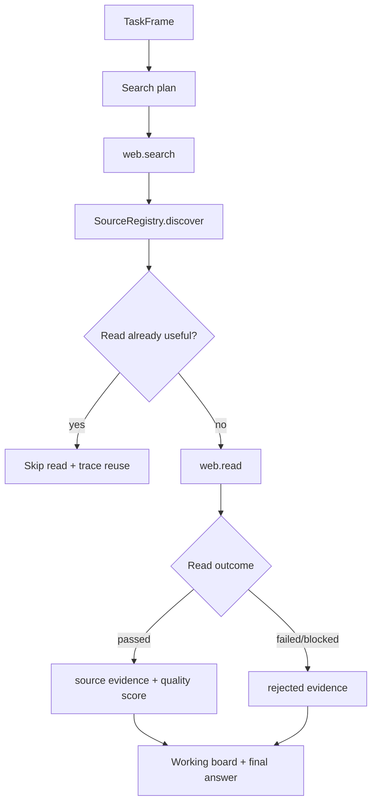

# P1 Source Acquisition, Search Discipline, And Source Cache

## Status

Status date: 2026-06-22.

- State: ready after task 05 is implemented.
- Priority: P1.
- Depends on: task 05 Working / Decision Ledger.
- Required process: follow `docs/development-convention.md`.

## 1. Idea And Measurable Increment

### Problem

Broad research runs can appear busy without being selective. They may search only in the
user's language, reread the same page, trust SEO listicles over primary sources, forget
blocked sources, or cite sources that were not the actual basis for the final answer.

### Measurable Increment

Add a run-scoped source acquisition layer that:

- respects explicit no-external-research instructions such as "без интернета" and keeps
  the run on reasoning/local evidence unless the user later asks to refresh externally;
- plans search queries by task mode and locale;
- uses mixed-language search for global research;
- normalizes source URLs;
- dedupes `web.read` attempts within a run;
- records failed/blocked sources as rejected evidence;
- ranks source quality by task-appropriate source type;
- feeds source decisions into the Working / Decision Ledger.

Measurement:

- broad global research runs include at least one user-language query and one English
  query unless explicitly local-language-only;
- no-internet / no-web tasks do not get over-framed as forced `product_selection`
  research contracts;
- repeated normalized URL reads are skipped or explained;
- final citations prefer read/verified sources when available;
- blocked sources appear as rejected evidence on the board.

### Non-Goals

- Do not implement proof artifact policy; task 07 owns that.
- Do not implement long-term source memory beyond existing Work/Evidence Ledger reuse.
- Do not create domain-specific source rules for one market/vendor/provider.

## 2. Use Cases, Weak Spots, Edge Cases

### Primary Happy Path

User asks for broad recommendation in Russian. The run creates a search plan with Russian
and English queries, searches, records discovered URLs, reads high-quality candidates,
rejects blocked/listicle/noisy sources when appropriate, and finalizes from verified
source records.

### Alternate Paths

- Local service search: include location and local-language terms.
- API/docs question: prioritize official docs and API reference pages.
- Product selection: prioritize manufacturer, retailer, review, benchmark, and pricing
  sources over generic roundups.
- Current fact: keep current-fact fast path narrow and avoid over-researching.
- Explicit no-internet comparison: allow structured reasoning and a board update without
  forcing web.search/web.read.

### Weak Spots

- Search diversification can increase latency if not bounded.
- URL normalization can accidentally merge distinct pages if too aggressive.
- Source scoring can become hidden hardcoding if rules are too domain-specific.
- Search snippets are useful leads but weak proof.

### Edge Cases

- Same article with tracking params/fragments.
- Same content served by mobile/AMP/canonical URLs.
- Search results in several languages.
- Pages blocked by Cloudflare/captcha/cookies.
- Source has good title/snippet but read fails.
- Local tasks where English search is worse than local-language search.

### Security / Privacy

- Do not persist secret-bearing query params.
- Redact tokens/keys from URLs before board/trace display.
- Do not fetch arbitrary private/local URLs unless allowed by existing tool policy.

## 3. Spec

### Functional Requirements

1. Extend task framing with source acquisition expectations.
2. Add a no-external-research flag to task framing and source planning.
3. Add a run-scoped `SourceRegistry`.
4. Normalize URLs before read attempts.
5. Record source discovery, read attempts, read status, quality hints, and rejection
   reasons.
6. Skip duplicate reads when an equal or richer source record already exists.
7. Avoid retrying blocked sources unless the strategy materially changes.
8. Produce search query plans:
   - global research: user language + English;
   - local providers: local language/location;
   - docs/API: official docs/reference focused queries.
9. Feed source records into task 05 board snapshots.
10. Keep current-fact fast path fast; do not require broad search plan for narrow direct
   current facts.

### Source Record Contract

```ts
type RunSourceRecord = {
  sourceId: string;
  normalizedUrl: string;
  originalUrls: string[];
  title?: string;
  sourceType:
    | "primary"
    | "official_docs"
    | "pricing"
    | "product"
    | "review"
    | "directory"
    | "roundup"
    | "social"
    | "unknown";
  language?: string;
  discoveredBy: Array<{ eventId: string; toolName: string; query?: string }>;
  readAttempts: Array<{
    eventId: string;
    status: "passed" | "failed" | "blocked" | "skipped_reuse";
    reason?: string;
    maxBytes?: number;
  }>;
  extractedTextPreview?: string;
  evidenceIds?: string[];
  qualityScore?: number;
  qualityReasons?: string[];
};
```

### Acceptance Criteria

- Broad global research emits mixed-language search plan.
- Explicit no-internet comparison emits no `web.search`/`web.read` calls and can still
  finish with a Working / Decision Board update.
- Duplicate `web.read` calls on the same normalized URL are skipped.
- Blocked sources are recorded and visible in board/trace.
- Final answer cites verified/read sources when available.
- Source scoring is generic and task-type based, not provider-specific.

## 4. Architecture

### Ownership

- `TaskFrame` owns search expectations.
- `SourceRegistry` owns run-scoped normalized source state.
- `BaseAgentToolExecution` consults the registry before `web.read`.
- Work/Evidence Ledger remains durable evidence store.
- Working / Decision Ledger renders source decisions to users/operators.

### Data Flow



### Durability

First slice can store source records as run events and board snapshots. Do not add a table
unless projection becomes too expensive.

### Observability

Required events:

- `source-search-plan-created`
- `source-discovered`
- `source-read-skipped`
- `source-read-recorded`
- `source-rejected`

Each event should include normalized URL, reason, source type, and source id.

## 5. Low-Level Technical Plan

Likely new files:

- `src/agents/sourceRegistry.ts`
- `src/agents/sourceQuality.ts`
- `src/agents/sourceSearchPlan.ts`

Likely touched files:

- `src/agents/taskFrame.ts`
- `src/agents/baseAgent.ts`
- `src/agents/baseAgentCurrentFact.ts`
- `src/agents/baseAgentToolExecution.ts`
- `src/agents/proofSourceUrls.ts`
- `src/tools/webSearchTool.ts`
- `src/tools/webReadTool.ts`
- task 05 board modules
- `web-react/src/routes/RunWorkspace.tsx`
- `web-react/src/routes/TraceLabRun.tsx`

Implementation details:

- Add pure `normalizeSourceUrl(url)` helper:
  - lowercase scheme/host;
  - remove fragments;
  - strip common tracking params;
  - normalize trailing slash;
  - preserve meaningful query params.
- Add generic source-type classifier from URL/title/snippet.
- Add `SearchQueryPlan` with language/location/reason/sourceType intent.
- Add pre-read hook for `web.read` calls.
- Add board integration: candidates/facts should reference source ids.

## 6. Test Plan

Unit tests:

- URL normalization and tracking param stripping;
- source type classification;
- multilingual search plan generation;
- duplicate read skip;
- blocked source rejection.

Integration tests:

- broad research emits mixed-language queries;
- repeated source read is deduped;
- blocked read appears as rejected evidence;
- current-fact path remains bounded.

Manual smoke:

1. Broad Russian business/product recommendation: confirm Russian + English search.
2. Laptop/product task: verify direct sources beat generic listicles.
3. Blocking page: verify rejection and fallback.
4. Trace/Run Workspace: verify source decisions are visible.

## 7. Decomposition

1. Add URL normalization and source quality helpers with tests.
2. Add search plan generation from `TaskFrame`.
3. Add run-scoped `SourceRegistry`.
4. Wire `web.search` discovery.
5. Wire `web.read` dedupe/rejection.
6. Feed source records into Working / Decision Ledger.
7. Adjust final source selection prompt/gates to prefer verified source records.
8. Add UI rendering for source decisions.
9. Verify with tests and manual broad/local smokes.

## 8. Completion Notes

Not started.
