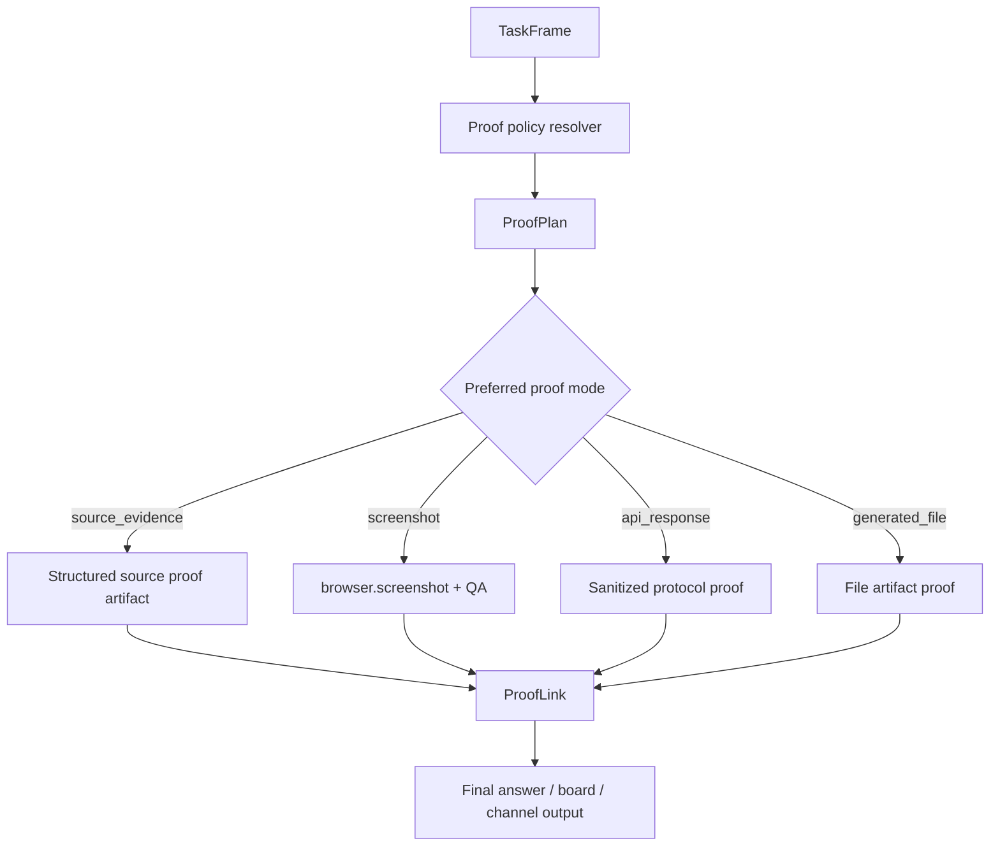

# P1 Proof Policy And Evidence Artifact Linking

## Status

Status date: 2026-06-22.

- State: ready after tasks 05 and 06.
- Priority: P1.
- Depends on: task 05 board, task 06 source records.
- Required process: follow `docs/development-convention.md`.

## 1. Idea And Measurable Increment

### Problem

The platform tries to prove answers, but proof is still too screenshot-centric and too
loosely linked to claims. Broad research can be forced into visual proof when structured
source evidence would be clearer. Screenshots can pass/fail because of cookies, captcha,
or focus text. Artifact galleries show files but do not always explain what each file
proves.

### Measurable Increment

Add a structured proof policy layer that:

- chooses proof modes by task frame;
- emits a proof plan before final answer;
- links proof artifacts/evidence to source/candidate/claim ids;
- filters failed proof artifacts from channel delivery;
- allows structured source proof for broad research;
- supports optional screenshot annotation when focus target is known.

Measurement:

- broad research can complete with structured source proof and no screenshot;
- current fact with explicit screenshot still captures focused visual proof;
- failed screenshot proof does not erase a good grounded answer;
- UI shows what each proof artifact proves.

### Non-Goals

- Do not redesign source acquisition; task 06 owns source quality.
- Do not redesign external action approval; external action proof remains in approval
  lifecycle.
- Do not require screenshots for every source-backed answer.

## 2. Use Cases, Weak Spots, Edge Cases

### Primary Happy Path

Broad product/business research selects final candidates. Runtime writes a structured
source-evidence artifact containing candidate ids, claim snippets, source urls, and
evidence ids. Final answer links to that proof and UI shows it near the candidates.

### Alternate Paths

- Current fact: source text/API proof is source of truth; screenshot is optional or
  explicit visual proof.
- API task: sanitized protocol/status/response-field proof.
- Local file/data task: generated file artifact is proof.
- External action: pre-submit/post-submit proof handled by proposal prepare/commit.

### Weak Spots

- Proof policy can become too permissive and allow unsupported claims.
- Structured proof can become unreadable if too verbose.
- Annotated screenshots must not modify originals silently.
- Channel delivery must not send failed diagnostic artifacts as successful proof.

### Edge Cases

- Proof artifact saved but artifact store unavailable later.
- Screenshot visual QA passes but semantic QA fails.
- Source evidence has no stable URL.
- Claim has multiple source records with conflicting values.
- User explicitly asks for screenshot proof and screenshot fails.

### Security / Privacy

- Sanitize API responses and external-action payloads.
- Do not expose raw secrets/contact values in proof.
- Failed proof diagnostics can be visible in UI but should not be pushed to channels by
  default.

## 3. Spec

### Functional Requirements

1. Add `ProofPlan` and `ProofLink` contracts.
2. Resolve proof policy from `TaskFrame.mode`.
3. Emit `proof-plan-created` before final answer where proof is relevant.
4. Save structured source proof artifacts for broad research/selection.
5. Link proof to claim/candidate/source/evidence ids.
6. Accept proof modes appropriate to task type in finalization gates.
7. Filter channel outbound artifacts by proof quality/status.
8. Optionally annotate screenshots when focus target is known.
9. Preserve degraded answers when screenshot proof fails but source proof is sufficient.

### Contracts

```ts
type ProofMode =
  | "source_evidence"
  | "screenshot"
  | "api_response"
  | "generated_file"
  | "external_action_pre_submit"
  | "external_action_post_submit";

type ProofPlan = {
  required: boolean;
  preferredModes: ProofMode[];
  acceptableModes: ProofMode[];
  reason: string;
  targetClaimIds?: string[];
  targetCandidateIds?: string[];
  sourceIds?: string[];
};

type ProofLink = {
  proofId: string;
  artifactId?: string;
  evidenceId?: string;
  sourceId?: string;
  claimId?: string;
  candidateId?: string;
  status: "passed" | "failed" | "blocked" | "partial";
  mode: ProofMode;
  summary: string;
};
```

### Acceptance Criteria

- Proof plan event exists for source-backed non-trivial runs.
- Broad research can pass with structured source proof.
- Explicit visual proof still uses screenshot and QA.
- Failed proof artifacts are not delivered as successful channel attachments.
- UI links proof to claims/candidates/sources where ids exist.

## 4. Architecture



Ownership:

- `TaskFrame` owns proof requirement signal.
- Proof resolver owns mode selection.
- Artifact store owns proof files.
- Work/Evidence Ledger owns raw evidence.
- Working / Decision Ledger displays proof status.
- Channel outbound delivery filters by proof link quality.

## 5. Low-Level Technical Plan

Likely new files:

- `src/agents/proofPolicy.ts`
- `src/agents/proofLinks.ts`
- `src/agents/sourceEvidenceProof.ts`

Likely touched files:

- `src/agents/baseAgentProof.ts`
- `src/agents/baseAgentFinalization.ts`
- `src/agents/baseAgentCurrentFact.ts`
- `src/agents/taskFrame.ts`
- `src/tools/browserScreenshotTool.ts`
- `src/server/modules/runs/run-outbound-event-recorder.ts`
- `web-react/src/components/ArtifactPreview.tsx`
- `web-react/src/routes/RunWorkspace.tsx`
- `web-react/src/routes/ConversationDetail.tsx`

Implementation details:

- Add pure `resolveProofPlan(taskFrame, board/source state)`.
- Add `saveSourceEvidenceProofArtifact`.
- Add `ProofLink` list to run result metadata or proof events.
- Add channel filter that excludes failed/blocked proof links.
- Add optional screenshot annotation metadata first; annotated image artifact can be a
  later slice if image mutation is risky.

## 6. Test Plan

Unit tests:

- proof plan per task mode;
- structured proof writer redacts and links ids;
- proof link status filtering;
- channel outbound excludes failed proof.

Integration tests:

- broad research completes with source proof;
- current fact screenshot proof remains accepted;
- screenshot failure degrades to source proof;
- external action proof remains proposal lifecycle-owned.

Manual smoke:

1. Broad recommendation with structured proof.
2. Bitcoin price with screenshot proof.
3. Blocked screenshot page with degraded source proof.
4. Telegram/channel output with failed proof present in UI but not sent.

## 7. Decomposition

1. Add proof contracts and resolver tests.
2. Add structured source proof artifact writer.
3. Wire proof plan events.
4. Update finalization gates by proof mode.
5. Add proof link rendering in UI.
6. Add channel artifact filtering.
7. Add screenshot annotation metadata.
8. Run full verification and manual smokes.

## 8. Completion Notes

Not started.
