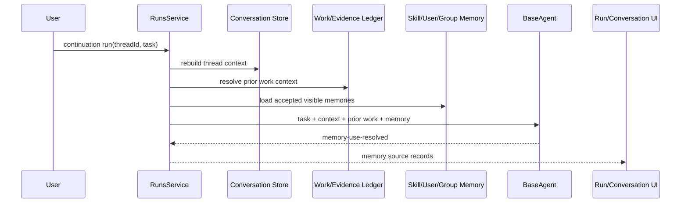

# P2 Conversation Memory, Prior Work, And Continuation Reliability

## Status

Status date: 2026-06-22.

- State: ready after tasks 05-07.
- Priority: P2.
- Depends on: task 05 board, task 06 source records, task 07 proof links.
- Required process: follow `docs/development-convention.md`.

## 1. Idea And Measurable Increment

### Problem

The platform has several memory layers, but users/operators cannot always tell which one
was used. Follow-up runs should reuse prior conversation facts, sources, artifacts, and
rejected attempts when appropriate. They should refresh only when freshness is required.

### Measurable Increment

Add explicit memory-source projection and harden continuation routing:

- each continuation run records which memory sources were available/used/ignored/stale;
- `thread_context_answer` remains no-tools for non-fresh prior-answer questions;
- fresh/current continuations reuse prior context only as context and reacquire data;
- UI shows memory source use in Run Workspace and Conversation detail.

Measurement:

- source/artifact follow-up can answer with zero tool calls when prior evidence is enough;
- fresh price/current follow-up reacquires data and explains why;
- restart/resume preserves thread context;
- UI shows memory source records.

### Non-Goals

- Do not build vector retrieval or new embedding memory in this task.
- Do not make every answer permanent memory.
- Do not add multi-agent shared memory yet.

## 2. Use Cases, Weak Spots, Edge Cases

### Primary Happy Path

User asks a broad recommendation, then asks "why did you not include MacBook?" in the
same thread. The agent sees prior answer/criteria/evidence, answers from thread context
plus maybe targeted lookup only if needed, and the UI shows the memory sources used.

### Alternate Paths

- "What source did you use?" should answer from Work/Evidence Ledger with zero new tools.
- "What is the price now?" should refresh current data.
- Restart/resume of a continuation run should keep thread context.
- User/profile/group facts should be visible as profile memory source when used.

### Weak Spots

- Thread summary can truncate newest answer.
- Old evidence can be stale but still look authoritative.
- Failed evidence must become retry exclusion, not truth.
- UI can confuse accepted memory with thread context if not labeled.

### Edge Cases

- Missing thread record.
- Prior artifact deleted.
- Prior source failed QA.
- Conflicting prior answers in same thread.
- User asks a new unrelated task inside same conversation.

### Security / Privacy

- Memory-source records should reference ids and safe summaries, not raw secrets.
- User/profile details must remain policy-filtered through existing memory/profile rules.

## 3. Spec

### Functional Requirements

1. Define `MemoryUseRecord`.
2. Emit `memory-use-resolved` after context/prior-work/memory resolution.
3. Attach memory-source summary to task 05 board snapshots.
4. Harden framing:
   - prior-answer/source/artifact questions -> `thread_context_answer`;
   - fresh/current questions -> fresh tool path with prior context only.
5. Preserve thread context in restart/resume/create-in-thread paths.
6. Render memory-source panel in Run Workspace and aggregate in Conversation detail.

### Contract

```ts
type MemoryUseRecord = {
  source:
    | "run"
    | "thread"
    | "work_ledger"
    | "evidence_ledger"
    | "accepted_memory"
    | "user_profile"
    | "group_profile";
  status: "used" | "available" | "ignored" | "stale" | "insufficient";
  reason: string;
  recordIds?: string[];
};
```

### Acceptance Criteria

- Non-fresh prior source/artifact follow-up uses prior evidence with no unnecessary tool.
- Fresh/current follow-up reacquires data.
- Restart/resume preserves thread context.
- UI shows memory sources.
- Failed/blocked prior evidence is exposed as retry exclusion.

## 4. Architecture



Ownership:

- `RunContextResolver` owns thread context rebuild.
- `RuntimePriorWork` owns prior ledger context.
- `MemoryContextView` owns accepted memory/profile projection.
- BaseAgent owns framing and memory-use event.
- UI renders memory source status.

## 5. Low-Level Technical Plan

Likely touched files:

- `src/server/modules/runs/runs.service.ts`
- `src/server/modules/runs/run-context-resolver.ts`
- `src/work-ledger/priorWorkResolver.ts`
- `src/work-ledger/runtimePriorWork.ts`
- `src/agents/baseAgentPriorWork.ts`
- `src/agents/baseAgentThreadContext.ts`
- `src/agents/memoryContext.ts`
- `src/agents/taskFrame.ts`
- task 05 board modules
- `web-react/src/routes/RunWorkspace.tsx`
- `web-react/src/routes/ConversationDetail.tsx`

Implementation details:

- Add pure conversion from resolved context to `MemoryUseRecord[]`.
- Emit `memory-use-resolved` event during context preparation.
- Add `memoryUse` field to board snapshot metadata.
- Add UI projection helper from run events.
- Add framing tests for prior-answer vs current/fresh continuation.

## 6. Test Plan

Unit tests:

- memory-use projection statuses;
- thread-context framing;
- fresh/current bypass;
- retry exclusions from failed evidence.

Integration tests:

- source follow-up zero tools;
- fresh follow-up reacquires;
- restart/resume thread context;
- UI DTO contains memory-use events.

Manual smoke:

1. Broad recommendation.
2. Ask "why that candidate?" and verify prior context.
3. Ask "what source did you use?" and verify zero new source lookup.
4. Ask current price in same thread and verify fresh lookup.
5. Restart/resume continuation and inspect memory-source panel.

## 7. Decomposition

1. Add `MemoryUseRecord` type and projection helpers.
2. Emit memory-use event after context resolution.
3. Wire to board snapshots.
4. Harden task framing.
5. Add UI rendering.
6. Add tests and manual smokes.

## 8. Completion Notes

Not started.
