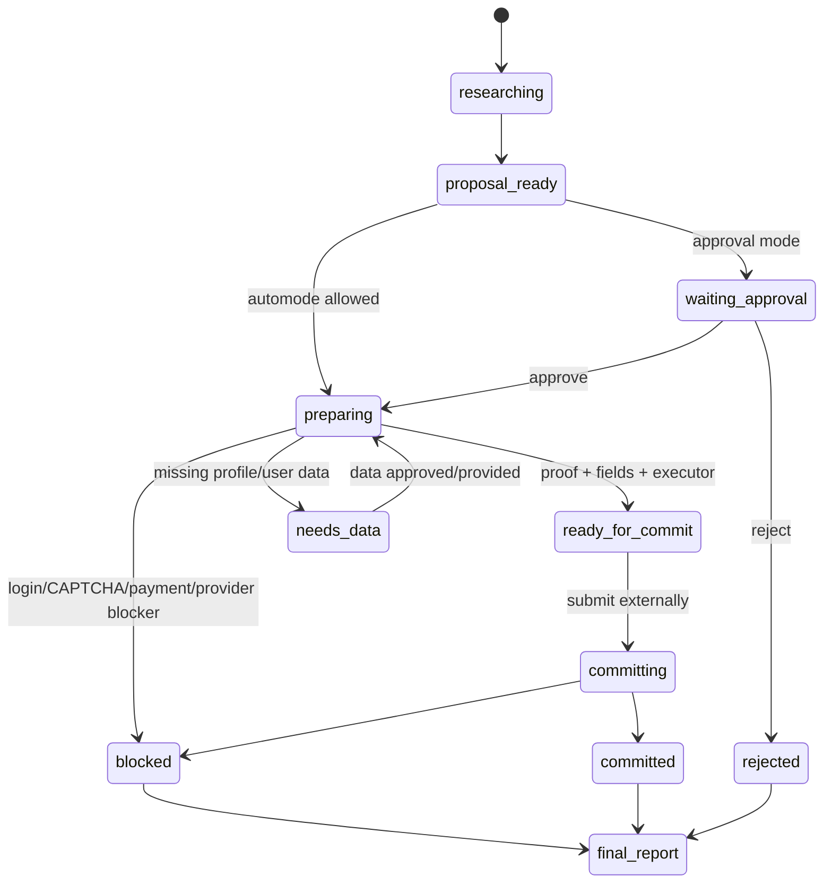

# P2 External Action UX And Real-Provider Flow

## Status

Status date: 2026-06-22.

- State: partially implemented; real-provider hardening remains open.
- Priority: P2.
- Depends on: task 05 board, task 07 proof links, existing approval/proposal runtime.
- Required process: follow `docs/development-convention.md`.

## 1. Idea And Measurable Increment

### Problem

External actions such as booking, form submission, outbound messages, and API writes are
the highest-risk part of the product. The current flow can prepare and commit a safe
fixture, but the user can still see internal states such as preparation, executor attach,
replay, commit readiness, and missing-data approval. That makes the product hard to test
and easy to misuse.

### Measurable Increment

Make external actions understandable and dependable for real providers:

- one user-facing proposal card per external action;
- clear separation between "prepare proof without external submit" and "submit
  externally now";
- one primary action at a time;
- explicit blocker taxonomy for login, CAPTCHA, payment, missing data, unavailable
  slot, unsupported widget, and provider failure;
- multi-candidate fallback before asking the user when a chosen provider blocks;
- final report for success, failure, or blocked state;
- channel output with only passed proof artifacts.

Measurement:

- safe fixture flow reaches proposal -> approval -> prepare proof -> commit -> final
  report;
- real-provider dry run either reaches ready-for-approval with proof or returns a clear
  non-submitting blocker;
- the user does not need to understand internal executor/replay controls for the happy
  path.

### Non-Goals

- Do not bypass login, CAPTCHA, payment, age, legal, or provider policy boundaries.
- Do not submit sensitive data without explicit authorization or automode policy.
- Do not add provider-specific Agentic code for one restaurant, barbershop, or booking
  platform.
- Do not redesign browser automation as part of this task unless required by the action
  boundary.

## 2. Use Cases, Weak Spots, Edge Cases

### Primary Happy Path

User asks: "Find a barbershop, fill the booking form with my details, show me what you
will submit, then submit after my approval."

The system:

1. researches and selects a provider;
2. creates an action proposal with target/action/data/submit boundary;
3. prepares the form without final submit;
4. captures pre-submit proof;
5. pauses for approval when mode is approval;
6. commits only after explicit final submit approval;
7. returns a final report with confirmation, submitted data summary, provider URL,
   location if known, cancellation/next-step info, and post-submit proof or blocker.

### Alternate Paths

- User asks only to find options: no approval proposal should be created.
- User asks to prepare but not submit: stop after pre-submit proof.
- Automode: commit only when policy, data sufficiency, proof, executor, and confirmation
  boundary are all satisfied.
- Channel flow: keep the same state machine but send compact user-safe messages.
- API write action: proof is structured request/response summary, not screenshot.

### Weak Spots

- A proposal can look approved while preparation is incomplete.
- Browser automation can fill hidden or wrong fields.
- A provider can show a login/CAPTCHA/payment step after earlier proof passed.
- User can get stuck between "approve", "prepare again", and "submit".
- Channel messages can accidentally send failed diagnostic artifacts.

### Edge Cases

- Provider changes DOM between prepare and commit.
- Slot is available during prepare but gone during commit.
- Multiple candidates are plausible and the first blocks.
- Required field is unknown or cannot be mapped from user profile.
- User rejects, then continues the thread with corrected details.
- Approval happens after stale proof timeout.
- Provider returns confirmation with no id.

### Security / Privacy

- Redact sensitive profile/contact fields in logs and traces where appropriate.
- Store exact submitted values only according to existing audit/privacy policy.
- Never include raw payment credentials, session cookies, or provider secrets in proof.

## 3. Spec

### Functional Requirements

1. Keep external actions on the existing proposal/preparation/commit lifecycle.
2. Add or complete a canonical user-facing action state projection.
3. Render one primary next action and collapse advanced controls.
4. Normalize proposal copy:
   - where;
   - action;
   - page/provider;
   - data to send;
   - missing data;
   - current proof;
   - final submit boundary.
5. Auto-advance approved approval-mode proposals through safe preparation/executor attach
   when no extra user decision is needed.
6. Stop before final external submit unless automode policy explicitly allows commit.
7. Classify blockers and expose the next user/system action.
8. Retry another candidate when the blocker is provider-specific and alternatives exist.
9. Always produce a final report when the run ends or blocks.
10. Filter failed/blocked proof artifacts from outbound channels by default.

### Action State Contract

```ts
type ExternalActionUserState =
  | "drafting"
  | "proposal_ready"
  | "preparing"
  | "needs_data"
  | "ready_for_approval"
  | "waiting_approval"
  | "approved"
  | "ready_for_commit"
  | "committing"
  | "committed"
  | "blocked"
  | "rejected";

type ExternalActionBlocker =
  | "login_required"
  | "captcha"
  | "payment_required"
  | "missing_data"
  | "slot_unavailable"
  | "ambiguous_target"
  | "unsupported_widget"
  | "provider_error"
  | "policy_blocked"
  | "proof_failed";

type ExternalActionCardView = {
  state: ExternalActionUserState;
  title: string;
  summary: string;
  targetName?: string;
  targetUrl?: string;
  action: string;
  safeDataSummary: string;
  missingFields: string[];
  blocker?: ExternalActionBlocker;
  proofArtifactIds: string[];
  primaryAction?: {
    label: string;
    effect:
      | "approve_and_prepare"
      | "prepare_only"
      | "submit_externally"
      | "reject"
      | "provide_data"
      | "none";
  };
  finalSubmitBoundary: string;
};
```

### Acceptance Criteria

- Fixture flow completes through commit with one understandable card and passed proof.
- Real-provider dry run never silently submits.
- Approval mode does not require several unexplained button presses on the happy path.
- Blocked runs explain provider, blocker, attempted data, and next action.
- Final report exists for committed, rejected, and blocked outcomes.
- Failed proof artifacts remain visible in UI diagnostics but are not sent as successful
  channel proof.

## 4. Architecture



### Ownership Boundaries

- Agent chooses target and proposes action.
- Approval service owns proposal state, readiness, approval, rejection, and commit.
- Browser tools own preparation and proof capture, but not policy decisions.
- Commit tool owns final provider submission through a guarded input contract.
- UI owns projection, not business-state derivation.

### Observability

Required events:

- `external-action-proposal-created`
- `external-action-card-projected`
- `external-action-preparation-started`
- `external-action-preparation-completed`
- `external-action-blocked`
- `external-action-approval-waiting`
- `external-action-approved`
- `external-action-commit-started`
- `external-action-committed`
- `external-action-final-report-created`

## 5. Low-Level Technical Plan

Likely touched files:

- `src/server/modules/runs/action-proposals.service.ts`
- `src/server/modules/runs/action-proposal-*.ts`
- `src/agents/externalActionPlanning.ts`
- `src/tools/browserOperateTool.ts`
- `src/tools/externalActionPrepareTool.ts`
- `src/tools/externalActionCommitTool.ts`
- `web-react/src/features/approvals/externalActionUxState.ts`
- `web-react/src/routes/Approvals.tsx`
- `web-react/src/routes/RunWorkspace.tsx`
- external action fixture tests.

Implementation notes:

- Keep `externalActionUxState` as the canonical React projection.
- Add backend DTO fields only when the UI cannot derive them safely.
- Store blocker kind and next-action hint on proposal/preparation records.
- Treat proof stale timeout as a readiness blocker.
- Keep the final submit boundary explicit in both backend and UI.
- Do not attach generated task-specific commit tools for normal actions; prefer
  `external.action.commit` when compatible.

## 6. Test Plan

Automated:

- state projection tests for each action state;
- approval -> auto-prepare -> ready-for-commit transition;
- final submit blocked without proof/readiness/approval;
- blocker classification tests;
- channel proof filtering tests;
- final report creation for committed, blocked, and rejected states.

Manual:

1. Run safe fixture booking from UI.
2. Approve proposal once.
3. Confirm form proof appears and final submit remains explicit.
4. Submit fixture and verify confirmation/final report.
5. Run a real-provider dry run with no submit authorization.
6. Confirm it either prepares safely or returns a blocker.
7. Inspect Run Workspace, Trace Lab, Approvals, artifacts, and channel output when used.

## 7. Decomposition

1. Spec-readiness pass over current approval/proposal state.
2. Add blocker taxonomy to backend records.
3. Add canonical final-report generation.
4. Simplify UI projection and button copy.
5. Add auto-advance guardrails for approval mode.
6. Add proof filtering for channel sends.
7. Add multi-candidate fallback for provider-specific blockers.
8. Add tests.
9. Run fixture and real-provider dry-run smoke.
10. Update docs and close task.

## 8. Completion Notes

Completed earlier on 2026-06-19:

- fixture approval and commit flow;
- one-primary-action UI projection;
- basic browser preparation compatibility;
- generic `external.action.commit` attachment;
- safe fixture final report.

Remaining work should harden real providers and reduce user-visible complexity, not add
new provider-specific branches.
