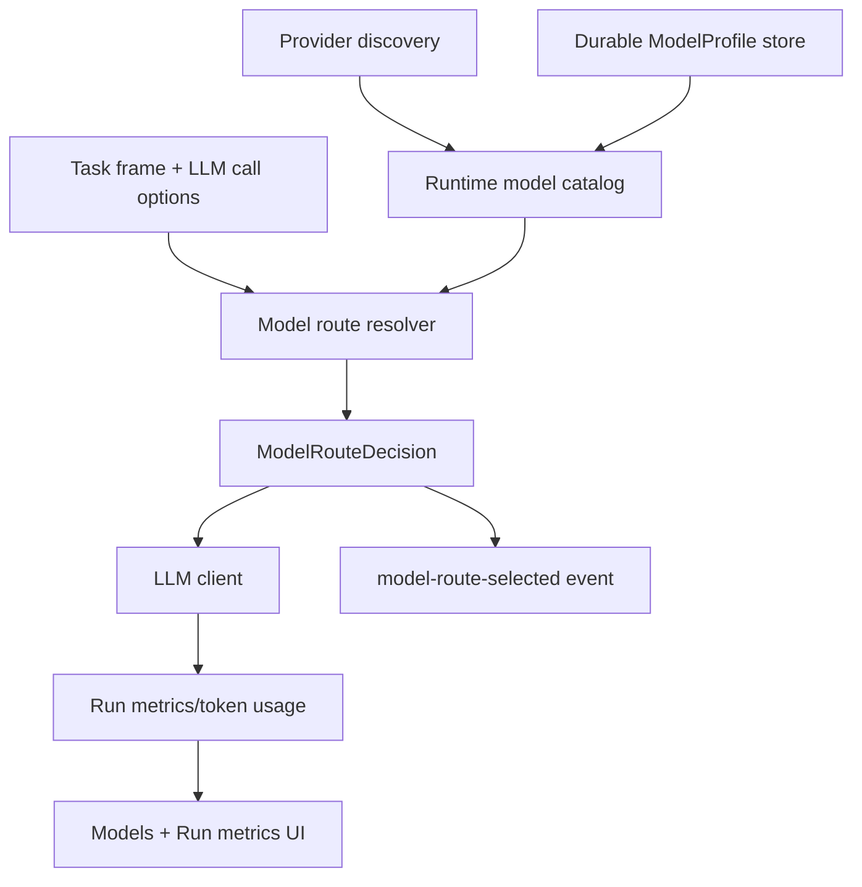

# P2 Model Routing, Capability Profiles, And Evaluation

## Status

Status date: 2026-06-22.

- State: partially implemented; durable profiles/probes/multimodal routing remain open.
- Priority: P2.
- Depends on: task 04 metrics, existing `model-route-selected` trace events.
- Required process: follow `docs/development-convention.md`.

## 1. Idea And Measurable Increment

### Problem

The product supports local and remote LLMs, but model choice is not yet a reliable
operator-controlled product feature. The user wants tier-based routing with capability
constraints:

- choose by S/M/L/XL tier;
- if a task requires vision, choose a model in that tier or fallback chain with vision;
- if a task requires coding/reasoning/tool-calling, use configured preferences;
- explain rejected candidates.

### Measurable Increment

Make model routing durable, capability-aware, and observable:

- durable editable `ModelProfile` records;
- automatic discovery plus operator overrides;
- capability probes for local/remote models where possible;
- tier + capability resolver;
- routing metrics and trace-visible rejected candidates;
- UI for operator preferences and probe results.

Measurement:

- vision-required tasks never route to non-vision models;
- simple S-tier calls use a small/fast configured model when available;
- BaseAgent loop defaults to M-tier or stronger rather than utility S-tier;
- Trace Lab shows selected model, reason, and rejected candidates;
- token/time metrics can be compared by route.

### Non-Goals

- Do not hardcode one local model as universal.
- Do not require every provider to expose perfect modality metadata.
- Do not send images/files to a model until a multimodal message contract and policy are
  in place.
- Do not build automatic model benchmarking beyond first useful probes in this task.

## 2. Use Cases, Weak Spots, Edge Cases

### Primary Happy Path

Operator loads Qwen and Gemma locally, marks capabilities, and sets tier preferences.
The runtime routes:

- cheap classification/ranking to S;
- normal agent loop to M;
- broad reasoning to L/XL when requested;
- image/screenshot analysis only to vision-capable candidates.

### Alternate Paths

- Remote provider added manually with API token.
- Local model discovered but capabilities unknown.
- Preferred model is unloaded/unreachable.
- Task asks for vision but only non-vision models exist.
- Model supports chat but not tool-calling.

### Weak Spots

- Capability inference from model names can be wrong.
- Probes can be slow or flaky.
- Operators may mark capabilities incorrectly.
- Route fallback can silently degrade quality if not traced.
- Token/time metrics can be provider-specific or missing.

### Edge Cases

- Same model served by multiple providers.
- Provider exposes OpenAI-compatible API but omits model metadata.
- Context window is lower than expected.
- Model outputs tool syntax incorrectly.
- Vision model accepts images but does not reason well over screenshots.

### Security / Privacy

- Store provider credentials as secret handles, not raw values.
- Do not route private images/files to remote providers unless policy allows it.
- Trace route decisions without exposing provider secrets.

## 3. Spec

### Functional Requirements

1. Maintain durable `ModelProvider` and `ModelProfile` records.
2. Merge discovered local models with durable operator profiles.
3. Support operator edits for tier, capabilities, preferred roles, notes, and disabled
   status.
4. Resolve model route by requested tier, required capabilities, preferred capabilities,
   cost/privacy constraints, and fallback policy.
5. Emit `model-route-selected` for every LLM call path.
6. Record selected model metrics from task 04.
7. Add capability probes for chat/tool-calling/vision/reasoning/coding where practical.
8. UI shows profile, capabilities, tier preferences, probe status, latency/token stats,
   and rejection reasons.
9. Existing env-based config remains fallback for local dev.

### Contracts

```ts
type ModelCapability =
  | "chat"
  | "tool_calling"
  | "vision"
  | "reasoning"
  | "coding"
  | "embedding"
  | "long_context";

type ModelProvider = {
  providerId: string;
  type: "lmstudio" | "openai_compatible" | "openai" | "custom";
  baseUrl?: string;
  authSecretHandle?: string;
  status: "available" | "unreachable" | "disabled";
};

type ModelProfile = {
  modelId: string;
  providerId: string;
  displayName: string;
  enabled: boolean;
  tierPreferences: Array<"S" | "M" | "L" | "XL">;
  capabilities: ModelCapability[];
  preferredRoles: Array<"classification" | "planning" | "coding" | "vision" | "synthesis">;
  contextWindow?: number;
  maxOutputTokens?: number;
  verifiedAt?: string;
  operatorNotes?: string;
};

type ModelRouteRequest = {
  tier: "S" | "M" | "L" | "XL";
  requiredCapabilities?: ModelCapability[];
  preferredCapabilities?: ModelCapability[];
  preferredRole?: string;
  allowRemote?: boolean;
};

type ModelRouteDecision = {
  selected: { providerId: string; modelId: string };
  reason: string;
  rejected: Array<{ providerId: string; modelId: string; reason: string }>;
  fallbackUsed: boolean;
};
```

### Acceptance Criteria

- Operator can persistently configure model capabilities.
- Resolver filters by capability inside tier before choosing fallback.
- Missing compatible model produces clear blocker or explicit fallback.
- Trace records selected and rejected candidates.
- Metrics UI can compare time/token cost by model route.
- Existing direct/current/local utility runs continue to work.

## 4. Architecture



### Ownership Boundaries

- Provider discovery reports what is loaded/reachable.
- Durable profile store owns operator truth.
- Resolver owns route decisions.
- LLM client executes selected route.
- BaseAgent/tooling passes requested tier/capabilities.
- UI edits profiles and displays decisions; it should not duplicate resolver logic.

## 5. Low-Level Technical Plan

Likely touched files:

- `src/settings/modelRouting.ts`
- `src/settings/modelProviderStore.ts`
- `src/settings/postgresModelProviderStore.ts`
- `src/server/modules/models/*`
- `src/llm/client.ts`
- `src/agents/baseAgent.ts`
- `src/agents/baseAgentCurrentFact.ts`
- `src/types.ts`
- `web-react/src/routes/Models.tsx`
- `web-react/src/api/types.ts`
- `docs/model-routing-roadmap.md`

Implementation notes:

- Keep existing route resolver and `model-route-selected` event as the base.
- Add persistence before adding more inference heuristics.
- Treat inferred capabilities as low confidence until verified or operator-confirmed.
- Add route-decision metrics to run-level summaries from task 04.
- Capability probes should be explicit operator-triggered actions, not hidden latency in
  normal runs.

## 6. Test Plan

Automated:

- model profile store tests;
- catalog merge tests;
- resolver tests for tier + vision/reasoning/coding/tool-calling;
- disabled/unreachable model tests;
- API DTO tests;
- trace event tests;
- metrics aggregation by model route.

Manual:

1. Start LM Studio with two local models.
2. Open Models UI and confirm discovery.
3. Mark one model vision-capable and another non-vision.
4. Run a simple direct task and inspect route.
5. Run a vision-required test after multimodal input is supported.
6. Inspect Trace Lab and metrics.
7. Restart backend and confirm profiles persist.

## 7. Decomposition

1. Review current routing implementation and gaps.
2. Add durable `ModelProvider`/`ModelProfile` schema and store.
3. Add API endpoints and DTO validation.
4. Merge discovery with persisted profiles.
5. Add Models UI profile editing.
6. Extend resolver with confidence and explicit rejection reasons.
7. Add probe commands and probe result persistence.
8. Add metrics by model route.
9. Add tests and manual smoke.
10. Update docs.

## 8. Progress

Completed on 2026-06-19:

- tier + capability-aware route resolver in `src/settings/modelRouting.ts`;
- resolver wired through `src/llm/client.ts`;
- `model-route-selected` trace events in BaseAgent and current-fact path;
- catalog responses decorated with inferred/operator capability metadata;
- Models UI capability badges and tier hints;
- unit coverage for capability parsing, routing, catalog DTOs, and trace wiring;
- manual smoke for direct and current BTC runs.

Still open:

- durable editable profiles;
- operator-verified capability editing;
- active probes;
- multimodal message contract;
- evaluation dashboard.
