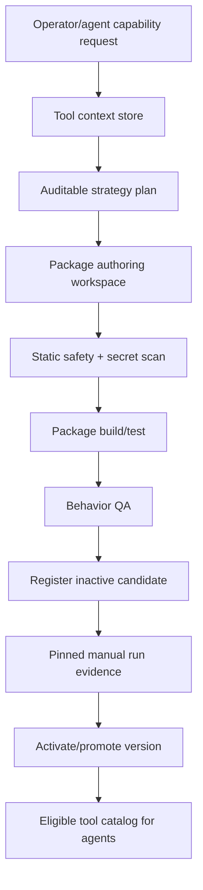

# P3 Tool Builder Redesign Around Portable Packages

## Status

Status date: 2026-06-22.

- State: frozen except critical baseline fixes; redesign required before expansion.
- Priority: P3.
- Depends on: stable core toolbelt, task 05 board, task 06 source discipline, task 07
  proof policy, task 12 hygiene.
- Required process: follow `docs/development-convention.md`.

## 1. Idea And Measurable Increment

### Problem

The old builder became too complex before the base runtime was stable. It mixed product
core, generated source, provider-specific behavior, QA, versioning, and service lifecycles
into a fragile path. The product still needs dynamic tools, but they must be built as
portable packages over the same contract as first-party core tools.

### Measurable Increment

Redesign Tool Creation V1 as a separate product layer:

- no generated code is written into tracked Agentic app source;
- every generated tool has a package manifest, schemas, runner, health, docs, QA
  evidence, version metadata, and optional service lifecycle;
- docs/files/URLs/credential handles are stored as editable tool context;
- builder decisions are traceable and reviewable;
- package QA blocks promotion;
- agent-requested creation remains disabled or heavily gated until manual flow is
  reliable.

Measurement:

- a public API-client tool can be built from docs/files and manually promoted;
- a credential-backed tool stores only secret handles;
- a failed QA candidate remains inactive and unavailable to agents;
- import/export of a source bundle preserves manifest/context/QA metadata.

### Non-Goals

- Do not revive deleted legacy builder/council/coordinator pipelines.
- Do not create task-specific one-off tools for ordinary user requests.
- Do not add domain-specific concepts to core contracts.
- Do not let agents silently create and globally activate tools during normal runs until
  the redesigned manual path is stable.

## 2. Use Cases, Weak Spots, Edge Cases

### Primary Happy Path

User provides API documentation, optional uploaded files, and an API key. Builder stores
context, creates a package-local API client, runs deterministic and behavior QA, registers
an inactive candidate, allows manual pinned run, and promotes only after evidence.

### Alternate Paths

- NPM wrapper: builder finds package and creates adapter.
- Browser automation package: builder wraps Playwright logic in isolated runtime.
- Always-on service: builder creates service contract with start/stop/health.
- Import existing source bundle and re-QA.
- Edit existing generated tool using previous context plus new request.

### Weak Spots

- LLM-authored packages can compile but miss the real capability.
- Docs can be ambiguous or stale.
- Live API examples can be flaky.
- Secrets can leak through traces/source/artifacts if intake is wrong.
- Agent-originated builder requests can explode a simple run.

### Edge Cases

- API requires OAuth/login not just static token.
- Docs have several environments/targets.
- Uploaded files conflict with docs URL.
- Existing active version should remain available while candidate is tested.
- Always-on service edit must restart supervisor only when promoted.
- Package QA depends on network but package itself is structurally valid.

### Security / Privacy

- Credentials are accepted only as secret handles.
- Generated package source must be scanned for raw secret values and unsafe paths.
- Tool runtime must not import Agentic internals.
- Callback/webhook secrets must be scoped to the tool and redacted in events.

## 3. Spec

### Functional Requirements

1. Define the portable tool package contract as the only builder target.
2. Keep generated package workspaces outside tracked app source or explicitly ignored.
3. Store tool context items separately from versions:
   - docs URLs;
   - uploaded text/files;
   - OpenAPI specs;
   - notes;
   - QA examples;
   - credential handles.
4. Builder lifecycle must emit trace stages:
   - intake;
   - context normalization;
   - strategy selection;
   - authoring;
   - safety review;
   - build/test;
   - behavior QA;
   - registration;
   - manual verification;
   - promotion/rejection.
5. Register candidates inactive by default.
6. Agents see only available/healthy/eligible versions.
7. Manual promotion requires evidence for the exact version.
8. Edits inherit active context unless explicitly removed.
9. Import/export supports portable source bundles.

### Package Contract

```ts
type ToolPackageManifest = {
  name: string;
  version: string;
  description: string;
  runtime: "http" | "stdio" | "service" | "oci";
  entrypoint: string;
  inputSchema: Record<string, unknown>;
  outputSchema: Record<string, unknown>;
  capabilities: string[];
  requiredSettings?: string[];
  requiredSecrets?: string[];
  artifacts?: Array<{ name: string; mimeTypes: string[] }>;
  health: { command?: string; endpoint?: string };
  integration?: {
    mode: "run-on-demand" | "always-on-service";
    inboundSchema?: Record<string, unknown>;
    outboundSchema?: Record<string, unknown>;
  };
};

type ToolBuilderLifecycleStage =
  | "intake"
  | "context_normalization"
  | "strategy_selection"
  | "authoring"
  | "safety_review"
  | "build_test"
  | "behavior_qa"
  | "registration"
  | "manual_verification"
  | "promotion";
```

### Acceptance Criteria

- Generated packages do not modify tracked Agentic app source.
- Secret values never appear in source, trace, artifact, or QA output.
- Candidate remains unavailable until QA and verification policy pass.
- Activation of rejected/failed candidate is blocked.
- Existing active version remains active while candidate is tested.
- Always-on service contracts require `startService()` or equivalent lifecycle.

## 4. Architecture



### Ownership Boundaries

- Builder owns package authoring and QA.
- Tool metadata store owns versions, status, activation, evidence.
- Tool registry owns loaded runtime availability.
- Agent runtime only consumes eligible catalog entries and may request missing
  capabilities once builder policy permits.
- UI owns context editing, candidate review, pinned runs, and promotion actions.

## 5. Low-Level Technical Plan

Likely touched files:

- `src/tools/toolBuilderAgent.ts`
- `src/tools/toolCreationV1*.ts`
- `src/tools/toolPackageRunner*.ts`
- `src/tools/toolIntegrationContract.ts`
- `src/tools/toolCatalog.ts`
- `src/server/modules/tools/*`
- `src/server/modules/runs/*` for agent-requested creation gates
- `web-react/src/routes/Tools.tsx`
- `docs/architecture/tool-build-council.md`
- new builder architecture docs if needed.

Implementation notes:

- First formalize contract and gates before changing authoring.
- Prefer package runner abstractions already used by core/generated tools.
- Separate deterministic QA failure from live-provider manual verification.
- Keep agent-originated creation disabled or constrained until manual builder exams pass.
- Builder events should be compatible with task 05 board and Trace Lab.

## 6. Test Plan

Automated:

- manifest validation tests;
- secret redaction/scanning tests;
- package source path guard tests;
- build/test/QA failure blocks promotion;
- inactive/disabled/rejected versions excluded from agent catalog;
- version activation requires exact evidence;
- context inheritance/edit/delete tests;
- import/export tests.

Manual:

1. Create a public API-client tool from docs.
2. Create a credential-backed API tool using secret handle.
3. Verify package source is outside tracked app source.
4. Run package QA.
5. Run pinned manual verification.
6. Promote and confirm agent catalog eligibility.
7. Roll back.
8. Export/import and re-QA.

## 7. Decomposition

1. Freeze and document current builder behavior.
2. Write formal package manifest validator.
3. Audit package workspace path and gitignore behavior.
4. Harden context/secret intake.
5. Refactor builder stages into explicit lifecycle records.
6. Rework QA policy and manual verification gates.
7. Rework UI candidate review/context editing around lifecycle.
8. Re-enable one safe manual create/edit flow.
9. Add tests and manual exams.
10. Decide when agent-originated missing-capability creation can return.

## 8. Completion Notes

The current generated-tool builder contains useful pieces but should not drive the next
product phase until core runs, source discipline, proof policy, and code hygiene are
stable. This task is intentionally P3.
