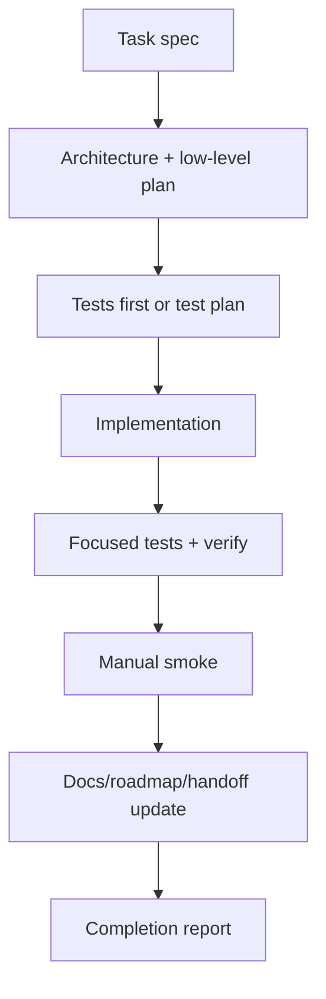

# Cross-Cutting Code Hygiene And Documentation Discipline

## Status

Status date: 2026-06-22.

- State: continuous gate for every task.
- Priority: cross-cutting.
- Depends on: active roadmap discipline.
- Required process: follow `docs/development-convention.md`.

## 1. Idea And Measurable Increment

### Problem

The product has gone through several rewrites, tool-builder experiments, external-action
iterations, and branch handoffs. Old code, stale docs, oversized files, and unclear
verification make every next feature slower and riskier.

### Measurable Increment

Every feature task must keep the repo understandable:

- active TypeScript/TSX files stay below the project line limit when touched;
- legacy paths are not restored;
- docs and roadmap reflect the implemented behavior;
- tests and manual smoke are recorded;
- generated tool source stays outside tracked app source unless deliberately promoted as
  first-party package;
- handoff docs are enough for a new AI agent to continue without this chat.

Measurement:

- `npm run verify` passes before completion unless explicitly reported otherwise;
- `git diff --check` passes;
- no touched source file grows past the agreed limit without a documented split plan;
- docs mention new architecture/events/contracts.

### Non-Goals

- Do not pause all feature work for a whole-repo cleanup unless the user explicitly asks.
- Do not refactor unrelated modules just because they are imperfect.
- Do not hide verification failures.

## 2. Use Cases, Weak Spots, Edge Cases

### Primary Happy Path

Developer picks a task, reads its spec, updates only needed modules, keeps files split,
adds tests, runs verify/manual smoke, updates docs, and leaves a clear status.

### Alternate Paths

- A touched file is already oversized: split the relevant responsibility first or as part
  of the task.
- A global verify failure exists before work: record baseline, run focused tests, and do
  not claim green verify.
- Manual UI smoke is impossible because dependencies are down: report exact blocker.
- A task reveals stale docs: update the docs in the same change.

### Weak Spots

- Splitting for line count can create worse architecture if done mechanically.
- Docs can become too verbose and stop being useful.
- Manual smoke can mutate local data; use fixtures where possible.
- Generated package workspaces can be confused with tracked app source.

### Edge Cases

- Old runs/tasks have event shapes that new UI must tolerate.
- Long docs may exceed normal reading comfort; use summaries and links but keep specs
  complete.
- A file slightly above limit may be acceptable only with an explicit temporary note.
- Tests requiring Docker/LM Studio may be unavailable.

## 3. Spec

### Functional Requirements

1. Use `docs/development-convention.md` before implementing a feature task.
2. Keep source files under the current practical limit:
   - target: 800 lines;
   - hard exception: only when explicitly justified in task/completion notes;
   - no new multi-thousand-line files.
3. Prefer responsibility-based modules over arbitrary line splitting.
4. Do not restore deleted legacy runtime paths:
   - `UniversalAgent` as active runtime;
   - old coordinator DAG;
   - recursive prototype;
   - legacy tool-builder queue/council as active path.
5. Keep these docs current when architecture changes:
   - `AGENTS.md`;
   - `docs/agent-handoff.md`;
   - `docs/current-architecture.md`;
   - `docs/roadmap-core-toolbelt.md`;
   - active file in `docs/tasks`.
6. Feature completion must state:
   - what changed;
   - practical user/system capability;
   - automated tests;
   - manual smoke;
   - known gaps.
7. Do not stage/commit unrelated dirty work unless explicitly requested.

### Hygiene Checklist Contract

```md
## Hygiene Checklist

- [ ] Touched boundaries identified.
- [ ] Oversized touched files reviewed.
- [ ] Tests added/updated.
- [ ] Focused tests run.
- [ ] `npm run verify` run or blocker recorded.
- [ ] Manual smoke run or blocker recorded.
- [ ] Docs updated.
- [ ] `git diff --check` run.
- [ ] `git status --short` reviewed for unrelated files.
```

### Acceptance Criteria

- The task can be handed to another agent using repo docs only.
- Verification status is explicit.
- No unrelated files are staged.
- UI/API behavior changed by the task is manually checked when feasible.
- Active roadmap remains consistent with task files.

## 4. Architecture

This is a process gate, not runtime architecture. It affects all layers:



## 5. Low-Level Technical Plan

Per feature:

- inspect `wc -l` for touched files;
- split only the responsibility being changed;
- add tests near existing patterns;
- update docs in same change;
- run `git diff --check`;
- run focused tests and `npm run verify`;
- manually test the user-facing path when possible.

Current known oversized/risky files to review when touched:

- `src/server/modules/runs/action-proposal-preparation-runner.ts`
- `tests/actionProposalPreparationRunner.test.ts`
- `src/server/modules/runs/runs.service.ts`
- `tests/nestApi.test.ts`

This list must be refreshed periodically rather than treated as exhaustive.

## 6. Test Plan

There is no single test suite for hygiene. Each task must include:

- focused automated tests for changed behavior;
- `npm run verify`;
- `git diff --check`;
- manual UI/API smoke when the feature is user-visible.

Suggested periodic audit:

```bash
find src web-react tests -type f \( -name '*.ts' -o -name '*.tsx' \) \
  -not -path '*/node_modules/*' \
  -exec wc -l {} + | sort -nr | head -30
```

## 7. Decomposition

For each future feature:

1. Read active task file.
2. Perform readiness/spec pass.
3. Identify touched modules and line-count risks.
4. Add/update tests.
5. Implement.
6. Run tests and manual smoke.
7. Update docs.
8. Report verification and remaining gaps.

## 8. Completion Notes

This task is never "done" as a product feature. It is the quality bar for all future
tasks.
