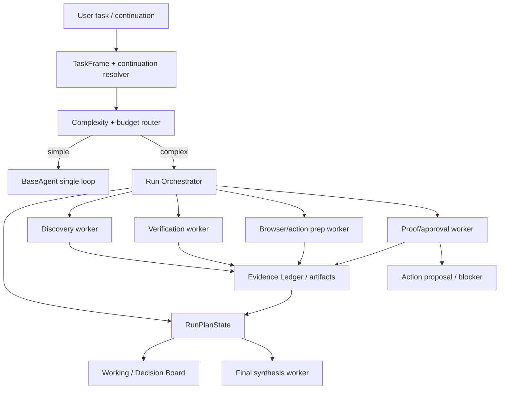

# P2 Context-Budgeted Run Decomposition

## Status

Status date: 2026-06-24.

- State: proposed from live regression analysis; not implemented.
- Priority: P2.
- Trigger: `thread_1782238426343_bla80wwj`, where a booking continuation first failed
  from output truncation, then completed after a restart but consumed a large context and
  skipped the external-action approval lifecycle.
- Depends on: working decision ledger, source/search discipline, proof policy,
  conversation continuation, action mode semantics, and model routing.
- Required process: follow `docs/development-convention.md`.

## 1. Idea And Measurable Increment

### Problem

Long research/action runs currently rely on one large BaseAgent loop that repeatedly sees
conversation summaries, tool traces, search results, browser screenshots, repair prompts,
proof gates, and final-answer drafts. This creates several product failures:

- the model can hit output/context limits before producing a valid final answer;
- repair loops replay too much irrelevant history;
- action-preparation runs can spend many turns on research/browser work and still finish
  as a normal answer instead of a proposal;
- Working / Decision Board may show phases, but the run lacks a compact durable
  orchestrator state that every worker can reuse;
- broad tasks accumulate token cost without clear handoff boundaries.

### Measurable Increment

Introduce a context-budgeted orchestration layer for complex runs:

- a parent orchestrator owns a compact `RunPlanState`;
- bounded worker calls handle discovery, source verification, browser preparation,
  proof/approval readiness, and final synthesis;
- raw tool payloads and screenshots are stored as artifacts/evidence records, while the
  model sees compact evidence summaries;
- repair turns replay only compact state plus the failing gate;
- external-action continuation runs preserve action intent and cannot silently downgrade
  into product-selection research.

Measurement:

- the barber booking continuation regression no longer truncates and either creates an
  approval proposal or records a precise external-action blocker;
- broad runs keep prompt size within configured budgets;
- trace shows parent/worker boundaries and token usage per worker;
- final answer quality is based on evidence ledger summaries, not repeated raw dumps.

### Non-Goals

- Do not build arbitrary recursive agents.
- Do not replace every BaseAgent task with workers.
- Do not add provider-specific booking logic.
- Do not hide reasoning or proof in an opaque worker result.
- Do not remove the existing trace/event model.

## 2. Use Cases, Weak Spots, Edge Cases

### Primary Happy Path

User asks Agentic to find a provider, prepare a booking, and stop for approval. The parent
run decomposes the work:

1. discovery worker finds candidates;
2. verification worker reads source/provider pages;
3. browser preparation worker opens the chosen booking page and records proof;
4. approval-readiness worker builds a proposal or blocker;
5. synthesis worker returns a concise status.

Each worker receives only the objective, constraints, selected evidence summaries, and
its own budget.

### Alternate Paths

- The provider requires login, CAPTCHA, SMS, or payment.
- The user provides contact details in a later continuation after the original booking
  request.
- A worker fails or returns low-confidence evidence.
- A repair gate fires after a partial final answer.
- The selected model has too small a context window for the whole trace.
- The task is simple enough to stay in the normal BaseAgent loop.

### Weak Spots

- Splitting too aggressively can lose task coherence.
- Worker summaries can omit details needed by a later worker.
- The orchestrator can become another hidden prompt if not persisted and traced.
- External-action policy must survive continuation messages that contain only data, such
  as phone/email/time.
- Evidence compression can accidentally remove source URLs or proof ids.

### Edge Cases

- Old thread summaries contain stale or misleading action intent.
- Several candidate providers have similar names.
- A worker emits a proposal-like summary for a research-only task.
- Repair turns happen after the worker result but before finalization.
- The user switches external action mode from approval to auto mid-thread.

### Security / Privacy

- Sensitive contact fields are carried in structured state with masked trace previews.
- Workers should receive raw sensitive values only when their role requires them.
- External action workers must preserve commit boundaries and approval notes.
- Evidence summaries must keep provenance without exposing secrets.

## 3. Spec

### Functional Requirements

1. Add a durable or reconstructable `RunPlanState` for complex runs.
2. Store compact state separately from raw tool payloads.
3. Route complex tasks to bounded workers only when task frame and budget policy justify
   it.
4. Preserve external-action intent across continuation messages when thread context shows
   an unresolved action and the new message supplies required data.
5. Worker outputs must include:
   - status;
   - evidence ids/artifact ids;
   - compact findings;
   - unresolved blockers;
   - recommended next state transition.
6. Parent orchestrator updates Working / Decision Board from `RunPlanState`, not only
   ad-hoc events.
7. Repair turns receive compact plan state plus the failing gate, not the whole trace.
8. Final synthesis uses evidence summaries and selected artifacts only.
9. Token/time metrics are recorded per worker and parent step.
10. External-action runs must finish in one of these explicit states:
    - proposal ready and `waiting_approval`;
    - automode committed with proof;
    - blocked with exact missing requirement;
    - research-only when no action intent exists.

### Acceptance Criteria

- `thread_1782238426343_bla80wwj` restart-style continuation with name/phone/email/time
  inherits booking intent and does not frame as generic `product_selection`.
- A large browser/research run stays below configured prompt budgets without truncation.
- Working / Decision Board shows current worker, draft status, and next action from
  compact state.
- Trace Lab shows parent and worker spans with token/time metrics.
- A failed worker can be retried without replaying the whole original trace.
- External-action approval/auto tests still pass after decomposition.
- Research-only automode does not create external-action proposals.

## 4. Architecture



### Ownership Boundaries

- `TaskFrame` decides whether the task is simple, research, or external-action
  continuation.
- The orchestrator owns `RunPlanState`, worker scheduling, and budget policy.
- Workers own narrow evidence-producing steps.
- Evidence Ledger and artifact store own raw outputs.
- Working / Decision Board renders compact state.
- Action proposal service owns approval/commit lifecycle.

## 5. Low-Level Technical Plan

Likely touched files/modules:

- `src/agents/taskFrame.ts`
- `src/agents/baseAgent.ts`
- `src/agents/baseAgentTruncation.ts`
- `src/agents/workingDecisionLedger.ts`
- `src/agents/externalActionPlanning.ts`
- `src/agents/baseAgentPriorWork.ts`
- `src/work-ledger/*`
- `src/server/modules/runs/*`
- `src/types.ts`
- `web-react/src/features/run-workspace/WorkingDecisionBoard.tsx`
- `docs/tasks/09-p2-action-mode-semantics.md`

Potential new modules:

- `src/agents/runPlanState.ts`
- `src/agents/runDecompositionRouter.ts`
- `src/agents/runWorkers/discoveryWorker.ts`
- `src/agents/runWorkers/sourceVerificationWorker.ts`
- `src/agents/runWorkers/browserPreparationWorker.ts`
- `src/agents/runWorkers/approvalReadinessWorker.ts`
- `src/agents/runWorkers/finalSynthesisWorker.ts`

Example state shape:

```ts
type RunPlanState = {
  runId: string;
  threadId?: string;
  objective: string;
  mode: "simple" | "research" | "external_action";
  externalActionIntent?: {
    actionType: ExternalActionType;
    mode: ExternalActionExecutionMode;
    inheritedFromThread: boolean;
    target?: string;
    requiredInputs: string[];
    collectedInputs: Array<{ label: string; maskedValue: string; source: string }>;
  };
  selectedCandidateIds: string[];
  evidenceIds: string[];
  artifactIds: string[];
  blockers: Array<{ code: string; message: string; nextAction: string }>;
  nextAction?: { description: string; expectedEvidence?: string };
  draftStatus: WorkingDecisionDraftStatus;
  budget: {
    maxPromptTokens: number;
    usedPromptTokens: number;
    maxWorkerCalls: number;
  };
};
```

Implementation notes:

- Start with complex external-action runs and broad product-selection runs only.
- Keep worker count bounded and explicit.
- Prefer deterministic evidence summaries over LLM summarization where possible.
- Add a continuation resolver that can classify "here are my details" as data for the
  unresolved prior external action.
- Keep `BaseAgent` fallback path unchanged for direct/local/simple tasks.

## 6. Test Plan

Automated:

- continuation resolver preserves booking intent when later message supplies contact and
  time data;
- research-only automode stays research-only;
- budget router sends simple tasks to BaseAgent and complex tasks to orchestrator;
- worker state updates produce Working / Decision Board snapshots;
- repair prompt construction excludes oversized raw traces;
- external-action proposal or blocker is produced for the barber booking continuation;
- token budget warnings fire before truncation.

Manual:

1. Replay `thread_1782238426343_bla80wwj` from the failed contact-data message.
2. Confirm the run does not frame as generic `product_selection`.
3. Confirm it produces an approval proposal or a precise provider blocker.
4. Approve a fixture proposal and verify continuation.
5. Switch to auto mode on a safe fixture and confirm commit or explicit blocker.
6. Inspect Trace Lab and Working / Decision Board for worker state and token metrics.

## 7. Decomposition

1. Add continuation resolver tests for unresolved external-action intent.
2. Add compact `RunPlanState` types and event projection.
3. Add budget router in observe-only mode.
4. Add bounded worker interfaces and a no-op orchestrator behind a flag.
5. Move external-action preparation path to orchestrator.
6. Move broad product-selection research path if step 5 is stable.
7. Add UI rendering for worker/plan state.
8. Update docs and regression anchors.

## 8. Completion Notes

Not started.
