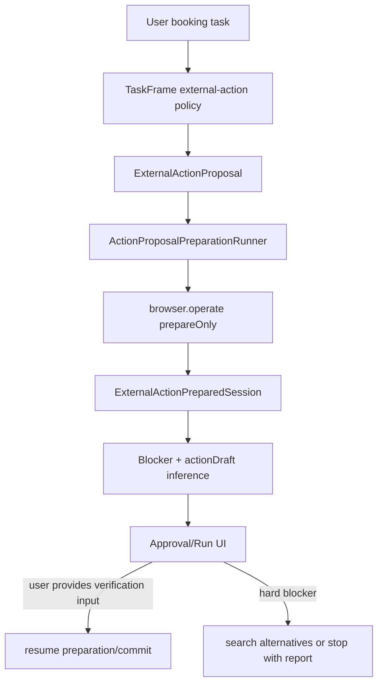

# P2 Resumable External Actions And Verification Handoff

## Status

Status date: 2026-06-24.

- State: spec-ready; implementation pending.
- Priority: P2, before broader model routing and generated provider executors.
- Trigger: real Booksy appointment investigation in `thread_1782238426343_bla80wwj`.
- Depends on: task 09 action-mode semantics and completed external-action UX baseline.
- Required process: follows `docs/development-convention.md`.

## 1. Idea And Measurable Increment

### Problem

The assistant can research and sometimes prepare external provider pages, but real
booking/sign-up flows often stop at provider-specific verification boundaries: SMS code,
email code, CAPTCHA, login, payment, or a provider widget that needs a generated executor.

Observed Booksy case:

- provider page, service, date, and time could be selected;
- disposable email could be created and entered;
- provider then showed account creation fields and required phone/SMS verification;
- the system should have preserved the prepared session and asked for exactly that
  verification input;
- instead, the useful behavior still depended on a human/operator understanding the
  provider flow from raw traces.

### Outcome

External actions become resumable state machines:

```text
intent -> proposal -> preparation/proof -> exact blocker/input request -> resume -> commit/proof
```

The assistant should not return instructions for the user to book manually when it can
still prepare, preserve proof, and wait for one specific human/provider boundary.

### Non-Goals

- Do not bypass CAPTCHA, SMS, payment, provider fraud checks, or login boundaries.
- Do not hardcode Booksy as a special provider in the core contract.
- Do not implement provider-specific final submit tools in this task.
- Do not revive broad unbounded browser loops.
- Do not store real phone numbers, SMS codes, passwords, or disposable-email tokens in
  unredacted traces.

## 2. Use Cases, Weak Spots, Edge Cases

### Happy Path

1. User asks the assistant to book an appointment.
2. Assistant finds a provider, chooses a slot, opens the booking flow, fills safe known
   fields, captures proof, and stops at a verification boundary.
3. UI shows a single next requirement: e.g. "phone/SMS verification required".
4. User provides the required value or chooses another provider.
5. Assistant resumes from the prepared session and commits only when all safety gates pass.

### Alternate Paths

- Provider requires login before slot selection: classify as `login_required`.
- Provider requires SMS after a disposable email sign-up: classify as
  `verification_required`.
- Provider requires a card/deposit: classify as `payment_required`.
- Provider slot disappears after preparation: classify as `slot_unavailable` and search
  alternatives.
- Browser tool captures a proof screenshot but cannot detect a submit control: keep proof
  and classify missing concrete submit/control, not generic provider failure.
- User approves automode but the task lacks phone/SMS data: automode must pause with the
  same verification blocker instead of inventing data.

### Security And Privacy

- Verification codes, passwords, payment data, and real phone numbers require explicit
  user input/approval.
- Disposable email is acceptable only as a preparation strategy when the provider does not
  require identity-sensitive or account-recovery data, and the created mailbox/token must
  be redacted from normal user-visible traces.
- The audit log must retain proof artifact ids, blocker type, provider URL, and redacted
  data preview.

## 3. Spec

### Functional Requirements

1. External-action blocker taxonomy includes `verification_required`.
2. Classifier maps SMS, OTP, one-time code, email confirmation code, and localized
   provider copy such as Spanish `código de confirmación` / `Número de teléfono` to that
   blocker before generic login/missing-data handling.
3. Prepared sessions infer verification boundaries from page text, form fields, and
   required field gaps.
4. Prepared session `actionDraft.missingBeforeCommit` includes a human-readable
   verification requirement when the provider needs phone/SMS verification.
5. UI copy explains that the action is resumable after the verification input is provided.
6. Auto mode must not cross verification boundaries automatically.
7. Approval mode should keep the proof artifact and prepared session visible.
8. Final reports for blocked actions should state the exact blocker and next action.
9. Unsupported content-type/API experiments are diagnostics only; they must not be shown
   as the user-facing solution.
10. Long external-action runs should decompose discovery, preparation, profile/input
    hydration, and commit into bounded steps so context does not balloon.

### Acceptance Criteria

- Booksy-like Spanish copy with `Número de teléfono` and `Enviaremos un código de
  confirmación` classifies as `verification_required`.
- A prepared session with phone/SMS fields is `needs_more_input`, not ready for submit.
- The next step asks for verification details or a supported verification route, not
  "book it yourself".
- Existing CAPTCHA/login/payment classifications still win for their respective flows.
- Automode fixture refuses to commit across verification boundary.
- Approval UI renders blocker title/copy for `verification_required`.

## 4. Architecture



### Ownership

- `TaskFrame` detects external-action intent.
- `ActionProposalPreparationRunner` owns browser/tool preparation and proof capture.
- `buildPreparedSession` owns page/form/session inference and action draft readiness.
- `classifyExternalActionBlocker` owns blocker taxonomy.
- `ActionProposalAuditRecorder` owns blocked/failed final reports.
- UI owns operator-facing explanation, not blocker inference.

## 5. Low-Level Technical Plan

Initial slice:

- Update `ExternalActionBlocker` with `verification_required`.
- Update blocker parsing/projection.
- Detect SMS/OTP/phone verification in blocker classifier.
- Infer prepared-session verification missing requirement from page text + form gaps.
- Add UI copy for verification blockers.
- Add tests for Booksy-like Spanish copy and prepared session readiness.

Next slices:

- Add a resumable input handoff model to prepared sessions:
  `requiredOperatorInputs[]` with type `phone`, `sms_code`, `email_code`, `captcha`,
  `payment`, `login`.
- Add conversation-visible continuation prompts that collect only the missing input.
- Add resume command that replays the prepared session and applies the supplied input.
- Add auto-mode guard tests for verification boundaries.
- Add context-budgeted external-action decomposition: discovery -> prepare -> hydrate ->
  commit/report.

## 6. Test Plan

Automated:

- `tests/actionProposalBlockers.test.ts`: localized SMS/verification classification.
- `tests/actionProposalPreparationRunner.test.ts`: prepared session surfaces
  verification blocker and remains not submit-ready.
- `tests/actionProposalCommitReadiness.test.ts`: commit rejects verification blockers.
- UI tests for approval copy once `verification_required` is exposed in queue items.

Manual:

- Run a fixture provider with SMS-like copy and verify approval UI shows a single precise
  requirement.
- Re-run Booksy-style flow and confirm final user answer says the assistant prepared slot
  proof and needs phone/SMS verification to continue.

## 7. Decomposition

1. Taxonomy/classifier/session-readiness slice.
2. UI copy and action card refinement.
3. Durable operator-input handoff.
4. Resume-from-prepared-session command path.
5. Automode guard and fixture smoke.
6. Context-budgeted decomposition for long external-action runs.

## 8. Completion Notes

First local slice:

- Added `verification_required` blocker type.
- Added localized phone/SMS classifier coverage.
- Added prepared-session verification warning and action draft missing gate.
- Added focused regression tests.

Second local slice:

- Added `ExternalActionRequiredOperatorInput` as durable prepared-session data.
- Prepared sessions now infer required operator inputs from proposal missing data,
  provider form gaps, provider verification copy, CAPTCHA/security text, and
  payment/deposit text.
- `actionDraft` mirrors required inputs for UI/backward-compatible consumers.
- Generic commit readiness blocks final external submit when structured operator inputs
  are still required, even if legacy blocker text is incomplete.
- Approval UI surfaces "Needed from operator" separately from generic preparation
  blockers.
