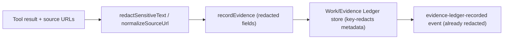

# P0 Runtime Safety Hardening: Ledger Redaction, Terminal Immutability, Freeze Posture

## Status

- Owner: Claude (collaborating with Codex via this queue).
- Status: spec ready, implementation in progress.
- Date: 2026-06-25.
- Branch: `claude/verify-green-and-toolcall-leak` (will integrate to `main`).
- Verification state: `npm run verify` must end green (currently green after the
  test:types fix; see Completion Notes for the two pre-implementation fixes already
  landed in this branch).
- Source: 2026-06-25 deep static + live audit of `main` (49fe49a). Findings independently
  reconfirmed against code before writing this spec.

## 1. Idea And Measurable Increment

### Problem (product/system gaps)

Four confirmed correctness/security gaps in the durable runtime boundary. None are
hypothetical; each was located at a concrete `file:line`:

1. **Secret leak into the durable Work/Evidence Ledger free-text.** Tool result content,
   summaries, and `sourceUrl(s)` are persisted verbatim (`src/agents/baseAgentToolLedger.ts`
   `recordEvidence` calls: `summary`, `contentPreview`, `sourceUrl`, `sourceUrls`). The
   ledger only key-redacts `metadata` (`src/work-ledger/sanitize.ts`), so a URL carrying
   `?api_key=...` or a tool `result.content` echoing a credential is written in cleartext
   and re-emitted in `evidence-ledger-recorded` events. A value-based text redactor
   (`redactSensitiveText`, `src/agents/workingDecisionBoardUpdate.ts:81`) and a URL
   normalizer (`normalizeSourceUrl`, `src/agents/sourceQuality.ts:32`) already exist but
   are not wired into this write path.

2. **Terminal-status mutability.** `PostgresRunStore.complete()` / `fail()` guard only
   `where status <> 'cancelled'` (`src/runs/postgresRunStore.ts:193-205`; mirrored in
   `src/runs/inMemoryRunStore.ts`). An already-`completed` or already-`failed` run can be
   silently overwritten by a late callback (e.g. an external-action completion path), so
   terminal results are not immutable. `waiting_approval -> completed/failed` must stay
   allowed (that is the deliberate resume path).

3. **Incomplete audit-metadata redaction.** `sanitizeObject` in
   `src/server/common/parsers.ts` (used for audit metadata) matches only
   `secret|token|password|apikey|api_key` — it misses `credential`, `authorization`,
   `auth`, and `cookie`. The richer ledger `isSecretKey` (`src/work-ledger/sanitize.ts`)
   already covers credential/authorization/auth but also misses `cookie`.

4. **Freeze posture is not enforced.** Agent-originated tool creation
   (`src/server/modules/runs/run-agent-runtime-helpers.ts` `createToolPackage({ source:
   "agent" })`) runs inside a normal run with **no feature flag**, contradicting task 11's
   "agent-originated creation stays disabled or heavily gated until the manual flow is
   reliable" freeze. Only manual promotion currently protects it.

### Measurable Increment

- No secret-shaped value survives into a persisted ledger row or `evidence-ledger-recorded`
  event free-text field; secret query params are stripped from persisted source URLs.
- A `complete()`/`fail()` call against an already-terminal run is a no-op; the original
  terminal result is preserved.
- Audit metadata and ledger metadata redact `cookie`, `authorization`, `credential`,
  `auth` keys in addition to the existing set.
- Agent-originated tool creation is gated behind an explicit opt-in env flag, default off;
  with the flag off the agent cannot create a tool package mid-run (it reports the missing
  capability instead).

### Non-Goals

- Not redesigning the ledger schema or the secret-handle architecture (both are sound).
- Not unfreezing or improving the tool builder (task 11).
- Not the `externalActionPlanning` regex/keyword refactor (separate P2 cleanup).
- Not changing the prepared-session value-restoration policy.

### Roadmap Fit

These are the audit's "immediate hardening pass" — cheap, high-leverage correctness/
security fixes that should land before the P0 external-action and P3 container work, so
that durable data and run lifecycle are trustworthy first.

## 2. Use Cases, Weak Spots, Edge Cases

### Primary paths

- A `web.read`/`http.request` run whose source URL contains `?api_key=...` completes; the
  persisted Evidence Ledger row and trace event show the URL with the secret param
  stripped and any `Bearer ...`/`token=...` in content previews redacted.
- An external-action run reaches `waiting_approval`, then commit completes it; this still
  works (`waiting_approval -> completed`). A second late `complete()` for an
  already-`completed` run changes nothing.

### Alternate paths

- A failed run later receives a stray `complete()` from a delayed callback: no-op, stays
  `failed`.
- A reused-evidence ledger write (`baseAgentToolLedger` reuse branch) is redacted on the
  same fields as the fresh-write branch.
- Audit metadata containing a key literally named `cookie` is redacted.
- With `AGENT_TOOL_CREATION` unset/disabled, a run that would have triggered agent tool
  creation instead records the capability as missing/unavailable and continues or stops
  cleanly; with the flag enabled, current behavior is preserved.

### Failure modes / edge cases

- Over-redaction: `redactSensitiveText` must not mangle normal prose (it targets
  `key: value` / `Bearer x` shapes only). URL normalization must not drop benign query
  params used for routing (`normalizeSourceUrl` already strips only credential-shaped
  params — verify its allowlist).
- Migration/old data: already-persisted unredacted rows are not rewritten (no backfill);
  the fix is forward-only. Document this.
- Concurrency: the terminal guard is a single SQL `WHERE` narrowing; no new race.

### Security / privacy

This task is itself the security increment. Redaction is defense-in-depth on top of the
secret-handle model (which already keeps raw secrets out of tool inputs).

### Observability

- `evidence-ledger-recorded` events carry the already-redacted fields.
- No new trace events required; existing events show redacted content.

### UX risk

- None user-facing. The agent-creation flag changes only an internal capability path; a
  run that needed agent-built tools reports a clear "capability not available" outcome.

## 3. Spec

### Functional requirements

1. **FR-1 Ledger free-text redaction.** Every `recordEvidence`/work-completion write in
   `src/agents/baseAgentToolLedger.ts` must pass `summary`, `contentPreview`,
   `outputSummary`, and `error`/limitation strings through `redactSensitiveText`, and pass
   `sourceUrl`/`sourceUrls` through `normalizeSourceUrl` (dropping credential query
   params) before persistence.
2. **FR-2 Terminal immutability.** `complete()` and `fail()` (Postgres + in-memory) mutate
   only runs whose status is in `('queued','running','waiting_approval')`. Already-terminal
   runs (`completed`,`failed`,`cancelled`) are immutable.
3. **FR-3 Audit/ledger key set.** `sanitizeObject` (parsers) and `isSecretKey`
   (work-ledger) both redact keys containing `cookie` in addition to their current sets;
   `sanitizeObject` is brought up to the full set (`credential`, `authorization`, `auth`,
   `cookie`).
4. **FR-4 Freeze flag.** Agent-originated `createToolPackage({ source: "agent" })` is
   reached only when an explicit env flag (`AGENT_TOOL_CREATION=enabled`) is set. Default:
   the agent cannot create tool packages mid-run; manual/operator creation
   (`source: "operator"`/UI) is unaffected.

### Acceptance criteria

- Given a tool result whose source URL is `https://api.example.com/x?api_key=SECRET`, the
  persisted evidence `sourceUrl` does not contain `SECRET`.
- Given a tool `result.content` containing `Authorization: Bearer abcdef123456...`, the
  persisted `contentPreview` shows `Bearer [redacted]`.
- Given a `completed` run, calling `fail()`/`complete()` again does not change its status,
  result, or error.
- Given audit metadata `{ cookie: "x", authorization: "y" }`, the persisted metadata shows
  both redacted.
- With `AGENT_TOOL_CREATION` unset, no run reaches `createToolPackage({ source: "agent" })`.

### Out of scope

- Backfilling/rewriting already-persisted rows.
- Any change to how secrets are resolved at execution time.

## 4. Architecture

### Module boundaries

- Ledger redaction lives at the **write boundary** in `baseAgentToolLedger.ts` (the agent
  runtime owns what it writes), reusing existing redactors. Do not push redaction into the
  store (stores stay dumb persisters); do not duplicate redactor logic.
- Terminal guard lives in the **store** (`postgresRunStore.ts`, `inMemoryRunStore.ts`) —
  it is a persistence invariant, enforced in one place.
- Key-set redaction stays in the two existing sanitizers; consolidate the secret-key list
  so both share the same predicate (export `isSecretKey` from work-ledger and reuse it in
  parsers, or mirror the list with a comment linking them).
- The freeze flag is read from env in `run-agent-runtime-helpers.ts` (or its options),
  consistent with the existing env-flag style (`BUILTIN_TOOLS`, `TOOL_OCI_RUNNER`).

### Data flow

### State ownership / durability

- No schema change. Forward-only redaction; old rows untouched.

### Failure / rollback

- Each of the four fixes is independently revertable. If `normalizeSourceUrl` proves too
  aggressive on a real run, it can be narrowed without touching the other three.

## 5. Low-Level Technical Plan

Affected files:

- `src/agents/baseAgentToolLedger.ts` — wrap free-text + URL fields in the existing
  redactors at every `recordEvidence`/completion write (fresh + reuse branches).
- `src/runs/postgresRunStore.ts` — `complete()`/`fail()` `WHERE status in
  ('queued','running','waiting_approval')`.
- `src/runs/inMemoryRunStore.ts` — mirror the guard (the `if (run.status !== ...)` checks).
- `src/work-ledger/sanitize.ts` — add `cookie` to `isSecretKey`.
- `src/server/common/parsers.ts` — bring `sanitizeObject` to the full key set (reuse
  `isSecretKey` or mirror it incl. `cookie`).
- `src/server/modules/runs/run-agent-runtime-helpers.ts` (and/or its options wiring in
  `runs.service.ts`) — gate `createToolPackage({ source: "agent" })` behind
  `process.env.AGENT_TOOL_CREATION === "enabled"`.
- `src/agents/sourceQuality.ts` — confirm/extend `normalizeSourceUrl` strips
  credential-shaped query params (`api_key`, `apikey`, `token`, `access_token`,
  `signature`, `sig`, `key`).

Env var: `AGENT_TOOL_CREATION` (`enabled` to opt in; default off). Document in `AGENTS.md`.

No new tables, endpoints, DTOs, or events.

## 6. Test Plan

Automated (add/extend):

- `tests/baseAgentToolLedger*.test.ts` (new or extend): evidence write with a secret in
  `sourceUrl` and in `content` -> persisted fields are redacted (fresh + reuse branches).
- `tests/runStore*.test.ts` (new `runStoreTerminalImmutability.test.ts`): `complete()` then
  `fail()` no-ops; `fail()` then `complete()` no-ops; `waiting_approval -> completed`
  still works. Cover both Postgres (via a fake pool or the in-memory store) and the
  in-memory store.
- `tests/parsers` / sanitizer test: `cookie`/`authorization`/`credential` keys redacted in
  `sanitizeObject` and `isSecretKey`.
- Agent-creation flag: a focused test that with the flag off the creation path is not
  reached (assert via the helper returning a "not available" outcome), with it on the path
  runs.

Manual smoke (durable stack):

- `POST /api/runs` with a task that reads `https://httpbin.org/get?api_key=SMOKE_SECRET`;
  confirm the Evidence Ledger row / `evidence-ledger-recorded` event shows the URL without
  `SMOKE_SECRET`.
- Drive a fixture external action to `completed`, then issue a second commit/complete and
  confirm the run stays `completed` unchanged.

## 7. Decomposition

1. FR-2 terminal immutability (Postgres + in-memory) + test. Validate: verify green.
2. FR-3 key-set consolidation (`cookie` + full set in parsers) + test.
3. FR-1 ledger free-text + URL redaction (wire existing redactors) + test. Validate green.
4. FR-4 agent-creation freeze flag + test + `AGENTS.md` note.
5. Full `npm run verify`; durable manual smokes; update handoff + this file's Completion
   Notes; remove from queue when merged.

Each step is independently committable and revertable.

## 8. Completion Notes

Pre-implementation fixes already landed on this branch (backfilled here per the
development-convention rule for critical/quality fixes patched before the spec):

- **Red `npm run verify` on committed `main` (49fe49a).** `test:types` failed with 3 type
  errors in `tests/actionProposalAutoAdvance.test.ts` (implicit-any `appendEvent` params;
  `string | undefined` passed to `RegExp.test`). Unit tests / typecheck / lint / build were
  green, so the failure was masked unless the full verify gate ran. Fixed.
- **Broad-research raw tool-call leak.** A live laptop-recommendation run shipped
  `<|tool_call>call:browser.screenshot{...}<tool_call|>` (gemma-4-26b pipe-token format) as
  its final answer and the return gate passed it. `containsRawToolCallSyntax`
  (`src/agents/baseAgentTrace.ts`) only matched `<tool_call>` (no pipe). Extended to catch
  `<|tool_call`, `tool_call|>`, `<|...|>` special tokens, and prose `call:tool.name{...}`.
  New `tests/rawToolCallSyntax.test.ts` (7 leak + 4 clean cases). `verify` 637/637.

Implementation of FR-1..FR-4 (2026-06-25, branch
`claude/verify-green-and-toolcall-leak`, `npm run verify` green at 644 tests):

- **FR-2 terminal immutability.** `complete()`/`fail()` (Postgres + in-memory) now mutate
  only `('queued','running','waiting_approval')`. Implementation discovered the
  external-action automode flow deliberately re-completes an already-completed run (appends
  "Automode external action result"), so a strict guard broke two fixture tests. Resolved
  by adding `RunStore.finalizeExternalActionResult(id, result)` — an explicit
  post-completion write that may overwrite a completed run but never a cancelled one — and
  routing `action-proposal-auto-mode.service.ts` and `external-action-run-completion.ts`
  through it. The normal agent completion (`runs.service.ts`) stays on the immutable
  `complete()`. Tests: `tests/runStoreTerminalImmutability.test.ts`.
- **FR-3 key set.** `cookie` added to `isSecretKey` (work-ledger) and `sanitizeObject`
  (parsers) brought to the full set (`credential`/`authorization`/`auth`/`cookie`). Tests:
  `tests/ledgerSecretRedaction.test.ts`.
- **FR-1 ledger redaction.** Free-text (`summary`/`contentPreview`/`outputSummary`/error/
  limitations) wrapped in `redactSensitiveText`; `sourceUrl(s)` through `normalizeSourceUrl`
  at every write in `baseAgentToolLedger.ts`. The manual smoke then exposed two write paths
  the unit test missed: (a) tool input URLs persisted in evidence `metadata.input` —
  `sanitizeArtifactValue` now strips credential query params from URL-shaped string values;
  (b) the durable `workKey` embedded the URL — `workKeyForToolCall` now strips credential
  query params before keying (keys by resource, not credential; deterministic so reuse
  matching is unchanged). Also fixed a latent bug in `redactSensitiveText` ("Authorization:
  Bearer X" left the token after the scheme word; the capture group `$1` was empty). Tests:
  `tests/ledgerSecretRedaction.test.ts`.
- **FR-4 freeze flag.** Agent-originated `createToolPackage({ source: "agent" })` gated
  behind `AGENT_TOOL_CREATION=enabled` (default off); reuse of an existing candidate is
  unaffected. Tests: `tests/agentToolCreationFreezeFlag.test.ts`. Documented in `AGENTS.md`.

Manual smoke (durable Postgres/MinIO stack, after restarting the API onto the new code —
the previously-running server predated these changes and showed the leak):
`run_1782402713421_77p4nypl` fetched
`https://jsonplaceholder.typicode.com/todos/2?api_key=SMOKESECRET98765`; the durable Work
Ledger (`workKey`, `sourceUrls`) and Evidence Ledger contain no `SMOKESECRET`, and the
answer was correct.

Follow-up (NOT in this task's scope; recommend a dedicated trace-redaction slice): the
secret URL still appears in non-ledger TRACE EVENTS — `agent-task-framed`,
`working-decision-*`, `tool-started`/`tool-completed` — because (a) the user's own task
text contained the URL and is echoed verbatim into framing/board snapshots, and (b) tool
event payloads echo tool input/output. The durable Work/Evidence Ledger (the audit's HIGH
finding) is clean; broad trace-event payload redaction is a larger separate surface.
