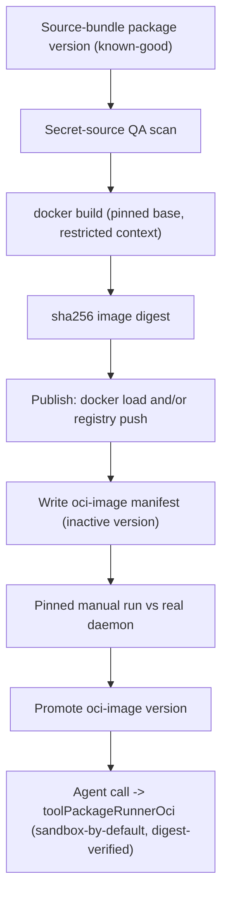

# P3 Container Produce Pipeline: Build, Publish, Secure-Run an OCI Tool Package

## Status

- Owner: unassigned (strategic; describe-first, implement after the P0/P2 queue).
- Status: spec only (no implementation yet). Companion to
  [`11-p3-tool-builder-redesign.md`](11-p3-tool-builder-redesign.md).
- Date: 2026-06-25.
- Priority: P3 (after the active P0 external-action + current-fact and the P2 resumable/
  decomposition tasks). This file exists so the container direction is visible and
  executable, not to reorder the queue.
- Source: 2026-06-25 audit, "Container / Tool-Builder readiness" — the consume side
  (OCI **run** runtime) is real; the produce side (build -> publish -> secure-run) does
  not exist.

## 1. Idea And Measurable Increment

### Problem

The product vision is "every tool is a container, and a builder creates any tool on
demand." Today the platform can **run** an OCI tool package
(`src/tools/toolPackageRunnerOci.ts` genuinely shells `docker run/port/stop`, waits on
`/health`, supports on-demand + always-on lifecycle, applies resource limits), and the
manifest validator already treats `oci-image` as first-class
(`src/tools/toolPackage.ts`). But the platform never **produces** a container:

- repo-wide there is no `docker build`/`buildx`/push;
- the generated Dockerfile (`src/tools/toolCreationV1PackageFiles.ts`) is written as a
  text file and never built;
- the creation pipeline only ever emits `source-bundle` (`toolPackageWorkspaceStore.ts`
  hardcodes the type; `toolPackageWorkspaceQa.ts` hard-rejects other types);
- the OCI runner is **off by default** (`TOOL_OCI_RUNNER === "enabled"`) and is **never
  integration-tested against a real daemon** (~22 assertions use a mock runtime).

This task does the smaller, safer half first: containerize a **known-good source-bundle
tool** end-to-end, with a default-restrictive sandbox, **without** unfreezing
LLM-authored tool creation (task 11). That sidesteps the largest risk surface (untrusted
LLM-authored code) while making the container path real.

### Measurable Increment

- A single existing source-bundle tool package can be **built into an OCI image**,
  **published** to a runtime-pullable location (local daemon load and/or a configured
  registry), promoted to an `oci-image` manifest version, and **run by the agent through
  `toolPackageRunnerOci` against a real Docker daemon** with the result indistinguishable
  from its source-bundle runtime.
- The container runs **sandbox-by-default**: no outbound network unless explicitly
  granted, read-only root FS, pids/memory caps — independent of operator `TOOL_OCI_*` env.
- One **integration smoke against a real daemon** exists (gated to environments where
  Docker is available), not only mock-runtime unit tests.

### Non-Goals

- Do not unfreeze agent-originated/LLM authoring (task 11 + task 15 FR-4 keep it gated).
- Do not build a multi-registry/registry-UI product; one configurable publish target.
- Do not containerize the in-process core toolbelt (they stay first-party).
- No Kubernetes/orchestration; single-host Docker is the target.

### Roadmap Fit

This is the "pursue containers via the runtime, not the builder" path from the audit:
prove build -> publish -> secure-run on trusted input first; only after it is solid does
task 11 reattach LLM authoring on top of it.

## 2. Use Cases, Weak Spots, Edge Cases

### Primary happy path

Operator selects an existing source-bundle tool version -> "Build container" -> the build
stage `docker build`s the package's generated Dockerfile -> tags with a content digest ->
loads into the local daemon (and/or pushes to the configured registry) -> writes an
`oci-image` manifest version (inactive) -> manual pinned run against the real daemon passes
QA -> promote -> agent can call the `oci-image` version through `toolPackageRunnerOci`.

### Alternate paths

- Registry publish vs local daemon load (both supported; config picks the target).
- Re-build of an existing tool produces a new digest-pinned version; the active version
  stays active until the new one is promoted.
- Always-on service tool: built image runs under the existing service supervisor lifecycle.
- Import an externally built `oci-image` manifest (already supported) and re-QA.

### Weak spots / failure modes

- Build failures (bad Dockerfile, missing base image, network) must fail the build stage
  with a readable error and leave no half-registered version.
- Daemon unavailable at run time -> clear capability-unavailable outcome, not a crash.
- Digest/tag drift: a pulled image whose digest differs from the manifest must be rejected.
- Resource exhaustion: a runaway container must be bounded by the default caps.

### Edge cases

- Air-gapped / no registry: local `docker load` path must work alone.
- Base image pinning: builds must use a pinned base (no floating `latest`).
- Large build context: respect a build context allowlist; never include host secrets.

### Security / privacy (the core of this task)

- **Default-deny sandbox** for every agent-invoked generated container: `--network none`
  (opt-in network only via manifest+operator grant), `--read-only` root FS with a tmpfs
  scratch, `--pids-limit`, `--memory`, `--cpus`, drop Linux capabilities, no host bind
  mounts, non-root user.
- **Raw-secret source scan** is a hard QA gate on the package source/Dockerfile before
  build (no inline tokens/keys); secrets reach the container only via secret-handle ->
  env at run time, redacted in logs.
- **Provenance**: image is content-addressed (sha256 digest) in the manifest; run time
  verifies the pulled/loaded digest matches; registry auth via secret handles.

### Observability

- Builder lifecycle stages from task 11 extended with `build_image`, `publish_image`,
  and `digest_verified`; build logs streamed and redacted; Trace Lab shows the
  build/publish/run stages.

## 3. Spec

### Functional requirements

1. **FR-1 Build stage.** Given a source-bundle package version with a valid Dockerfile,
   `docker build` it with a pinned base, a restricted build context, and a deterministic
   tag, producing a sha256 image digest.
2. **FR-2 Publish stage.** Load the image into the local daemon and/or push to a
   configured registry (config selects target); record the digest.
3. **FR-3 OCI manifest writer.** Emit an `oci-image` `ToolPackageManifest`
   (`runtime: "oci-image"`, image ref + tag + sha256 digest) as a new **inactive** version;
   the source-bundle version stays active until promotion.
4. **FR-4 Secure run defaults.** `toolPackageRunnerOci` runs agent-invoked generated
   containers with default-deny network, read-only FS + tmpfs, pids/memory/cpu caps, dropped
   caps, non-root — overridable only by explicit manifest capability + operator grant.
5. **FR-5 Digest verification.** At run time, verify the running image's digest matches the
   manifest; reject on mismatch.
6. **FR-6 Secret-source QA gate.** Block build/promotion if the package source or Dockerfile
   contains raw secret-shaped values or unsafe paths.
7. **FR-7 Real-daemon integration smoke.** One end-to-end test (build -> load -> run ->
   assert output) gated to run only where Docker is available.

### Acceptance criteria

- An existing source-bundle tool is built, published locally, promoted as `oci-image`, and
  produces identical output when the agent calls it via the OCI runner against the real
  daemon.
- A container launched for an agent call has no outbound network by default (proven by a
  test tool that tries an egress and fails) unless explicitly granted.
- A manifest/digest mismatch is rejected at run time.
- A package with an inline `API_KEY=...` in source fails the QA gate before build.

### Out of scope

- LLM authoring of new tools (task 11), multi-arch builds, registry UI, k8s.

## 4. Architecture

### Ownership boundaries

- **Builder/package layer** owns build + publish + manifest writing + secret scan.
- **Tool metadata store** owns versions/activation/evidence (unchanged contract).
- **`toolPackageRunnerOci`** owns secure run defaults + digest verification.
- **Operator UI** owns "build container", candidate review, pinned run, promotion.
- Agent runtime only consumes promoted eligible versions (unchanged).

### Compatibility

- Reuses the existing `ToolPackageManifest` (`oci-image` already first-class), the existing
  metadata/version/promotion contract, and the existing OCI runner — this is additive.

## 5. Low-Level Technical Plan

Likely touched files:

- `src/tools/toolPackageRunnerOci.ts` — secure-run defaults + digest verification.
- `src/tools/toolCreationV1PackageFiles.ts` — pinned base, restricted context Dockerfile.
- `src/tools/toolPackageWorkspaceStore.ts` / `toolPackageWorkspaceQa.ts` — allow building
  an `oci-image` version from a source-bundle; secret-source scan gate.
- new `src/tools/toolImageBuilder.ts` (or similar) — `docker build`/tag/digest/load/push.
- `src/tools/toolPackage.ts` — any manifest helpers for digest pinning.
- `src/server/modules/tools/*` — build/publish/promote endpoints + lifecycle stage events.
- `web-react/src/features/tools-page/*` — "Build container" + version review.
- env: `TOOL_OCI_RUNNER` (already), new `TOOL_IMAGE_REGISTRY`, `TOOL_OCI_DEFAULT_NETWORK`
  (default `none`), `TOOL_OCI_BUILD` gate, registry auth via secret handles.

## 6. Test Plan

- Manifest/digest validation + mismatch rejection (unit).
- Secret-source scan blocks build (unit).
- Sandbox default-deny network proven via a fixture container egress attempt
  (integration, Docker-gated).
- Build -> load -> run -> assert output end-to-end (integration, Docker-gated, FR-7).
- Promotion gate: inactive until pinned-run evidence exists.
- Manual: build a known-good source-bundle tool into a container and call it from an agent
  run; confirm identical output and a sandboxed process.

## 7. Decomposition

1. Secure-run defaults + digest verification in the existing OCI runner (no producer yet),
   tested against a manually `docker load`ed image. Validate: Docker-gated smoke.
2. Secret-source QA scan gate on all authoring paths.
3. `toolImageBuilder` build+tag+digest+load (local only).
4. `oci-image` manifest writer + inactive version + promotion path.
5. Registry publish + auth via secret handles (optional target).
6. UI "Build container" + review + promote.
7. Real-daemon integration smoke (FR-7) + docs.

Only after step 4 is solid should task 11 reattach LLM authoring on top.

## 8. Completion Notes

_To be filled when implemented._ This task is intentionally describe-first so the
container direction is a visible, executable plan rather than tribal knowledge.
