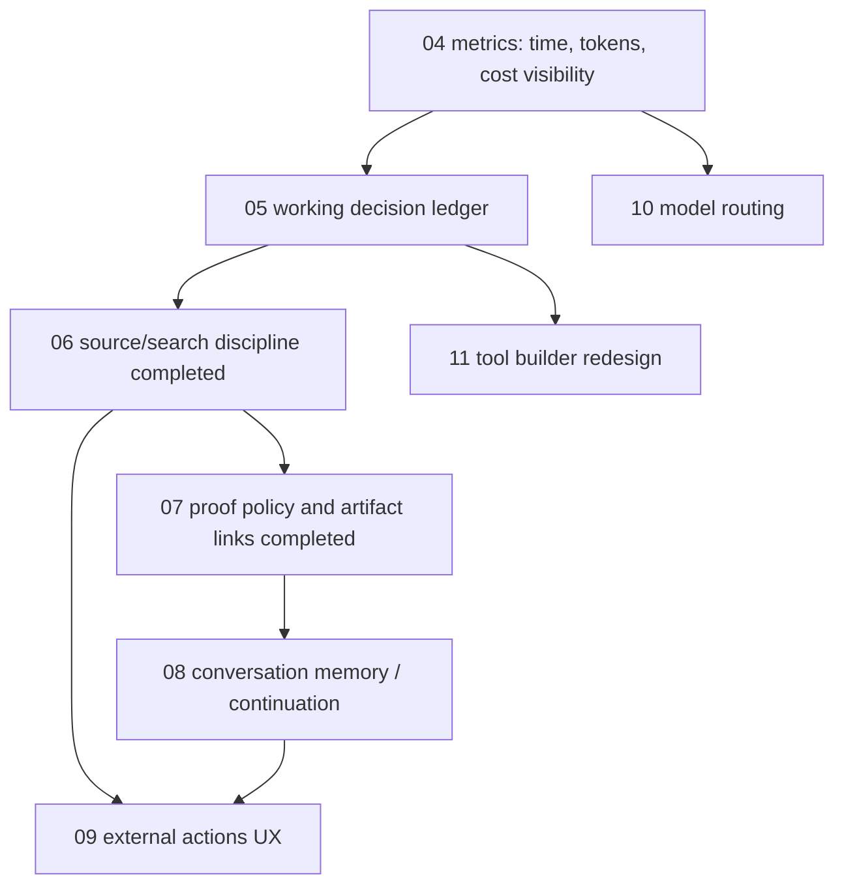

# Active Task Specs

Status date: 2026-06-23.

This directory is the execution queue for the active Agentic roadmap. Each active task
file is a self-contained spec-first/test-first contract:

- idea and measurable increment;
- use cases, weak spots, and edge cases;
- behavior spec and acceptance criteria;
- architecture and ownership boundaries;
- low-level implementation plan;
- test plan and manual verification plan;
- decomposed delivery steps.

Before implementation, each task must follow the project development convention in
[`../development-convention.md`](../development-convention.md). If a task file does not
cover the readiness gates above, upgrade the task file first and only then code.

When a task is completed, verified, documented, and merged, remove its file from this
directory and update this index plus `docs/roadmap-core-toolbelt.md`.

## Execution Order

Work from top to bottom unless a production blocker requires reordering:

1. [P2 Conversation Memory, Prior Work, And Continuation Reliability](08-p2-conversation-memory-and-continuation.md)
2. [P2 External Action UX And Real-Provider Flow](09-p2-external-action-ux.md)
3. [P2 Model Routing](10-p2-model-routing.md)
4. [P3 Tool Builder Redesign](11-p3-tool-builder-redesign.md)

Cross-cutting gates apply to every task:

- [Code Hygiene And Documentation Discipline](12-cross-cutting-code-hygiene.md)

## Current Run-Quality Backlog

These tasks were created from the 2026-06-22 run analysis of
`run_1782129801101_54i3rfdu` and its follow-up discussion.

## Recently Completed

- 2026-06-23: P1 Proof Policy And Evidence Artifact Linking was completed and its task
  file was removed from the active queue. Implementation: `src/agents/proofPolicy.ts`,
  proof-plan/proof-link contracts in `src/types.ts`, BaseAgent finalization wiring,
  structured source-proof metadata in `src/agents/baseAgentProof.ts`, and Run Workspace
  proof-policy rendering. Source-backed runs now emit `proof-plan-created` and
  `proof-links-created`, final results expose `proofPlan` and `proofLinks`, failed
  diagnostic screenshot proof can remain visible in UI while passed structured
  source-evidence proof carries stable claim/source ids, and local/external/API proof
  modes are represented explicitly. The same slice fixed explicit API/HTTP URL tasks so
  they are routed to `http.request` and require `api_response`/source evidence instead
  of completing from model memory, even when the user says a screenshot is not needed.
  Focused coverage: `tests/proofPolicy.test.ts`, `tests/baseAgent.p0.test.ts`, and
  BaseAgent source-evidence fallback regression coverage. Manual smoke:
  `run_1782212526320_l8enrfme` for generated-file proof and
  `run_1782213246669_ycrbvo5l` for API structured proof without screenshot.
- 2026-06-22: P1 Source Acquisition, Search Discipline, And Source Cache was completed
  and its task file was removed from the active queue. Implementation:
  `TaskFrame.sourcePolicy`, `src/agents/sourceSearchPlan.ts`,
  `src/agents/sourceQuality.ts`, `src/agents/sourceRegistry.ts`,
  `src/agents/baseAgentSourceEvents.ts`, `src/agents/baseAgentSearchHistory.ts`,
  `src/agents/baseAgentSourcePlanRepair.ts`, and Working / Decision Ledger source-event
  projection. The runtime now respects explicit no-internet/no-web tasks, emits a
  source search plan for broad research, repairs broad mixed-language runs that skip a
  planned English/user-language query angle, normalizes and redacts source URLs, skips
  duplicate normalized `web.read` attempts inside a run, records blocked/failed source
  reads as rejected evidence, filters technical assets/search-result pages/social search
  pages out of source discovery, skips those low-value reads before spending `web.read`
  budget unless the user explicitly targets that host, and projects source decisions into
  the board. Product-selection gates now require enough source coverage rather than a
  fixed third search call: two successful research calls plus three independent
  proof-worthy URLs and one successful source read can complete. Focused
  coverage: `tests/sourceRegistry.test.ts`, `tests/sourceSearchPlan.test.ts`,
  `tests/baseAgentSourceAcquisition.test.ts`, plus regression coverage for duplicate
  search and board projection.
- 2026-06-22: P1 Run Metrics, Token Accounting, And Cost Observability was completed and
  its task file was removed from the active queue. Implementation: provider token usage
  is captured at the LLM boundary, LLM events carry per-step duration/model/usage, run
  DTOs include a metrics projection from events, SSE snapshots preserve enriched DTOs,
  and Runs / Run Workspace / Trace Lab / Conversation UI render elapsed time, tool/LLM
  counts, model summary, token usage when available, and slowest events. Focused coverage:
  `tests/runMetrics.test.ts`, `tests/llmClient.test.ts`, and BaseAgent/UI DTO tests.
- 2026-06-19: P1 Tool Catalog Cleanup was completed and its task file was removed.
  Implementation: `src/tools/toolCatalog.ts`, `/api/tools` catalog normalization,
  run-side eligibility filtering in `src/server/modules/runs/run-tool-catalog.ts`, and
  React Tools filters for Active/Core/Generated/Inactive/All. Focused tests cover
  core-first sorting, inactive generated segregation, legacy-reference metadata without
  implementation, unhealthy/missing runtime exclusion, and run prompt filtering.
  Manual durable smoke: Tools UI defaulted to active 12/25 with core-first entries and
  inactive 13/25 separated; `run_1781876088935_yg4izgpx` completed with 10 offered tools
  in `agent-context-prepared` and no inactive/guarded tools. DB records were checked.
- 2026-06-22: P1 Working / Decision Ledger Blackboard was completed and its task file was
  removed from the active queue. Implementation:
  `src/agents/workingDecisionLedger.ts`,
  `src/agents/workingDecisionBoardUpdate.ts`,
  `src/agents/baseAgentWorkingBoard.ts`, BaseAgent meta-action wiring, semantic LLM
  trace titles, and `web-react/src/features/run-workspace/WorkingDecisionBoard.tsx`.
  Focused tests cover event projection, model-writable board updates, invalid update
  rejection, and BaseAgent meta-action handling. Manual smokes:
  `run_1782161622838_s46658d4` completed a deterministic JSON-to-CSV file task with 8
  board events, 2 tool calls, and 1 CSV artifact; Run Workspace and Trace Lab rendered
  the board and metrics. `run_1782161672962_2lrltrod` verified that the model sees and
  can call `update_working_board`, and Trace Lab renders semantic labels such as
  `Choose tools: update_working_board`. That second run exposed a separate source/task
  framing issue later closed by task 06: "сравни ... без интернета" was over-framed as
  `product_selection` and forced web research.
- 2026-06-19: P1 Memory Continuity Model was completed and its task file was removed.
  Implementation: `src/agents/memoryContext.ts`,
  `src/agents/baseAgentContextEvents.ts`, BaseAgent context normalization, and
  `RunAgentRuntimeHelpers` accepted-memory retrieval. Focused tests cover memory scope
  calculation, accepted-only policy filtering, prompt/trace injection, runtime retrieval,
  exact scoped-memory ranking, and partial memory PATCH updates. Full `npm run verify`
  passed with 539 tests. Manual durable smoke:
  `run_1781874414255_yy0s68ik` used an accepted group memory via
  `memory-context-prepared` without any tool calls; the smoke memory was archived and DB
  records were checked.
- 2026-06-19: P0 Ledger Recovery And Reuse was completed and its task file was removed.
  Implementation: `src/work-ledger/priorWorkResolver.ts`,
  `src/work-ledger/runtimePriorWork.ts`, `src/agents/baseAgentPriorWork.ts`, and
  BaseAgent wiring. Focused tests cover reuse, refresh, retry exclusions, and zero-tool
  source follow-ups. Manual durable smoke: `run_1781869705670_93qohg1o` created
  persisted `http.request` evidence in `thread_1781869705669_bj426305`; after backend
  restart, `run_1781870036522_1to9slex` answered the source follow-up from Ledger with
  zero new tool calls and visible `work-ledger-prior-context-*` events.
- 2026-06-19: P0 Simple Current Web Runs was completed and its task file was removed.
  Implementation: `src/agents/baseAgentCurrentFact.ts` plus BaseAgent wiring. Verification:
  `npm run verify` passed with 528 tests. Manual smokes:
  `run_1781863897402_6ntzkgym` for current fact without screenshot and
  `run_1781864151384_z8b9fzb9` for explicit screenshot proof.

## Current Owner Rule

The current agent working on the repo owns the next unfinished file in the queue. Before
starting implementation, read the relevant task file, `docs/agent-handoff.md`,
`docs/current-architecture.md`, `docs/development-convention.md`, and `AGENTS.md`.
If the task file is not yet ready by the convention, update the task file first and only
then implement.

## Completion Rule

A task is done only when:

- implementation is merged;
- `npm run verify` passes;
- at least one relevant manual run is executed through the user-visible UI/API surface;
- docs are updated;
- the task file is removed or replaced by follow-up task files with explicit ordering.
