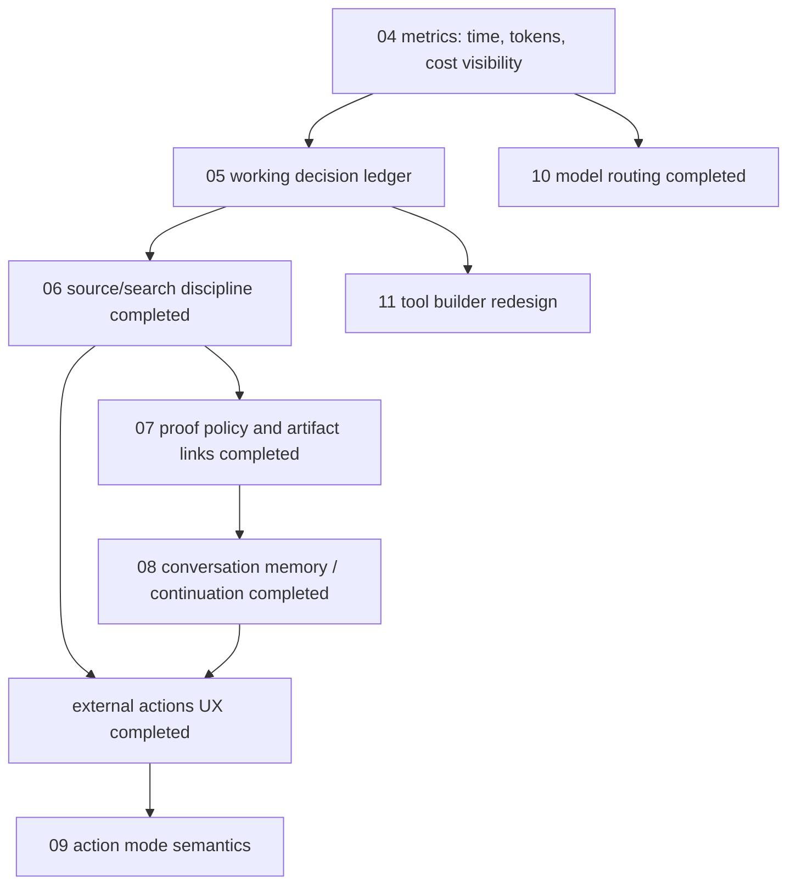

# Active Task Specs

Status date: 2026-06-25.

This directory is the execution queue for the active Agentic roadmap. Each active task
file is a self-contained spec-first/test-first contract:

- idea and measurable increment;
- use cases, weak spots, and edge cases;
- behavior spec and acceptance criteria;
- architecture and ownership boundaries;
- low-level implementation plan;
- test plan and manual verification plan;
- decomposed delivery steps.

Before implementation, each task must follow the project development convention in
[`../development-convention.md`](../development-convention.md). If a task file does not
cover the readiness gates above, upgrade the task file first and only then code.

When a task is completed, verified, documented, and merged, remove its file from this
directory and update this index plus `docs/roadmap-core-toolbelt.md`.

## Execution Order

Work from top to bottom unless a production blocker requires reordering:

1. [P0 Runtime Safety Hardening](15-p0-runtime-safety-hardening.md)
2. [P0 Systemic Grounding: Frame Detector + Universal Verification + Breadth/Replan](18-p0-systemic-grounding-breadth-and-verification.md) — supersedes the case-specific parts of task 17; decisions locked (hybrid framing + moderate breadth); ships observability-first in 7 steps
3. [P0 Commerce / "Where To Buy" Framing + Existence Grounding](17-p0-commerce-and-existence-grounding.md) — FR-1/FR-3/FR-4 commerce patch landed (commit 07b258e) but is being GENERALIZED and removed by task 18; FR-2 existence guard folds into task 18 FR-4
4. [P0 External-Action Prepare For Real Booking Widgets](01-p0-external-action-real-booking-prepare.md)
4. [P0 Current-Fact Answer Signal Fallback](02-p0-current-fact-answer-signal-fallback.md)
6. [P2 Resumable External Actions And Verification Handoff](14-p2-resumable-external-actions-verification-handoff.md)
7. [P2 Context-Budgeted Run Decomposition](13-p2-context-budgeted-run-decomposition.md)
8. [P3 Tool Builder Redesign](11-p3-tool-builder-redesign.md)
9. [P3 Container Produce Pipeline](16-p3-container-produce-pipeline.md)

Cross-cutting gates apply to every task:

- [Code Hygiene And Documentation Discipline](12-cross-cutting-code-hygiene.md)

## 2026-06-25 Audit + Safety-Hardening Update

A deep static + live audit of `main` (49fe49a) on 2026-06-25 added one P0 task and one P3
companion task, and found two issues fixed immediately on branch
`claude/verify-green-and-toolcall-leak`:

- **`npm run verify` was RED on committed `main`** — the `test:types` step failed with 3
  type errors in `tests/actionProposalAutoAdvance.test.ts`. Unit tests (626) plus
  typecheck/lint/build were green, so the break was masked unless the full verify gate
  ran. Fixed; verify is now 637/637 green with the new detector tests.
- **Broad-research runs could ship raw tool-call syntax as the final answer.** A live
  laptop-recommendation run returned `<|tool_call>call:browser.screenshot{...}<tool_call|>`
  (gemma-4-26b pipe-token format) and the return gate passed it because
  `containsRawToolCallSyntax` only matched `<tool_call>` without the pipe. Detector
  extended; `tests/rawToolCallSyntax.test.ts` added.

[Task 15](15-p0-runtime-safety-hardening.md) captures the remaining audit hardening
(ledger free-text/URL secret redaction, terminal-status immutability, audit/ledger
`cookie`/`auth` key set, and a feature flag that makes the agent-tool-creation freeze
real). [Task 16](16-p3-container-produce-pipeline.md) is the describe-first container
"produce" pipeline (build -> publish -> secure-run an `oci-image`) that complements the
already-working OCI **run** runtime; it slots after task 11.

## Current Run-Quality Backlog

These tasks were created from the 2026-06-22 run analysis of
`run_1782129801101_54i3rfdu` and its follow-up discussion.

## Active Regression Anchor

2026-06-24 manual complex smokes added two new P0 anchors:

- `run_1782328992857_f4j7lnef` and `run_1782329227878_8ghhknaf` verified that
  approval-mode external-action preparation can reach `waiting_approval`, then prepare
  the local appointment fixture after approval, fill visible form fields, detect
  `Confirm reservation`, save a proof artifact, and stop before final submit. The same
  smokes exposed target-extraction noise from status/form/button headings and URL
  priority bugs, now covered by focused tests.
- `run_1782331268320_hyen5hhw` is the latest clean fixture anchor: it reached
  `waiting_approval`, approval auto-prepared the form, saved
  `artifact_1782331348656_mfhi3tz1`, attached the existing
  `external.action.commit`, and still stopped before final submit. It also anchors the
  remaining optimization gap: explicit prepare-URL tasks can still perform an
  unnecessary failed `http.request` before proposal creation.
- `run_1782332823871_2fh9uzh1` is the deterministic explicit-URL fast-path anchor: it
  reached `waiting_approval` in about 1 second with 0 LLM calls, 0 tool calls, and 0
  failed tools; approval then prepared the local form through semantic
  `browser.operate`, saved `artifact_1782332854998_l15vr3q0`, detected
  `Confirm reservation`, attached `external.action.commit`, and stopped before final
  submit. This closes the previous explicit prepare-URL source-probing gap for direct
  form URLs.
- `run_1782388658959_gyqpaz9e` is the shared-operator-card fixture anchor: the UI showed
  one reviewed action card, approval prepared the form, the final submit control was
  explicit, and fixture commit completed with confirmation. The same pass verified that
  rejecting/cancelling a proposal removes it from the active operator queue without
  external submit.
- `run_1782388970107_6qr7qj9d`, `run_1782389012994_6cqr9pzu`, and
  `run_1782389074701_7225uh97` are the latest UI smoke anchors for direct no-tool,
  current-fact proof, and local JSON-to-CSV artifact runs after the approval UI pass.
- `run_1782325936513_t9kpao4m` exposed a current-fact weakness: a narrow BTC price task
  can finish with a weak answer when the selected source/read does not expose the
  expected numeric answer signal. Task 02 covers answer-signal validation and fallback.

Task 09 was created after analyzing `thread_1782232645230_a59xpy0f`.
The first run completed useful research without action proposals. The second run was a
research-only continuation, but because the UI injected `Автомод:` into the task text the
runtime created `Reservation proposal: Vibe coding рынок`, attached
`external.action.commit`, and attempted an invalid automode commit. Task 09 fixes that
mode semantics issue by moving mode into structured `externalActionMode` run context;
manual smoke confirmed research-only auto stays research-only and explicit booking auto
keeps an auto external-action policy.

Follow-up regression from 2026-06-23: `thread_1782238426343_bla80wwj` was restarted
from failed run `run_1782238958911_9fytbfml` into `run_1782239978110_4p2ifhzn`.
The restart completed, but the contact-data continuation was framed as
`product_selection` with no `externalActionPolicy`, so it produced no action proposal and
could not exercise approval/automode. This is a continuation/action-intent inheritance
bug and a context-budgeting trigger for task 13.

Real-provider follow-up from the same investigation: a Booksy appointment flow could be
prepared through service/date/time selection and account email entry, but the provider
required phone/SMS verification before final booking. The assistant must treat that as a
resumable external-action blocker with proof and a precise missing input, not as a manual
"go book yourself" instruction. Task 14 covers this provider-neutral verification
handoff path.

## Recently Completed

- 2026-06-24: P2 Model Routing durable profile slice was completed and its task file was
  removed from the active queue. Implementation added durable `model_profiles`
  persistence, `/api/model-profiles`, Models UI editing, catalog/profile merge,
  authoritative capability overrides, disabled-model rejection, and focused
  routing/store/client tests. Manual API smoke verified profile create/list/catalog merge
  against the live backend and cleaned up the smoke profile afterward.
- 2026-06-23: P2 External Action UX And Real-Provider Flow was completed and its
  task file was removed from the active queue. Implementation added a provider-neutral
  external-action blocker taxonomy, canonical
  `external-action-final-report-created` events for committed/blocked/failed outcomes,
  final-report projection in approval/run UI, clearer one-primary-action copy for
  proposal/prepare/commit states, fixed the registered-but-unattached executor button
  path, and ensured failed diagnostic artifacts stay visible in Agentic UI while being
  withheld from outbound channel delivery. Focused coverage:
  `tests/actionProposalBlockers.test.ts`, `tests/actionProposalFixture.test.ts`,
  `tests/nestApi.test.ts`, `tests/runOutboundDelivery.test.ts`, and
  `web-react/src/features/approvals/externalActionUxState.test.ts`. Manual smoke used
  the local fixture action lifecycle: proposal -> approve -> auto-prepare -> attach
  executor -> commit -> final report, and `/approvals` rendered the simplified copy
  against the live dev stack.
- 2026-06-23: P2 Conversation Memory, Prior Work, And Continuation Reliability was
  completed and its task file was removed from the active queue. Implementation:
  `src/agents/memoryUse.ts`, `memory-use-resolved` trace/span events in
  `src/agents/baseAgentContextEvents.ts`, prior-work memory-view rebuilding in
  `src/agents/baseAgentPriorWork.ts`, Working / Decision Board projection in
  `src/agents/workingDecisionLedger.ts`, and memory-source rendering in Run Workspace
  plus Conversation detail through
  `web-react/src/features/run-workspace/MemoryUsePanel.tsx`. Continuation runs now show
  which memory sources were available, used, stale, ignored, or insufficient across run,
  thread, user profile, group profile, accepted memory, Work Ledger, and Evidence Ledger.
  Focused coverage: `tests/memoryUse.test.ts`, `tests/baseAgentPriorWork.test.ts`, and
  `tests/workingDecisionLedger.test.ts`. Manual smoke:
  `run_1782223820553_bhej2jmg` stored a code word in
  `thread_1782223820551_ptiv0rnp`; `run_1782223824632_wm6xfej8` answered the follow-up
  from thread memory, and both Run Workspace and Conversation detail rendered the memory
  source records.
- 2026-06-23: P1 Proof Policy And Evidence Artifact Linking was completed and its task
  file was removed from the active queue. Implementation: `src/agents/proofPolicy.ts`,
  proof-plan/proof-link contracts in `src/types.ts`, BaseAgent finalization wiring,
  structured source-proof metadata in `src/agents/baseAgentProof.ts`, and Run Workspace
  proof-policy rendering. Source-backed runs now emit `proof-plan-created` and
  `proof-links-created`, final results expose `proofPlan` and `proofLinks`, failed
  diagnostic screenshot proof can remain visible in UI while passed structured
  source-evidence proof carries stable claim/source ids, and local/external/API proof
  modes are represented explicitly. The same slice fixed explicit API/HTTP URL tasks so
  they are routed to `http.request` and require `api_response`/source evidence instead
  of completing from model memory, even when the user says a screenshot is not needed.
  Focused coverage: `tests/proofPolicy.test.ts`, `tests/baseAgent.p0.test.ts`, and
  BaseAgent source-evidence fallback regression coverage. Manual smoke:
  `run_1782212526320_l8enrfme` for generated-file proof and
  `run_1782213246669_ycrbvo5l` for API structured proof without screenshot.
- 2026-06-22: P1 Source Acquisition, Search Discipline, And Source Cache was completed
  and its task file was removed from the active queue. Implementation:
  `TaskFrame.sourcePolicy`, `src/agents/sourceSearchPlan.ts`,
  `src/agents/sourceQuality.ts`, `src/agents/sourceRegistry.ts`,
  `src/agents/baseAgentSourceEvents.ts`, `src/agents/baseAgentSearchHistory.ts`,
  `src/agents/baseAgentSourcePlanRepair.ts`, and Working / Decision Ledger source-event
  projection. The runtime now respects explicit no-internet/no-web tasks, emits a
  source search plan for broad research, repairs broad mixed-language runs that skip a
  planned English/user-language query angle, normalizes and redacts source URLs, skips
  duplicate normalized `web.read` attempts inside a run, records blocked/failed source
  reads as rejected evidence, filters technical assets/search-result pages/social search
  pages out of source discovery, skips those low-value reads before spending `web.read`
  budget unless the user explicitly targets that host, and projects source decisions into
  the board. Product-selection gates now require enough source coverage rather than a
  fixed third search call: two successful research calls plus three independent
  proof-worthy URLs and one successful source read can complete. Focused
  coverage: `tests/sourceRegistry.test.ts`, `tests/sourceSearchPlan.test.ts`,
  `tests/baseAgentSourceAcquisition.test.ts`, plus regression coverage for duplicate
  search and board projection.
- 2026-06-22: P1 Run Metrics, Token Accounting, And Cost Observability was completed and
  its task file was removed from the active queue. Implementation: provider token usage
  is captured at the LLM boundary, LLM events carry per-step duration/model/usage, run
  DTOs include a metrics projection from events, SSE snapshots preserve enriched DTOs,
  and Runs / Run Workspace / Trace Lab / Conversation UI render elapsed time, tool/LLM
  counts, model summary, token usage when available, and slowest events. Focused coverage:
  `tests/runMetrics.test.ts`, `tests/llmClient.test.ts`, and BaseAgent/UI DTO tests.
- 2026-06-19: P1 Tool Catalog Cleanup was completed and its task file was removed.
  Implementation: `src/tools/toolCatalog.ts`, `/api/tools` catalog normalization,
  run-side eligibility filtering in `src/server/modules/runs/run-tool-catalog.ts`, and
  React Tools filters for Active/Core/Generated/Inactive/All. Focused tests cover
  core-first sorting, inactive generated segregation, legacy-reference metadata without
  implementation, unhealthy/missing runtime exclusion, and run prompt filtering.
  Manual durable smoke: Tools UI defaulted to active 12/25 with core-first entries and
  inactive 13/25 separated; `run_1781876088935_yg4izgpx` completed with 10 offered tools
  in `agent-context-prepared` and no inactive/guarded tools. DB records were checked.
- 2026-06-22: P1 Working / Decision Ledger Blackboard was completed and its task file was
  removed from the active queue. Implementation:
  `src/agents/workingDecisionLedger.ts`,
  `src/agents/workingDecisionBoardUpdate.ts`,
  `src/agents/baseAgentWorkingBoard.ts`, BaseAgent meta-action wiring, semantic LLM
  trace titles, and `web-react/src/features/run-workspace/WorkingDecisionBoard.tsx`.
  Focused tests cover event projection, model-writable board updates, invalid update
  rejection, and BaseAgent meta-action handling. Manual smokes:
  `run_1782161622838_s46658d4` completed a deterministic JSON-to-CSV file task with 8
  board events, 2 tool calls, and 1 CSV artifact; Run Workspace and Trace Lab rendered
  the board and metrics. `run_1782161672962_2lrltrod` verified that the model sees and
  can call `update_working_board`, and Trace Lab renders semantic labels such as
  `Choose tools: update_working_board`. That second run exposed a separate source/task
  framing issue later closed by task 06: "сравни ... без интернета" was over-framed as
  `product_selection` and forced web research.
- 2026-06-19: P1 Memory Continuity Model was completed and its task file was removed.
  Implementation: `src/agents/memoryContext.ts`,
  `src/agents/baseAgentContextEvents.ts`, BaseAgent context normalization, and
  `RunAgentRuntimeHelpers` accepted-memory retrieval. Focused tests cover memory scope
  calculation, accepted-only policy filtering, prompt/trace injection, runtime retrieval,
  exact scoped-memory ranking, and partial memory PATCH updates. Full `npm run verify`
  passed with 539 tests. Manual durable smoke:
  `run_1781874414255_yy0s68ik` used an accepted group memory via
  `memory-context-prepared` without any tool calls; the smoke memory was archived and DB
  records were checked.
- 2026-06-19: P0 Ledger Recovery And Reuse was completed and its task file was removed.
  Implementation: `src/work-ledger/priorWorkResolver.ts`,
  `src/work-ledger/runtimePriorWork.ts`, `src/agents/baseAgentPriorWork.ts`, and
  BaseAgent wiring. Focused tests cover reuse, refresh, retry exclusions, and zero-tool
  source follow-ups. Manual durable smoke: `run_1781869705670_93qohg1o` created
  persisted `http.request` evidence in `thread_1781869705669_bj426305`; after backend
  restart, `run_1781870036522_1to9slex` answered the source follow-up from Ledger with
  zero new tool calls and visible `work-ledger-prior-context-*` events.
- 2026-06-19: P0 Simple Current Web Runs was completed and its task file was removed.
  Implementation: `src/agents/baseAgentCurrentFact.ts` plus BaseAgent wiring. Verification:
  `npm run verify` passed with 528 tests. Manual smokes:
  `run_1781863897402_6ntzkgym` for current fact without screenshot and
  `run_1781864151384_z8b9fzb9` for explicit screenshot proof.

## Current Owner Rule

The current agent working on the repo owns the next unfinished file in the queue. Before
starting implementation, read the relevant task file, `docs/agent-handoff.md`,
`docs/current-architecture.md`, `docs/development-convention.md`, and `AGENTS.md`.
If the task file is not yet ready by the convention, update the task file first and only
then implement.

## Completion Rule

A task is done only when:

- implementation is merged;
- `npm run verify` passes;
- at least one relevant manual run is executed through the user-visible UI/API surface;
- docs are updated;
- the task file is removed or replaced by follow-up task files with explicit ordering.
